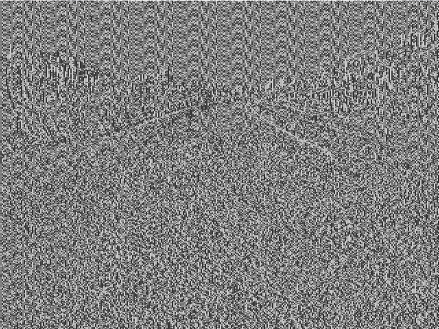
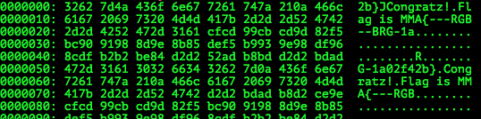

# MMA-CTF-2015: miyako-350

**Category:**  Stego
**Points:** 350
**Solves:** 2
**Description:**

> Get the flag.
>
> [stego.png](stego.png-e7cd78e3f592084b819788c46755921528d066efba391773307994d69beae3f3)


## Write-up

by [polym](https://github.com/abpolym)

This writeup is based on a writeup by [khack40](http://khack40.info/mma-ctf-2015-miyako-stega-write-up/).

We are given a PNG and print the pixels using [pixels.py](./pixels.py).

On a closer look, we see that each pixel and its following neighbour differs slightly:

```
224 216 216
229 221 222
223 217 222
227 221 217
```

The difference between the first pixel RGB values and the second is around 6, between the second and fourth 5 etc.

Though it is not entirely obvious, the authors encoded a binary string in the sign of the difference of the blue values.

Every second pixel, we calculate the difference of the blue value to the previous pixel and interpret it as either a 0 (if negative) or 1 (if positive).

The python script [picdiff.py](./picdiff.py) prints the encoded binary string and shows us the resulting picture:



We then can convert the binary string to ASCII to find the (broken) flag:

```bash
+bash-4.3$ python2.7 picdiff.py stego.png-e7cd78e3f592084b819788c46755921528d066efba391773307994d69beae3f3 | perl -lpe '$_=pack"B*",$_' | xxd
```


The final flag is: `MMA{---RGB--BRG-1a02f42b}`

## Other write-ups and resources

* <http://khack40.info/mma-ctf-2015-miyako-stega-write-up/>
