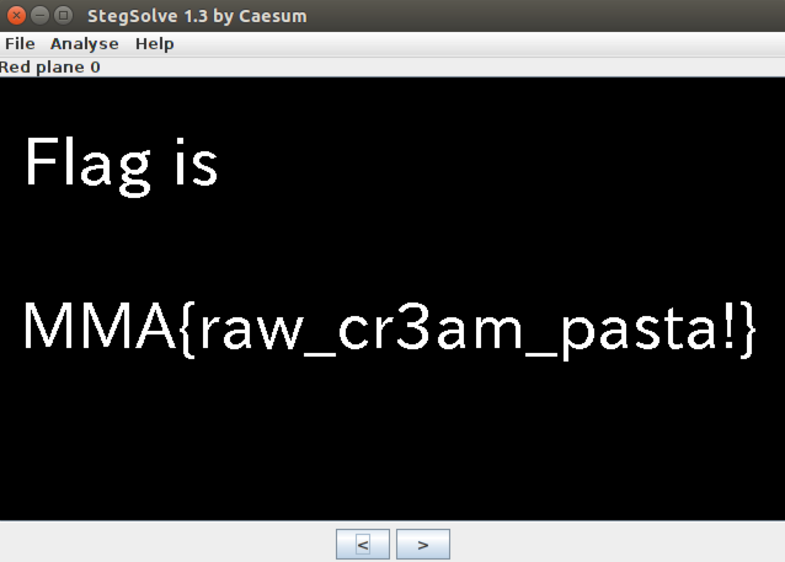

# MMA-CTF-2015: nogaya-castle-100

**Category:** Stego
**Points:** 100
**Solves:** 243
**Description:**

> Get the flag.
>
> [problem.png](problem.png-dbaddea0492910076ff7c1b3140edfcaa3132784443bdc504d50e0559efa0463)

## Write-up

by [polym](https://github.com/abpolym)

We are given a PNG that we open with `stegsolve` to find the flag in the RGB plane 0 values:

## Other write-ups and resources

* <https://shankaraman.wordpress.com/2015/09/07/mma-ctf-2015-steganography-100-nagoya-castle-writeup/>
* <http://fadec0d3.blogspot.com/2015/09/mma-ctf-2015-nagoya-castle-100.html>
* <https://0x90r00t.com/2015/09/07/mma-2015-stegano-nagoya-castle-write-up/>
* [b01lers](https://b01lers.net/challenges/MMA%20CTF%202015/Nagoya%20Castle/55/)
* <http://ctf-for-beginners.blogspot.in/2015/09/write-up-mma-ctf-2015-nagoya-castle-100.html>
* <https://github.com/ByteBandits/writeups/blob/master/mma-ctf-2015/stego/nagoya-castle/chaitan94/README.md>
