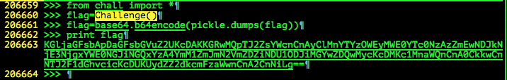

# Nuit du Hack Quals CTF 2015: Bpythonastic

**Category:** Forensics
**Points:** 300
**Solves:** 121
**Description:** 

> <http://static.challs.nuitduhack.com/Bpythonastic.tar.gz>

[Alternative download](https://mega.nz/#!GE9x0A4K!2A-9Pc3DLOGPiu7cUSKnHIIs-l1PXJnaId0FOz_o92c)

## Write-up

by [polym](https://github.com/abpolym)

This writeup is based on a writeup by [capturetheswag](http://capturetheswag.blogspot.com.au/2015/04/nuit-du-hack-quals-2015-bpythonastic.html).

After extracting the gzipped tar using `tar xvf Bpythonastic.tar.gz`, we get another tar `Bpythonastic.tar` that contains a 1.3GB file named `chall.raw`.

This file seems to be an ELF at first:

```bash
+bash-4.3$ file chall.raw 
chall.raw: ELF 64-bit LSB core file x86-64, version 1 (SYSV)
```

But it most likeley is a memory dump that begins with an ELF file.

[Some writeups](http://ipushino.blogspot.de/2015/04/ndh-ctf-2015-bpythonastic.html) used memory recovery /forensics tools like `volatility` to analyze the dump further.

However, the easiest solution is to apply `strings` to the memory dump and search for strings like `flag`, `python` and `challenge`:

```bash
strings -a chall.raw | grep -iE 'flag' | grep -i 'challenge'
>>> flag=Challenge()
>>> flag=Challenge()
>>> flag=Challenge()
flag=Challenge()
>>> flag=Challenge()                                                             
>>> flag=Challenge()                                                             
flag=Challenge()
flag=Challenge()
flag=Challenge()
flag=Challenge()
flag=Challenge()
flag=Challenge()
```

Looks like python code. We search the output of `strings -a chall.raw` for the complete python code to see this:



We decode the base64 encoded string `KGljaGFsbApDaGFsbGVuZ2UKcDAKKGRwMQpTJ2ZsYWcnCnAyClMnYTYzOWEyMWE0YTc0NzAzZmEwNDJkNjE3NjgxYWE0NGJiNGQxYzA4YmM1ZmJmN2VmZDZiNDU1ODJiMGYwZDQwMycKcDMKc1MnaWQnCnA0CkkwCnNTJ2F1dGhvcicKcDUKUydZZ2dkcmFzaWwnCnA2CnNiLg==` to find:

```bash
$ echo 'KGljaGFsbApDaGFsbGVuZ2UKcDAKKGRwMQpTJ2ZsYWcnCnAyClMnYTYzOWEyMWE0YTc0NzAzZmEwNDJkNjE3NjgxYWE0NGJiNGQxYzA4YmM1ZmJmN2VmZDZiNDU1ODJiMGYwZDQwMycKcDMKc1MnaWQnCnA0CkkwCnNTJ2F1dGhvcicKcDUKUydZZ2dkcmFzaWwnCnA2CnNiLg==' | base64 --decode
(ichall
Challenge
p0
(dp1
S'flag'
p2
S'a639a21a4a74703fa042d617681aa44bb4d1c08bc5fbf7efd6b45582b0f0d403'
p3
sS'id'
p4
I0
sS'author'
p5
S'Yggdrasil'
p6
sb.
```

We see a sha256 hash, `a639a21a4a74703fa042d617681aa44bb4d1c08bc5fbf7efd6b45582b0f0d403`, that we crack using a hash database such as <http://md5decrypt.net/en/Sha256/> to find the flag (`Yougotit`):


## Other write-ups and resources

* <http://ipushino.blogspot.de/2015/04/ndh-ctf-2015-bpythonastic.html>
* <http://capturetheswag.blogspot.com.au/2015/04/nuit-du-hack-quals-2015-bpythonastic.html>