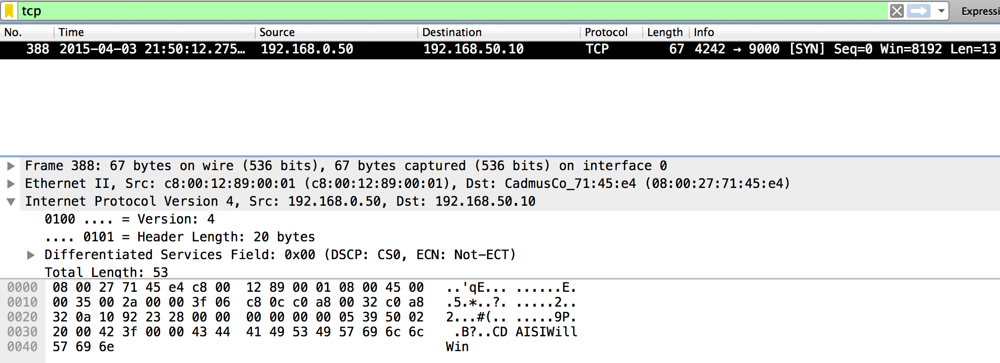
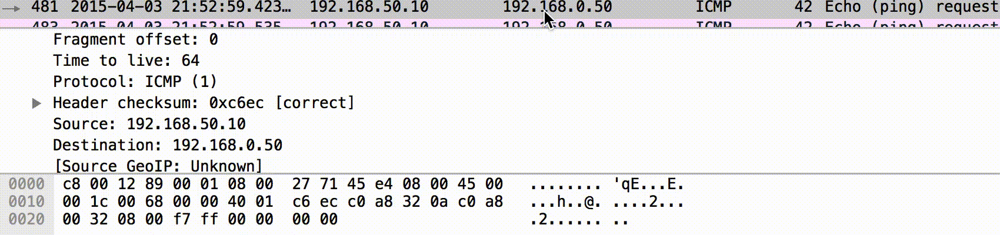

# Nuit du Hack Quals CTF 2015: Private

**Category:** Forensics
**Points:** 100
**Solves:** 114
**Description:** 

> "The quiet you are, the more you are able to ear"
> 
> [http://static.challs.nuitduhack.com/Private.tar.gz](Private.tar.gz)

## Write-up

by [polym](https://github.com/abpolym)

This writeup is loosely based on [this writeup](https://hexpresso.wordpress.com/2015/04/05/quals_ndh-2k15-private-100-writeup/).

We are given a gzipped tar archive that we extract using `tar xvf Private.tar.fz` to find a pcap-ng capture file named `PrivateChannel.pcap.pcapng`.

Looking at the protocols used in the transmission, we see a bunch of STP, ICMP, DNS and some other requests.

The single TCP request that does stand out (because it's lonely :(), does not give us anything that tells us where our flag is:



However, after some fiddling with the data, we notice that the Identifiers of all IP layers of ICMP packets are inside the ASCII value range (32-126).

Most notably, the ID's begin to spell 'here is your flag' when only looking at the ICMP requests from IP `192.168.50.10` to `192.168.0.50`.

To see the flag, you can either apply a filter in wireshark `icmp and ip.src==192.168.50.10` and scroll down the requests to notice the flag in the Identifier bytes:



Or you could use apply the mentioned filter in `tshark` and grep for the offset range that contains the identifier:

```bash
$ tshark -r PrivateChannel.pcap.pcapng -x 'icmp and ip.src==192.168.50.10' | grep 0010
0010  00 38 00 0e 00 00 ff 01 d6 5a c0 a8 32 01 c0 a8   .8.......Z..2...
0010  00 38 00 0f 00 00 ff 01 d6 59 c0 a8 32 01 c0 a8   .8.......Y..2...
0010  00 38 00 10 00 00 ff 01 d6 58 c0 a8 32 01 c0 a8   .8.......X..2...
[...]
0010  00 54 09 69 00 00 40 01 bd b3 c0 a8 32 0a c0 a8   .T.i..@.....2...
0010  00 1c 00 22 00 00 40 01 c7 32 c0 a8 32 0a c0 a8   ..."..@..2..2...
0010  00 1c 00 68 00 00 40 01 c6 ec c0 a8 32 0a c0 a8   ...h..@.....2...
0010  00 1c 00 65 00 00 40 01 c6 ef c0 a8 32 0a c0 a8   ...e..@.....2...
0010  00 1c 00 72 00 00 40 01 c6 e2 c0 a8 32 0a c0 a8   ...r..@.....2...
0010  00 1c 00 65 00 00 40 01 c6 ef c0 a8 32 0a c0 a8   ...e..@.....2...
0010  00 1c 00 20 00 00 40 01 c7 34 c0 a8 32 0a c0 a8   ... ..@..4..2...
0010  00 1c 00 69 00 00 40 01 c6 eb c0 a8 32 0a c0 a8   ...i..@.....2...
0010  00 1c 00 73 00 00 40 01 c6 e1 c0 a8 32 0a c0 a8   ...s..@.....2...
0010  00 1c 00 20 00 00 40 01 c7 34 c0 a8 32 0a c0 a8   ... ..@..4..2...
0010  00 1c 00 79 00 00 40 01 c6 db c0 a8 32 0a c0 a8   ...y..@.....2...
0010  00 1c 00 6f 00 00 40 01 c6 e5 c0 a8 32 0a c0 a8   ...o..@.....2...
0010  00 1c 00 75 00 00 40 01 c6 df c0 a8 32 0a c0 a8   ...u..@.....2...
0010  00 1c 00 72 00 00 40 01 c6 e2 c0 a8 32 0a c0 a8   ...r..@.....2...
0010  00 1c 00 20 00 00 40 01 c7 34 c0 a8 32 0a c0 a8   ... ..@..4..2...
0010  00 1c 00 66 00 00 40 01 c6 ee c0 a8 32 0a c0 a8   ...f..@.....2...
0010  00 1c 00 6c 00 00 40 01 c6 e8 c0 a8 32 0a c0 a8   ...l..@.....2...
0010  00 1c 00 61 00 00 40 01 c6 f3 c0 a8 32 0a c0 a8   ...a..@.....2...
0010  00 1c 00 67 00 00 40 01 c6 ed c0 a8 32 0a c0 a8   ...g..@.....2...
0010  00 1c 00 20 00 00 40 01 c7 34 c0 a8 32 0a c0 a8   ... ..@..4..2...
0010  00 1c 00 3a 00 00 40 01 c7 1a c0 a8 32 0a c0 a8   ...:..@.....2...
0010  00 1c 00 20 00 00 40 01 c7 34 c0 a8 32 0a c0 a8   ... ..@..4..2...
0010  00 1c 00 53 00 00 40 01 c7 01 c0 a8 32 0a c0 a8   ...S..@.....2...
0010  00 1c 00 33 00 00 40 01 c7 21 c0 a8 32 0a c0 a8   ...3..@..!..2...
0010  00 1c 00 63 00 00 40 01 c6 f1 c0 a8 32 0a c0 a8   ...c..@.....2...
0010  00 1c 00 72 00 00 40 01 c6 e2 c0 a8 32 0a c0 a8   ...r..@.....2...
0010  00 1c 00 33 00 00 40 01 c7 21 c0 a8 32 0a c0 a8   ...3..@..!..2...
0010  00 1c 00 74 00 00 40 01 c6 e0 c0 a8 32 0a c0 a8   ...t..@.....2...
0010  00 1c 00 34 00 00 40 01 c7 20 c0 a8 32 0a c0 a8   ...4..@.. ..2...
0010  00 1c 00 67 00 00 40 01 c6 ed c0 a8 32 0a c0 a8   ...g..@.....2...
0010  00 1c 00 33 00 00 40 01 c7 21 c0 a8 32 0a c0 a8   ...3..@..!..2...
0010  00 1c 00 6e 00 00 40 01 c6 e6 c0 a8 32 0a c0 a8   ...n..@.....2...
0010  00 1c 00 74 00 00 40 01 c6 e0 c0 a8 32 0a c0 a8   ...t..@.....2...
```

The flag is `S3cr3t4g3nt`!

PS: You can also use `scapy` to print out the identifiers, as done [here](http://geeksspeak.github.io/blog/2015/04/05/ndh-ctf-2015-private-writeup/) and [here](https://hexpresso.wordpress.com/2015/04/05/quals_ndh-2k15-private-100-writeup/).

## Other write-ups and resources

* <http://geeksspeak.github.io/blog/2015/04/05/ndh-ctf-2015-private-writeup/>
* <https://hexpresso.wordpress.com/2015/04/05/quals_ndh-2k15-private-100-writeup/>
* <http://anee.me/nuit-du-hack-2015-quals-private-writeup/>
