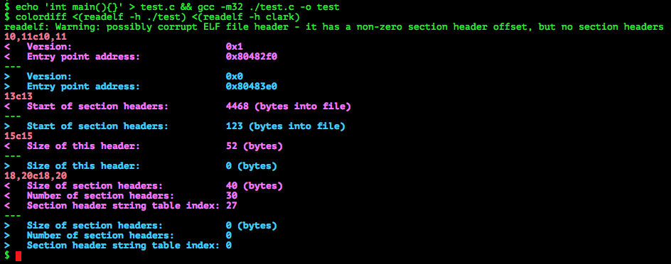
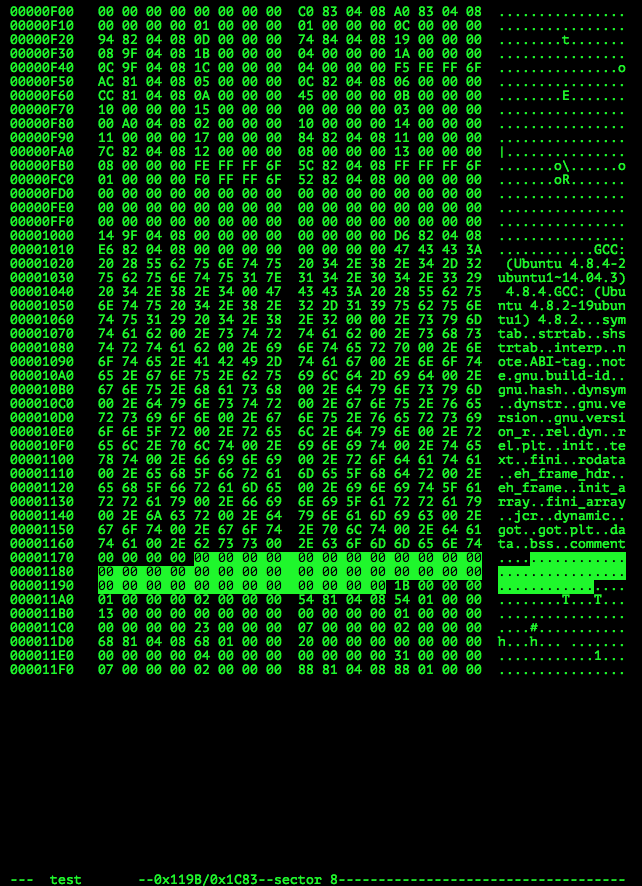
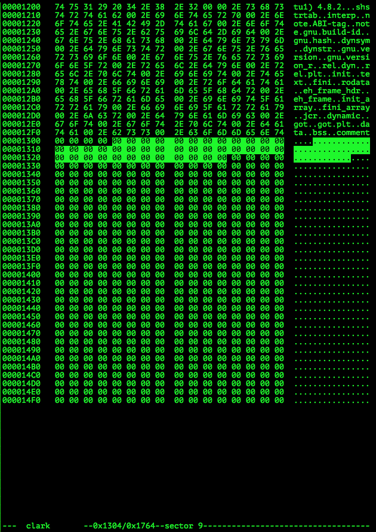
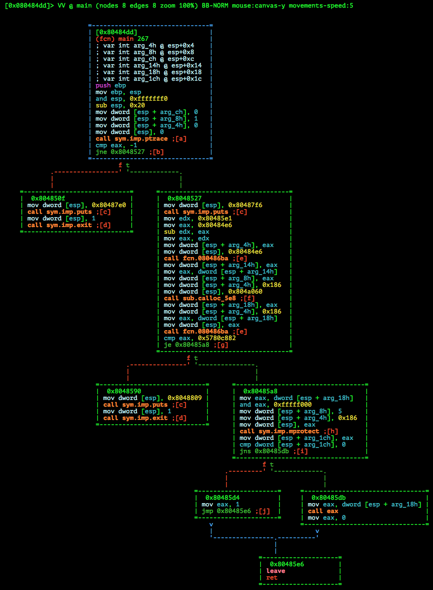
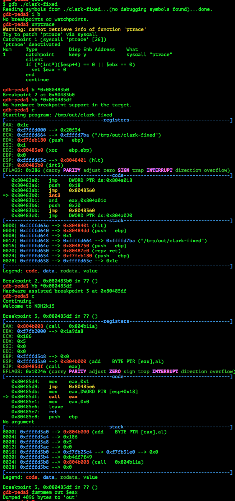

# Nuit du Hack Quals CTF 2015: Clark Kent

**Category:** Crackme/Reverse
**Points:** 150
**Solves:** 72
**Description:** 

> "There's a shadow inside all of us. But that doesn't mean you need to embrace it. You decide who you really are. And I know you'll make the right choice and become the hero you're destined to be." (Clark Kent)
> 
> Become that hero you're destined to be. Discover and evolve your reversing powers.
> 
> [http://static.challs.nuitduhack.com/clark.tar.gz](clark.tar.gz)

## Write-up

by [polym](https://github.com/abpolym)

This writeup is based on following writeups:

* <https://github.com/smokeleeteveryday/CTF_WRITEUPS/tree/master/2015/NUITDUHACK/reverse/clarkkent>
* <http://depier.re/md/quals_ndh_2k15_clark_kent_150/>
* [French](https://wiki.zenk-security.com/doku.php?id=ndhquals2015:clark_kent)

Keywords:

* `i386` 32 Bit Linux Executable
* Anti-Debugging Techniques: `call eax`, `ptrace`, code checksums and more

We are given a gzipped tar archive that contains a 32 Bit Linux Executable:

```bash
$ tar xvf clark.tar.gz 
Clark.txt
clark
$ file clark
clark: ELF 32-bit LSB  executable, Intel 80386, invalid version (SYSV), for GNU/Linux 2.6.24, dynamically linked (uses shared libs), corrupted section header size
```

Running it:

```bash
$ ./clark 
Welcome to NDH2k15
Need supercow power!!!
Bye!
```

Superpowers as in `root`? If we run the binary in our (resettable VM) with `sudo`, the system reboots. Never run executables with unknown origin, especially with root :).

If we open the binary with `radare2`, we also get some warnings as `radare2` analyzes it:

```bash
$ r2 ./clark
Warning: Cannot initialize section headers
Warning: Cannot initialize strings table
Warning: Cannot initialize dynamic strings
Warning: malformed file, relocation entry #5 is partially beyond the end of section 1.
[...]
[0x080483e0]> 
```

We also can't execute the binary in `gdb-peda`:

```bash
$ gdb ./clark
"/tmp/out/./clark": not in executable format: File truncated
gdb-peda$ r
Starting program:  
No executable file specified.
Use the "file" or "exec-file" command.
gdb-peda$ quit
```

If we analyze the binary with `readelf`, we see that something is off with the header:

```bash
$ readelf -h clark
ELF Header:
  Magic:   7f 45 4c 46 01 01 01 00 00 00 00 00 00 00 00 00 
  Class:                             ELF32
  Data:                              2's complement, little endian
  Version:                           1 (current)
  OS/ABI:                            UNIX - System V
  ABI Version:                       0
  Type:                              EXEC (Executable file)
  Machine:                           Intel 80386
  Version:                           0x0
  Entry point address:               0x80483e0
  Start of program headers:          52 (bytes into file)
  Start of section headers:          123 (bytes into file)
  Flags:                             0x0
  Size of this header:               0 (bytes)
  Size of program headers:           32 (bytes)
  Number of program headers:         9
  Size of section headers:           0 (bytes)
  Number of section headers:         0
  Section header string table index: 0
readelf: Warning: possibly corrupt ELF file header - it has a non-zero section header offset, but no section headers
```

We create a 32 ELF with `gcc` for reference and compare their headers:



We see that several entries in the header might be wrong:

* The start of the section headers is way too early in `clark` (magenta) as compared to our dummy program (blue)
* The size of the ELF header is `0` according to `clark` - which is pretty much false
* The size and number of section headers as well as the index for the string table for the names of each section is set to `0`

After looking at the dummy binary, we see that the start of the section headers is right after the string table (the highlighted area is one `40` byte section header entry):



We find the string table containing the names of our section tables for `clark` as well as an unfortunately nulled section header table:



We calculate the remaining bytes (`0x1764-0x1304=0x460`) and amongst others insert the number of sections (`0x460 / 40 = 28`) and the start of the section header table (`0x1304`), assuming a section header size of `40` bytes.

This removed some warnings when analyzing the [resulting binary](./clark-fixed) with `readelf` and `radare2` - and we can run the binary now in `gdb-peda`:

```bash
$ gdb ./clark-fixed 
Reading symbols from ./clark-fixed...(no debugging symbols found)...done.
gdb-peda$ r
Starting program: /tmp/out/clark-fixed 
Booh! Don't debug me!
[Inferior 1 (process 3461) exited with code 01]
Warning: not running or target is remote
```

Looks like the executable uses some anti-debugging techniques and indeed, we find a `ptrace` call in `main`:



At the end of node `0x8048527` we see a comparison of the result of the `fcn.080486ba` function against `0x5780c882`, which turns out to be a checksum on code.
Besides the `ptrace` trick, this is another anti-debugging technique that is effective against software breakpoints.
Whenever a software breakpoint is set at an address e.g. by `gdb-peda`, a `0xcc` byte (INT 3 instruction) replaces the first byte at said address.
Note that this can be countered by setting hardware breakpoints.

The function `sub.calloc_5e8` uses to a previous calculated checksum to decrypt another piece of code, which later is executed with the `call eax` trick after having its rwx page protections set.

Fortunately, `gdb-peda` has a `unptrace` function that counters the `ptrace` trick.
Adding to that, we can set a hardware breakpoint right before the `call eax` instruction and dump the memory at address `eax`:



Opening the [resulting dump](./out) in `radare2` yields a series of [syscalls](http://docs.cs.up.ac.za/programming/asm/derick_tut/syscalls.html) (int 0x80, eax is the syscall number), such as `0x58==88==reboot` if the previous `0x18==24==getuid` syscall returned the user id `0`, indicating the user being `root`.

Fortunately, the flag is stored in the dump as a string:

```bash
$ strings -a out
RjZX
Need supercow power!!!
Bye!
OMG! Why you root?
Try again!
Congratz!
WhyN0P4tch?
Alloc  : %x
== Before
```

The flag is `WhyN0P4tch?`.

## Other write-ups and resources

* <https://github.com/smokeleeteveryday/CTF_WRITEUPS/tree/master/2015/NUITDUHACK/reverse/clarkkent>
* <http://depier.re/md/quals_ndh_2k15_clark_kent_150/>
* [French](https://wiki.zenk-security.com/doku.php?id=ndhquals2015:clark_kent)