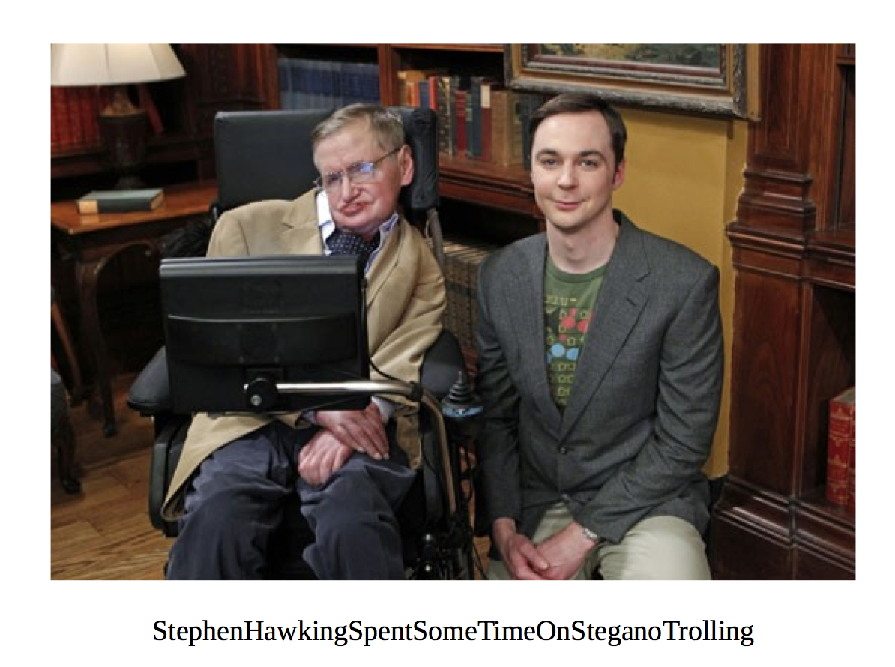

# Nuit du Hack Quals CTF 2015: Cooper

**Category:** Stegano
**Points:** 300
**Solves:** 29
**Description:** 

> "I am not crazy, my mother had me tested." (Sheldon)
> 
> What did Sheldon ... huh sorry, Dr. Cooper really mean?
> 
> [http://static.challs.nuitduhack.com/Cooper.tar.gz](Cooper.tar.gz)

## Write-up

by [polym](https://github.com/abpolym)

This writeup is based on [this writeup](http://ipushino.blogspot.de/2015/04/ndh-ctf-2015-cooper.html).

We extract the `tar.gz` file with `tar xvf Cooper.tar.gz` to get a `PE32` Executable named Cooper.exe.

Using `binwalk`, we see that it contains a PDF and some Zip archives:

```bash
+bash-4.3$ binwalk Cooper.exe  | grep -v 'Zlib'
DECIMAL       HEXADECIMAL     DESCRIPTION
--------------------------------------------------------------------------------
0             0x0             Microsoft portable executable
111           0x6F            PDF document, version: "1.5"
496128        0x79200         Zip archive data, at least v1.0 to extract, name: "Stegano-BMP-master/"
496186        0x7923A         Zip archive data, at least v1.0 to extract, compressed size: 187,  uncompressed size: 564, name: "Stegano-BMP-master/Makefile"
496439        0x79337         Zip archive data, at least v1.0 to extract, compressed size: 144,  uncompressed size: 238, name: "Stegano-BMP-master/README.md"
496650        0x7940A         Zip archive data, at least v1.0 to extract, compressed size: 310,  uncompressed size: 533, name: "Stegano-BMP-master/decrypt.cpp"
497029        0x79585         Zip archive data, at least v1.0 to extract, name: "Stegano-BMP-master/easybmp/"
497095        0x795C7         Zip archive data, at least v1.0 to extract, compressed size: 782,  uncompressed size: 1489, name: "Stegano-BMP-master/easybmp/BSD_(revised)_license.txt"
497968        0x79930         Zip archive data, at least v1.0 to extract, compressed size: 9338,  uncompressed size: 48149, name: "Stegano-BMP-master/easybmp/EasyBMP.cpp"
507383        0x7BDF7         Zip archive data, at least v1.0 to extract, compressed size: 840,  uncompressed size: 2418, name: "Stegano-BMP-master/easybmp/EasyBMP.h"
508298        0x7C18A         Zip archive data, at least v1.0 to extract, compressed size: 823,  uncompressed size: 2815, name: "Stegano-BMP-master/easybmp/EasyBMP_BMP.h"
509200        0x7C510         Zip archive data, at least v1.0 to extract, compressed size: 9396,  uncompressed size: 31370, name: "Stegano-BMP-master/easybmp/EasyBMP_ChangeLog.txt"
518683        0x7EA1B         Zip archive data, at least v1.0 to extract, compressed size: 973,  uncompressed size: 2708, name: "Stegano-BMP-master/easybmp/EasyBMP_DataStructures.h"
519746        0x7EE42         Zip archive data, at least v1.0 to extract, compressed size: 558,  uncompressed size: 1975, name: "Stegano-BMP-master/easybmp/EasyBMP_VariousBMPutilities.h"
520399        0x7F0CF         Zip archive data, at least v1.0 to extract, name: "Stegano-BMP-master/easybmp/sample/"
520472        0x7F118         Zip archive data, at least v1.0 to extract, compressed size: 180430,  uncompressed size: 308278, name: "Stegano-BMP-master/easybmp/sample/EasyBMPbackground.bmp"
700996        0xAB244         Zip archive data, at least v1.0 to extract, compressed size: 820,  uncompressed size: 2835, name: "Stegano-BMP-master/easybmp/sample/EasyBMPsample.cpp"
701906        0xAB5D2         Zip archive data, at least v1.0 to extract, compressed size: 5599,  uncompressed size: 113266, name: "Stegano-BMP-master/easybmp/sample/EasyBMPtext.bmp"
707593        0xACC09         Zip archive data, at least v1.0 to extract, compressed size: 707,  uncompressed size: 1807, name: "Stegano-BMP-master/easybmp/sample/makefile"
708381        0xACF1D         Zip archive data, at least v1.0 to extract, compressed size: 368,  uncompressed size: 768, name: "Stegano-BMP-master/encrypt.cpp"
708818        0xAD0D2         Zip archive data, at least v1.0 to extract, compressed size: 28,  uncompressed size: 28, name: "Stegano-BMP-master/main.cpp"
708912        0xAD130         Zip archive data, at least v1.0 to extract, compressed size: 937,  uncompressed size: 2705, name: "Stegano-BMP-master/stegano.cpp"
709918        0xAD51E         Zip archive data, at least v1.0 to extract, compressed size: 137,  uncompressed size: 196, name: "Stegano-BMP-master/stegano.h"
712075        0xADD8B         End of Zip archive, comment: "6e73434c01138685e9ade26e76724b13f9d9b663"
```

Let's extract those with `foremost`:

```bash
+bash-4.3$ foremost Cooper.exe 
Processing: Cooper.exe
|foundat=Stegano-BMP-master/UT
foundat=Stegano-BMP-master/MakefileUT
foundat=Stegano-BMP-master/README.mdUT
foundat=Stegano-BMP-master/decrypt.cppUT
foundat=Stegano-BMP-master/easybmp/UT
foundat=Stegano-BMP-master/easybmp/BSD_(revised)_license.txtUT
foundat=Stegano-BMP-master/easybmp/EasyBMP.cppUT
foundat=Stegano-BMP-master/easybmp/EasyBMP.hUT
foundat=Stegano-BMP-master/easybmp/EasyBMP_BMP.hUT
foundat=Stegano-BMP-master/easybmp/EasyBMP_ChangeLog.txtUT
foundat=Stegano-BMP-master/easybmp/EasyBMP_DataStructures.hUT
foundat=Stegano-BMP-master/easybmp/EasyBMP_VariousBMPutilities.hUT
foundat=Stegano-BMP-master/easybmp/sample/UT
foundat=Stegano-BMP-master/easybmp/sample/EasyBMPbackground.bmpUT
foundat=Stegano-BMP-master/easybmp/sample/EasyBMPsample.cppUT
foundat=Stegano-BMP-master/easybmp/sample/EasyBMPtext.bmpUT
foundat=Stegano-BMP-master/easybmp/sample/makefileUT
foundat=Stegano-BMP-master/encrypt.cppUT
foundat=Stegano-BMP-master/main.cppUT
foundat=Stegano-BMP-master/stegano.cppUT
foundat=Stegano-BMP-master/stegano.hUT
*|
```

Though `Stegano-BMP-master` sounds promising, using it's `decrypt.ccp` or `stegano.cpp` does not work here, especially because we do not have any bmp that can contain steganography information.

So we turn our heads to the PDF file, `output/pdf/00000000.pdf`.

When opening this PDF, we are asked to enter a password we don't have. So we use `pdfcrack` with a dictionary-attack (dictionary: rockyou.txt):

```bash
+bash-4.3$ pdfcrack -w ./rockyou.txt output/pdf/00000000.pdf

PDF version 1.5
Security Handler: Standard
V: 2
R: 3
P: -1028
Length: 128
Encrypted Metadata: True
FileID: 001b62552dee6ce9fdc2b442e9f0cc0b
U: fdaee14bbe641f80b7e43e2b1b29358700000000000000000000000000000000
O: d03d46c7c843771542245350273096ebf319e82bbeb82a3326e43a2ccfeaf2ff
found user-password: 'sheldon'
```

That was easy! Let's open the PDF:



The flag is `StephenHawkingSpentSomeTimeOnSteganoTrolling`.

## Other write-ups and resources

* <http://geeksspeak.github.io/blog/2015/04/06/ndh-ctf-2015-cooper-writeup/>
* <http://ipushino.blogspot.de/2015/04/ndh-ctf-2015-cooper.html>
