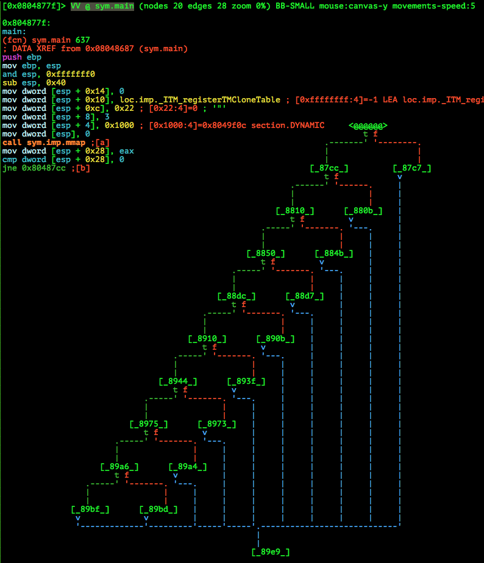
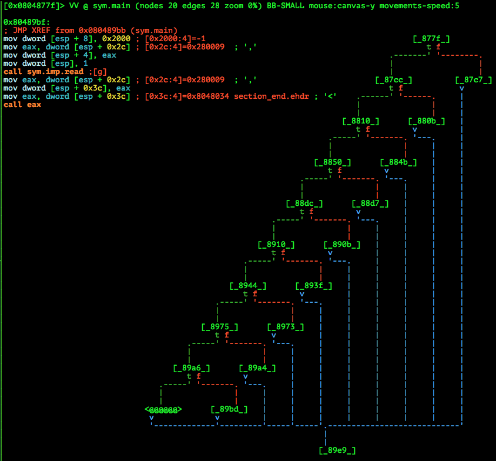
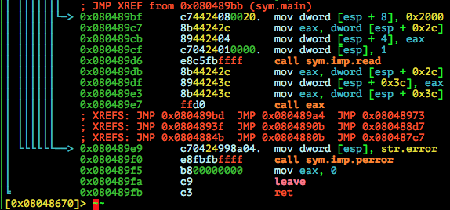
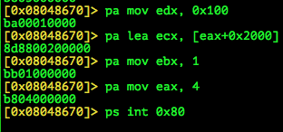
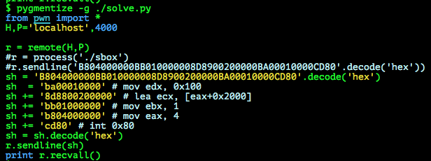

# nullcon HackIM 2015: Exploitation 200

**Category:** Exploitation
**Points:** 200
**Author:**
**Description:**

> 54.163.248.69:9001
>
>	[Binary](sbox.tar.gz)

## Write-up

by [polym](https://github.com/abpolym)

This writeup is based on following writeups:

* <http://www.pawpetersen.dk/nullcon-hackim-2015-exploitation-question-2/>
* <https://ctf-team.vulnhub.com/hackim-2015-exploit-200/> or <http://barrebas.github.io/blog/2015/01/11/hackim-ctf-sbox/>
* <http://v0ids3curity.blogspot.in/2015/01/hackim-ctf-2014-exploitation-2.html>

### Meta

Keywords:

* [seccomp](https://en.wikipedia.org/wiki/Seccomp) sandboxing
* Provide shellcode to program

We are given a non-stripped i386 32bit ELF for Linux:

```bash
$ file sbox
sbox: ELF 32-bit LSB  executable, Intel 80386, version 1 (SYSV), dynamically linked (uses shared libs), for GNU/Linux 2.6.24, BuildID[sha1]=4a1f7a461b8539b7e230cafbf628cf55d465c61e, not stripped
```

Running it the first time:

```bash
$ ./sbox
./sbox: error while loading shared libraries: libseccomp.so.2: cannot open shared object file: No such file or directory
```

I'm running the binary on an Ubuntu 14.04:

```bash
$ lsb_release -r
Release:        14.04
```

To install the needed library (for i386 architecture) for this challenge, we do the following:

```bash
$ sudo apt-get install libseccomp2:i386
Reading package lists... Done
Building dependency tree       
Reading state information... Done
The following NEW packages will be installed:
  libseccomp2:i386
0 upgraded, 1 newly installed, 0 to remove and 498 not upgraded.
Need to get 0 B/32,1 kB of archives.
After this operation, 101 kB of additional disk space will be used.
Selecting previously unselected package libseccomp2:i386.
(Reading database ... 188734 files and directories currently installed.)
Preparing to unpack .../libseccomp2_2.1.0+dfsg-1_i386.deb ...
Unpacking libseccomp2:i386 (2.1.0+dfsg-1) ...
Setting up libseccomp2:i386 (2.1.0+dfsg-1) ...
Processing triggers for libc-bin (2.19-0ubuntu6) ...
$ ./sbox
error: No such file or directory
$ echo 'd3sp3r4t3_sh3llc0d3' > flag.txt
$ ./sbox
hi
```

After providing a flag file, it seems we can provide input the binary - but nothing happens!

First, read what seccomp actually is, e.g. [here](https://en.wikipedia.org/wiki/Seccomp) to find out that it seems to be a sandbox to only allow certain system calls:

* `exit`
* `read`
* `write`
* `sigreturn`

If a syscall not listed above is called by the sandboxed process, it receives a `SIGKILL`.

Calling `strace` on our binary:

```bash
$ strace -s 256 -f ./sbox 2> /tmp/out 
hello
$ cat /tmp/out 
execve("./sbox", ["./sbox"], [/* 31 vars */]) = 0
[...]
mmap2(NULL, 4096, PROT_READ|PROT_WRITE, MAP_PRIVATE|MAP_ANONYMOUS, -1, 0) = 0xfffffffff7726000
mmap2(NULL, 8192, PROT_READ|PROT_WRITE|PROT_EXEC, MAP_PRIVATE|MAP_ANONYMOUS, -1, 0) = 0xfffffffff7724000
open("flag.txt", O_RDONLY)              = 3
read(3, "d3sp3r4t3_sh3llc0d3\n", 100)   = 20
close(3)                                = 0
rt_sigaction(SIGSEGV, {0x804876d, [SEGV], SA_RESTART}, {SIG_DFL, [], 0}, 8) = 0
rt_sigaction(SIGTRAP, {0x804876d, [TRAP], SA_RESTART}, {SIG_DFL, [], 0}, 8) = 0
rt_sigaction(SIGALRM, {0x804876d, [ALRM], SA_RESTART}, {SIG_DFL, [], 0}, 8) = 0
alarm(10)                               = 0
brk(0)                                  = 0x9156000
brk(0x9177000)                          = 0x9177000
prctl(PR_SET_NO_NEW_PRIVS, 0x1, 0, 0, 0) = 0
prctl(PR_SET_SECCOMP, 0x2, 0x9156048, 0, 0) = 0
read(1, "hello\n", 8192)                = 6
--- SIGSEGV {si_signo=SIGSEGV, si_code=SEGV_ACCERR, si_addr=0xf7726000} ---
exit_group(1)                           = ?
+++ exited with 1 +++
```

We notice:

* Our input is `read` with size `8192`
* We get a Segmentation Fault Signal `SIGSEGV`
* Some weird stuff is happening with `alarm` and `sigacton`. It seems after a timer of `10` seconds we get an `SIGALRM` (`man 2 alarm` or `man 2 rt_sigaction` to read about it)

Decompiling the binary with `radare2` with `r2 -A ./sbox`, we have a look at the `main` functon's graph using `VV @ sym.main` and zoom out (`-`) to see several branches:



The node with `@@@@@` here is  `main`'s entry point, which is currently looked at and thus displayed as assembly on the left side.

We see a `jne 0x80487cc` jump instruction that branches to either the node `_87cc_` if the result of `cmp` is `n`ot `e`qual `0` (and thus `t`rue/green) or otherwise to `_87c7_` (the `f`alse branch).

If we <kbd>TAB</kbd> our way to the bottom, we see the `read` call with something interesting:



Right after reading our input, a `call eax` is happening. If we look closely to the previous instructions, we notice:

* `read` stores our input into the content of the address stored at `esp + 0x2c`
* After `read`, the address of our input is stored again into `eax` with `mov eax, dword [esp + 0x2c]`
* Then the address, stored in `eax`, is moved to `esp+0x3c` with `mov dword [esp + 0x3c], eax`
* Then again the address of our input from `esp+0x3c` is stored into `eax`
* Finally, we `call eax`, essentially interpreting whatever is stored at the address as instructions and thus executing our input

That makes clear what the challenge authors wants us to do: Break out from the `seccomp` sandbox or leak information (e.g. our flag) using the allowed system calls.

We choose the easier solution (latter), which means we have to find out where our flag is stored!

Let's continue our static analysis with `radare2` - decompiling the function `main` with `pdf @ sym.main` to see the addresses:



Now, let's set a breakpoint with `gdb-peda` at `call eax` (addr: `0x080489e7`) and - since two `mmap` calls are also visible in the previous `strace` output - have a look at the memory:

```bash
gdb-peda$ vmmap 
Warning: not running or target is remote
Start      End        Perm      Name
0x08048550 0x08048a88 rx-p      /home/vbox/pwn/tasks/nullcon/exploit-2/sbox
0x08048154 0x08048ba0 r--p      /home/vbox/pwn/tasks/nullcon/exploit-2/sbox
0x08049f00 0x0804a050 rw-p      /home/vbox/pwn/tasks/nullcon/exploit-2/sbox
gdb-peda$ b *0x080489e7
Breakpoint 1 at 0x80489e7
gdb-peda$ r
Starting program: /home/vbox/pwn/tasks/nullcon/exploit-2/sbox 
AAAA
[----------------------------------registers-----------------------------------]
EAX: 0xf7fd6000 ("AAAA\n")
EBX: 0xf7fa8000 --> 0x1a9da8 
ECX: 0xf7fd6000 ("AAAA\n")
EDX: 0x2000 ('')
ESI: 0x0 
EDI: 0x0 
EBP: 0xffffd578 --> 0x0 
ESP: 0xffffd530 --> 0x1 
EIP: 0x80489e7 (<main+616>:     call   eax)
EFLAGS: 0x203 (CARRY parity adjust zero sign trap INTERRUPT direction overflow)
[-------------------------------------code-------------------------------------]
   0x80489db <main+604>:        mov    eax,DWORD PTR [esp+0x2c]
   0x80489df <main+608>:        mov    DWORD PTR [esp+0x3c],eax
   0x80489e3 <main+612>:        mov    eax,DWORD PTR [esp+0x3c]
=> 0x80489e7 <main+616>:        call   eax
   0x80489e9 <main+618>:        mov    DWORD PTR [esp],0x8048a99
   0x80489f0 <main+625>:        call   0x80485f0 <perror@plt>
   0x80489f5 <main+630>:        mov    eax,0x0
   0x80489fa <main+635>:        leave
No argument
[------------------------------------stack-------------------------------------]
0000| 0xffffd530 --> 0x1 
0004| 0xffffd534 --> 0xf7fd6000 ("AAAA\n")
0008| 0xffffd538 --> 0x2000 ('')
0012| 0xffffd53c --> 0x0 
0016| 0xffffd540 --> 0xffffffff 
0020| 0xffffd544 --> 0x0 
0024| 0xffffd548 --> 0x804a000 --> 0x8049f0c --> 0x1 
0028| 0xffffd54c --> 0x8048a52 (<__libc_csu_init+82>:   add    edi,0x1)
[------------------------------------------------------------------------------]
Legend: code, data, rodata, value

Breakpoint 1, 0x080489e7 in main ()
gdb-peda$ vmmap
Start      End        Perm      Name
0x08048000 0x08049000 r-xp      /home/vbox/pwn/tasks/nullcon/exploit-2/sbox
0x08049000 0x0804a000 r--p      /home/vbox/pwn/tasks/nullcon/exploit-2/sbox
0x0804a000 0x0804b000 rw-p      /home/vbox/pwn/tasks/nullcon/exploit-2/sbox
0x0804b000 0x0806c000 rw-p      [heap]
0xf7dfc000 0xf7dfe000 rw-p      mapped
0xf7dfe000 0xf7fa6000 r-xp      /lib/i386-linux-gnu/libc-2.19.so
0xf7fa6000 0xf7fa8000 r--p      /lib/i386-linux-gnu/libc-2.19.so
0xf7fa8000 0xf7fa9000 rw-p      /lib/i386-linux-gnu/libc-2.19.so
0xf7fa9000 0xf7fac000 rw-p      mapped
0xf7fac000 0xf7fb9000 r-xp      /usr/lib/i386-linux-gnu/libseccomp.so.2.1.0
0xf7fb9000 0xf7fbc000 r--p      /usr/lib/i386-linux-gnu/libseccomp.so.2.1.0
0xf7fbc000 0xf7fbd000 rw-p      /usr/lib/i386-linux-gnu/libseccomp.so.2.1.0
0xf7fd6000 0xf7fd8000 rwxp      mapped
0xf7fd8000 0xf7fdb000 rw-p      mapped
0xf7fdb000 0xf7fdc000 r-xp      [vdso]
0xf7fdc000 0xf7ffc000 r-xp      /lib/i386-linux-gnu/ld-2.19.so
0xf7ffc000 0xf7ffd000 r--p      /lib/i386-linux-gnu/ld-2.19.so
0xf7ffd000 0xf7ffe000 rw-p      /lib/i386-linux-gnu/ld-2.19.so
0xfffdd000 0xffffe000 rw-p      [stack]
gdb-peda$ x/s 0xf7fd6000
0xf7fd6000:     "AAAA\n"
gdb-peda$ x/s 0xf7fd8000
0xf7fd8000:     "d3sp3r4t3_sh3llc0d3\n"
```

We notice:

* `eax`, as predicted, points at our input
* There are two mapped regions after `libseccomp`'s memory sections
  * The first one with `rwxp` permissions, `0xf7fd6000` is in red (Don't know what that means yet) and displaying the content there (you can also use `x/20wx 0xf7fd6000`), we see our input
  * The second one with `rw-p` permissions, `0xf7fd8000` contains the flag

According to [this writeup](http://v0ids3curity.blogspot.in/2015/01/hackim-ctf-2014-exploitation-2.html) each `mmap`'ed region in current Linux ASLR is adjacent to each other, meaning that their addresses are adjacent.

This means we simply can `write` the content of this mapped region, even though we haven't leaked any addresses yet. We just have to `write` the content of our current address, stored in `eax`, plus the offset of our regions `0x2000` back to us!

We have to do the following to test this approach:

* Look up the `syscall` number from [this syscall table](http://docs.cs.up.ac.za/programming/asm/derick_tut/syscalls.html) - `4`
* Either look up the function signature [here](http://lxr.free-electrons.com/ident?i=sys_write) or just do [`man 2 write`](http://man7.org/linux/man-pages/man2/write.2.html)
* Look up the calling convention to know where the parameters are stores in x86-32/i386, e.g. [here](http://stackoverflow.com/questions/2535989/what-are-the-calling-conventions-for-unix-linux-system-calls-on-x86-64)
  * `eax` - syscall number (`4`)
  * `ebx` - first parameter, `fd` (`1`==[`stdout`](https://en.wikipedia.org/wiki/File_descriptor))
  * `ecx` - second parameter `buf` (`addr(ecx+0x2000)`, since `ecx` is equal `eax` when calling `eax` as seen in our `gdb-peda` output)
  * `edx` - third parameter `count` (`0x100` - write `256` bytes back to us)

Since this writeup is written after the CTF did end, we have to run the binary locally and bind it to a port.

This is done using `socat tcp-l:4000,reuseaddr,fork exec:"strace ./sbox"` as [this writeup](https://www.pawpetersen.dk/nullcon-hackim-2015-exploitation-question-2/) suggests.
To create the shellcode, we can either use `radare2`'s assemble function `pa`:



Note that `radare2` isn't perfect yet - e.g. as we can see it can't assemble `int 0x80`! (Or maybe I don't know how to use it :D)

Or we can use `nasm` to either print opcodes instruction by instruction as done in [this writeup](http://v0ids3curity.blogspot.in/2015/01/hackim-ctf-2014-exploitation-2.html) or provide an assembly source file to be translated into opcodes by `nasm` as done [in this writeup](http://barrebas.github.io/blog/2015/01/11/hackim-ctf-sbox/).

The last option is using `pwntools` [`shellcraft`](pwntools.readthedocs.org/en/latest/shellcraft/i386.html) module, tested and demonstrated [here](https://github.com/ctfs/write-ups-2015/tree/master/icectf-2015/binary-exploitation/what).

Let's run the exploit, shall we?

"Server side":

```bash
$ ls
flag.txt  sbox
$ socat tcp-l:4000,reuseaddr,fork exec:"strace ./sbox"

```

"Attacker side":

[This python script](./solve.py) does the job:



```bash
$ p solve.py 
[+] Opening connection to localhost on port 4000: Done
[+] Recieving all data: Done (256B)
[*] Closed connection to localhost port 4000
d3sp3r4t3_sh3llc0d3
\x00\x00\x00\x00\x00[...]
```

The flag is `d3sp3r4t3_sh3llc0d3`.

## Other write-ups and resources

* <http://www.pawpetersen.dk/nullcon-hackim-2015-exploitation-question-2/>
* <https://ctf-team.vulnhub.com/hackim-2015-exploit-200/> or <http://barrebas.github.io/blog/2015/01/11/hackim-ctf-sbox/>
* <http://v0ids3curity.blogspot.in/2015/01/hackim-ctf-2014-exploitation-2.html>
