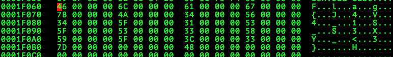

# OpenToAll CTF 2015: Capture The Bool

**Category:** Reverse
**Points:** 50
**Solves:** 112
**Author:** xenocidewiki
**Description:** 

> [CaptureTheBool.exe](CaptureTheBool.exe)

## Write-up

After finding nothing particular with `strings`, we open the file with a Hexeditor, `hexedit`, and look for something valuable.

We are lucky and find the flag by searching <kbd>/</kbd> for `{`:

The flag is `flag{J4V4_1S_S3XY_<3}`.

## Other write-ups and resources

* none yet