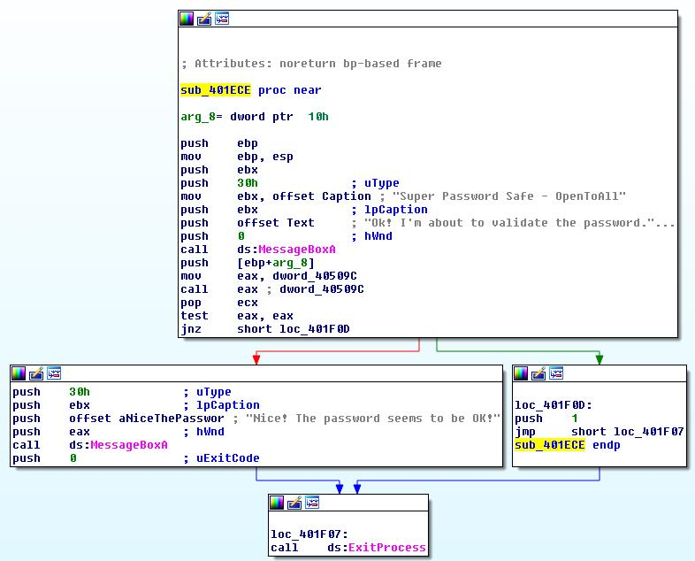

# OpenToAll CTF 2015: Static

**Category:** Reverse
**Points:** 550
**Solves:** 52
**Author:** Togusa
**Description:** 

> [http://public.givemesecurity.info/static.zip](static.zip)
> 
> NOTE: THIS FLAG DOES NOT FOLLOW THE NORMAL FLAG FORMAT ( flag{secret} )

## Write-up

We are given a Windows PE32 binary.

We open IDA and look for interesting strings.

We have a nice one : **.rdata:00404218 Nice! The password seems to
be OK!**

We find that the string is used in sub\_401ECE.

At *0x401EF2* we have the instruction `test eax, eax` which checks if eax is equal
to zero.
If `eax` equals zero the program opens a MessageBox to tell us that the
password is correct.

How to make `eax` equals to zero ?
`eax` contains the return value of the function called two instructions before.

`0x401EEF: call eax`

Just before we see a `mov eax, dword_40509C`. So we know that the interesting
function's address is at *0x40509C*.

Unfortunately when we look at *0x40509C*, we only see null bytes.

But it's not a problem since we can look at xrefs and find a `mov [0x40509C],
0x4015A8` instruction at *0x402802*.

Now, we know that the interesting function is sub\_4015A8, we look at it with
IDA and find that each byte of argv[1] is compared to a 14 chars buffer
**AfkYa3kApyA34h** xored with 14 bytes :
`0x71,0x16,0x58,0x37,0x4C,0x47,0x5B,0x1E,0x11,0x15,0x0D,0x6C,0x6B,0x37`.

It it matches, the function returns 0.

The flag is `0p3n-t0_alL___`

## Other write-ups and resources

* none yet
