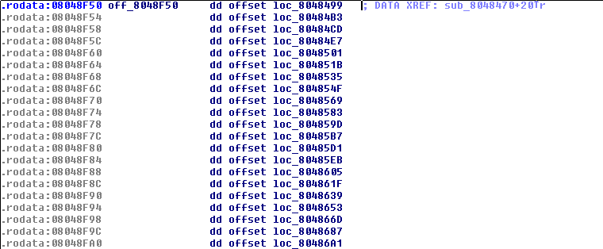

# OpenToAll CTF 2015: Switchy

**Category:** Reverse
**Points:** 150
**Solves:** 57
**Author:** gaffe
**Description:**

> [639c6e1ff3e75935601984458f5309f4.tar.bz2](639c6e1ff3e75935601984458f5309f4.tar.bz2)

## Write-up

Opening the binary in IDA, we can see 3 particular parts in the `main` function:

* The red one which is the prologue. Basically it saves the frame pointer, changes the stack pointer and allocates some space for the function.
* The green one which is in fact doing the same thing as the blue part but in a different way.
* The blue one whose pattern is then repeated about 30 times with different values.


Let’s focus on what the green block is doing. Here I highlighted the parts which are changing each time the pattern is repeated:


While second and third ones are just saving values which are never reused, the first one is a lot more interesting since it moves to `ecx` some data which is then moved on the stack on the next instruction. We’ll come back in these data later.

We can see that a function, `sub_8048470` is then called and probably taking as argument the datas previously moved on the stack.

The remaining instructions of the block is just printing the result of the previously called function as a character on stdout and then flush stdout. The blue block is as a result equivalent to the following C code.

```c
printf("%c", sub_8048470(dword_804B058));
fflush(stdout);
```

Now let's take a look at the **sub_8048470** function:


The first block is basically just saving the argument in `var_10` and jumping on `loc_80486BB` if the argument was above `0x14` (which is never the case we’ll see that later). Grey parts are useless since it just save values that are never reused. Since the jump is never triggered, the next instructions are:


This block is jumping on an offset from the offset array `off_8048F50` using `var_10 * 4` as index.

Here is the offset array:



All the offsets in `off_8048F50` lead us to the same pattern:


This is basically xoring two values and returning the result. A quick look on the values in the different blocks shows us that only the first values are always ASCII values. By the way, these ASCII values are:

```python
"o gpcuabefihjmlnstw{}"
```

Since we can make `flag{...}` with all these letters, let’s extract them in the same order the program does with a simple IDA Python script.

```python
from idaapi import get_byte, get_long

# Bytes offsets used as index in main function
b = [0x804B050, 0x804B058, 0x804B060, 0x804B068, 0x804B070, 0x804B078,
     0x804B080, 0x804B088, 0x804B090, 0x804B098, 0x804B0A0, 0x804B0A8,
     0x804B0B0, 0x804B0B8, 0x804B0C0, 0x804B0C8, 0x804B0D0, 0x804B0D8,
     0x804B168, 0x804B0E4, 0x804B16C, 0x804B0F0, 0x804B0F8, 0x804B170,
     0x804B104, 0x804B174, 0x804B110, 0x804B118, 0x804B178, 0x804B124,
     0x804B12C, 0x804B134, 0x804B13C, 0x804B144]
# Blocks offsets used to xor values
o = [0x8048499, 0x80484B3, 0x80484CD, 0x80484E7, 0x8048501, 0x804851B,
     0x8048535, 0x804854F, 0x8048569, 0x8048583, 0x804859D, 0x80485B7,
     0x80485D1, 0x80485EB, 0x8048605, 0x804861F, 0x8048639, 0x8048653,
     0x804866D, 0x8048687, 0x80486A1]

# Get index values
b = [get_long(x) for x in b]
b = [x if x != 4294967295 else 0 for x in b] # Patch BSS datas values
# Get bytes
o = [get_long(x + 3) for x in o]
# Get corresponding bytes
f = [get_byte(o[x]) for x in b]
# Convert to char
f = [chr(x) for x in f]
# Print result
print("".join(f))
```

This way, we get the flag `flag{switch jump pogo pogo bounce}`.

## Other write-ups and resources

* [Original source and writeup](https://github.com/gaffe23/gaffe-ota2/tree/master/switchy)
* <https://0x44696f21.wordpress.com/2015/03/11/switchy-opentoall-ctf-2015/>
