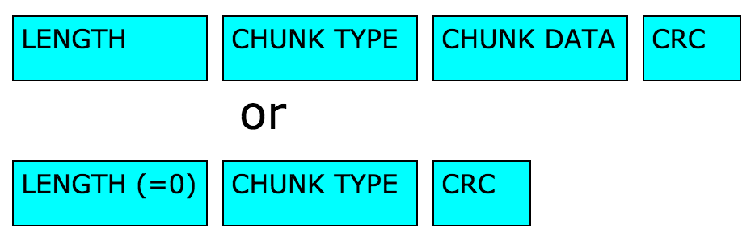
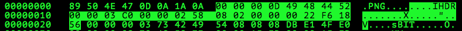
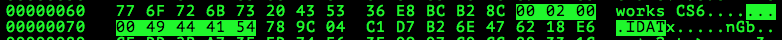
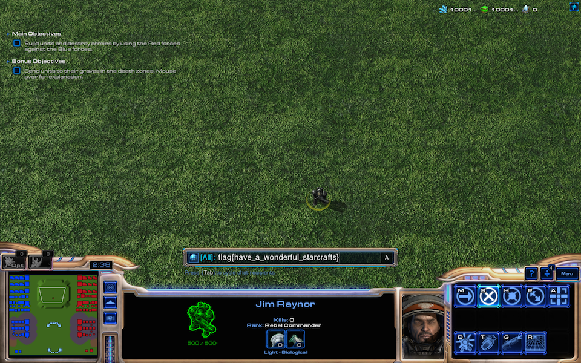

# PlaidCTF CTF 2015: PNG Uncorrupt

**Category:** Forensics
**Points:** 150
**Solves:** 115
**Description:**

> We received this [PNG file](http://play.plaidctf.com/files/corrupt_735acee15fa4f3be8ecd0c6bcf294fd4.png), but we're a bit concerned the transmission may have not quite been perfect.
>
>
> Team	Points	Submission
> SpamAndHex	156	2 days ago
> BU	153	2 days ago
> 0xffa	151	2 days ago

## Write-up

We are given a corrupted PNG and check it's state using `pngcheck`:

```bash
$ pngcheck -v corrupt_735acee15fa4f3be8ecd0c6bcf294fd4.png
File: corrupt_735acee15fa4f3be8ecd0c6bcf294fd4.png (1188435 bytes)
  File is CORRUPTED.  It seems to have suffered DOS->Unix conversion.
ERRORS DETECTED in corrupt_735acee15fa4f3be8ecd0c6bcf294fd4.png
```

Comparing the first 8 bytes of the corrupted PNG with the PNG signature in the [PNG specification](http://www.w3.org/TR/PNG/#5PNG-file-signature), we see a difference:

```bash
$ xxd -l8 corrupt_735acee15fa4f3be8ecd0c6bcf294fd4.png
0000000: 8950 4e47 0a1a 0a00                      .PNG....
```

The correct signature should be `8950 4e47 0d0a 1a0a`:

```bash
$ xxd -l8 fixed.png
0000000: 8950 4e47 0d0a 1a0a                      .PNG....
```

After fixing the signature, we still have a corrupt PNG:

```bash
$ pngcheck -v corrupt.v2.png
File: corrupt.v2.png (1188436 bytes)
  chunk IHDR at offset 0x0000c, length 13
    960 x 600 image, 24-bit RGB, non-interlaced
  chunk sBIT at offset 0x00025, length 3
    red = 8 = 0x08, green = 8 = 0x08, blue = 8 = 0x08
  chunk pHYs at offset 0x00034, length 9: 5629x5629 pixels/meter (143 dpi)
  chunk tEXt at offset 0x00049, length 28, keyword: Software
  chunk IDAT at offset 0x00071, length 131072
    zlib: deflated, 32K window, default compression
  CRC error in chunk IDAT (computed f0271404, expected 5a745d00)
ERRORS DETECTED in corrupt.v2.png
```

After the PNG signature, chunks containing specific meta information or pixel data follow. Each chunk follows this format:



An example is the `IHDR` chunk, which [comes right after](http://www.w3.org/TR/PNG/#5ChunkOrdering) the PNG signature:



First, we see the length of the `IHDR` chunk _data_, `0000000D = 13`, then comes the chunk type `IHDR`, then `13` bytes of [`IHDR` chunk data](http://www.w3.org/TR/PNG/#11IHDR) and finally `22F61856` - the [32 bit CRC](http://www.w3.org/TR/PNG/#5CRC-algorithm), which is essentially the same as the ZIP file CRC algorithm.

Following the `IHDR` chunk, we see the chunk types `sBIT`, `pHYs` and `tEXt`, which all do have valid CRCs and lengths.

However, the length of each `IDAT` chunk does not match with the actual length of the corresponding `IDAT` chunk data:




This results in incorrect CRCs as seen in the previous `pngcheck` output, since the offsets don't match.

Fixing the lengths of each `IDAT` chunk does not result in a correct PNG, so we assume that bytes are missing.
Since the first byte missing looked like a newline conversion from DOS `0x0D 0x0A == \r\n` to Unix `0x0A == \n`, this conversion might have happened elsewhere, too.

I wrote a [python program](fixpng.py) that bruteforces the correct placements of such `0x0D` bytes, by checking the length and CRC of each `IDAT` chunk

* If the length is correct and the CRC is incorrect, it replaces the incorrect CRC.
* If the length is incorrect and off by n bytes, it
	* Prepends `0x0D` bytes in front of each nth combination of `0x0A` occurrences in the chunk data
	* Calculates the CRC and compares it with the given CRC

The python program takes about 2m40s and gives us the flag in return:



```bash
$ time python fixpng.py corrupt_735acee15fa4f3be8ecd0c6bcf294fd4.png fixed.png
f55a745d
06e15ebf
a0bdc18a
adefb326
09c557f7
0848d2c4
295c44c9
a4afc965
2fad0fb3
7ec18f9e

real    2m38.393s
user    2m34.817s
sys     0m3.550s
```

The flag is `flag{have_a_wonderful_starcrafts}`.

## Other write-ups and resources

* <http://z1h4wk.tumblr.com/post/116828562808/ctf-plaidctf2015-forensic150>
* <https://nebelwelt.net/blog/plaid-pnguncorrupt.html>
* <http://www.securifera.com/blog/2015/04/23/plaidctf-2015-png-uncorrupt/>
* <https://mattscodecave.com/posts/plaidctf-2015---corrupt-png>
* <https://13c5.wordpress.com/2015/04/20/plaidctf-2015-png-uncorrupt/>
* <https://towerofhanoi.github.io/plaidctf2015/forensics/PNG_Uncorrupt/>
