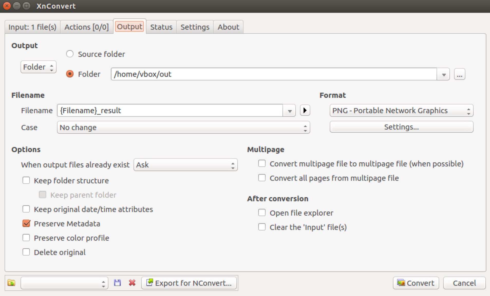
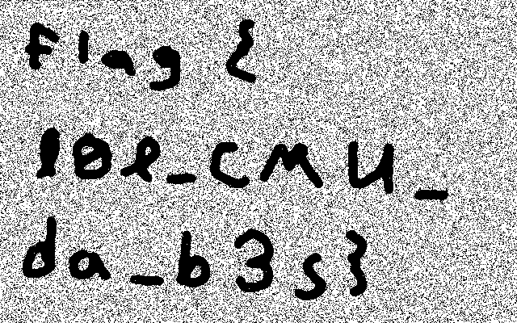

# PlaidCTF CTF 2015: Unknown

**Category:** Forensics
**Points:** 30
**Solves:** 290
**Description:**

> We recovered [this](http://play.plaidctf.com/files/unknown_2348c21020c876be4ae7d9eb19f8500a) file from a nearby computer. Maybe you can tell us what it means?
> 
> 
> Team	Points	Submission
> monads	31	a day ago
> LSE	30	a day ago
> Delusions of Grandeur	30	a day ago

## Write-up

by [polym](https://github.com/abpolym)

We are given a file that contains formatted data:

```bash
$ cat unknown_2348c21020c876be4ae7d9eb19f8500a
\begindata{raster,1}
2 0 65536 65536 0 0 640 400
bits 1 640 400
5a5c0b2f620b86f56c220475ab06266540dc7a04d980a3111a8008526d2a828130g!08422580010240a01441h084124010861700212g018022208dg07g0401c00bg0e4032089232g80g82 |
4534gc6458010g0108200881g89a008g45111201c84003400480gb0308e80480520123422b0020408b180a403g!49g483802c3010c284248g145002118087g08g02040848g10080d6508 |
[...]
02hc286h9301e008hc850090282g8240g36a0281c02a010g4080!02424d013023g0851c2g04019bga19a42052010g24441004gf410048022h84805003gd50431h40a052 |
30214a30019092201c10840790g351282043482108045g26h8a1b1c104448501052!400c4c9002030c20b0a0c091040998g0cg1cc428g0803044044a00cc3318720g02g3002c0g240208 |
400819e6!800524!804480041820244104020b0380242606i32800cg80c00a8641a080bc6020c504g044821026501880c5ag0bg02gae230a1280g084c48902460g01031802g25h |
\enddata{raster, 1}
```

Searching for `begindata raster`, we find that this file is [ATK raster image data](http://www.fileformat.info/format/cmu/spec/c4cfb8404a304ea687b344485c445eb2/view.htm), which is known as `Andrew Formats` or `CMU Bitmaps` as explained [here](http://www.fileformat.info/format/cmu/egff.htm).

Searching for `convert atk to png` or `convert atk to bmp` leads us to [this tool](http://www.xnview.com/de/xnconvert/), which we install on a virtual machine.

Now we can convert the data from the `.atk` or `.cmu` format to `.png`:



Afterwards, we get the flag in an image:



The flag is `flag{l0l_CMU_da_b3s}`.

## Other write-ups and resources

* [PlaidCTF CTF 2015: Unknown](http://ipushino.blogspot.de/2015/04/plaidctf-ctf-2015-unknown.html)
