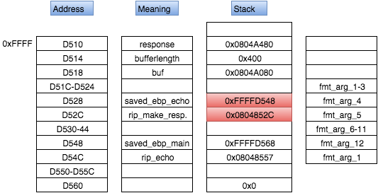

# PlaidCTF CTF 2015: EBP

**Category:** Pwnable
**Points:** 160
**Solves:** 157
**Description:**

> nc 52.6.64.173 4545 
> 
> Download: [%p%o%o%p](ebp_a96f7231ab81e1b0d7fe24d660def25a.elf).
> 
> 

## Write-up

by [ezliang](https://github.com/ezliang) and [polym](https://github.com/abpolym)

Completed --> [ebp.md](ebp.md)

### Additional Information to ebp.md

Through reversing the decompiled assembler code, a rough representation of the control flow of this program can be made through [this C pseudocode snippet](./pcode.c).

A stack representation right before the `snprintf` call instruction is the following graph, made with [draw.io](https://www.draw.io/):

The ultimative goal is to change the red sections, especially the `rip` of `make_response`.

This can be done in three steps:

* Leak a stack address - in this case the stack address `0xFFFFD548` that points to the saved/old ebp address of `echo` in `0xFFFFD568`:
  * Done using format string `%4$p` - 4 is the Format Argument Number (`fmt_arg_4` - Terminology might be wrong here, plz fix). Prints the fourth address (after `buf`) by `snprintf`
* Create a reference to `rip` of `make_response` for a later change
  * Done using second format string `%.<bytestoprint>u%4$hn`. Here, `snprintf` looks changed the last 2 bytes of the content in address `0xFFFFD548` from `0xFFFFD568` to `0xFFFFD52C`, which now references to `make_response`'s `rip`.
* Redirect the address of `make_response`'s `rip` from `0x0804852C` to `buf`'s address `0x0804A080`.
  * Done using third format string `%.<bytestoprint>u%12$hn`

Since the third format string contains the shellcode, the effect of adding the shellcode has to be removed by subtraction - see [this better documented solution](solve,py).

## Other write-ups and resources

* [https://ctf-team.vulnhub.com/plaidctf-2015-ebp/](https://ctf-team.vulnhub.com/plaidctf-2015-ebp/)
* <http://geeksspeak.github.io/blog/2015/04/20/plaidctf-ctf-2015-ebp-writeup/>
* <https://github.com/smokeleeteveryday/CTF_WRITEUPS/tree/master/2015/PCTF/pwnable/ebp>
* [Korean](http://blackcon.tistory.com/119)
* <http://pastebin.com/UHXYAMt2>
