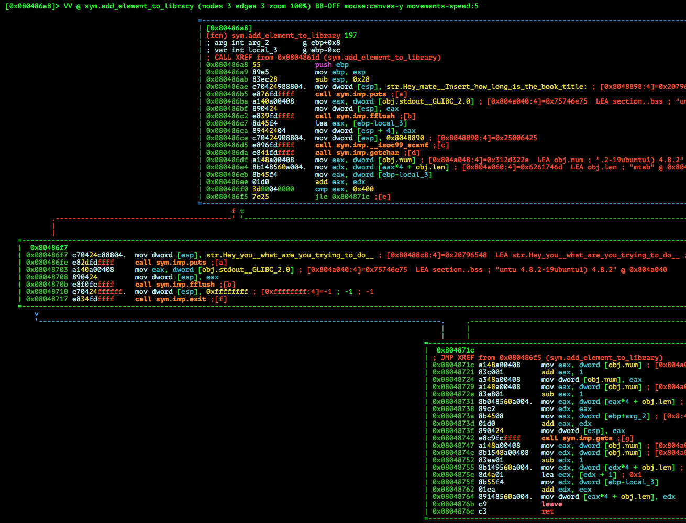
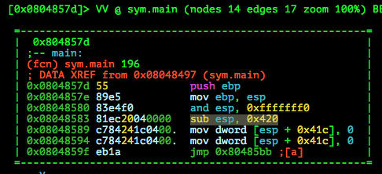
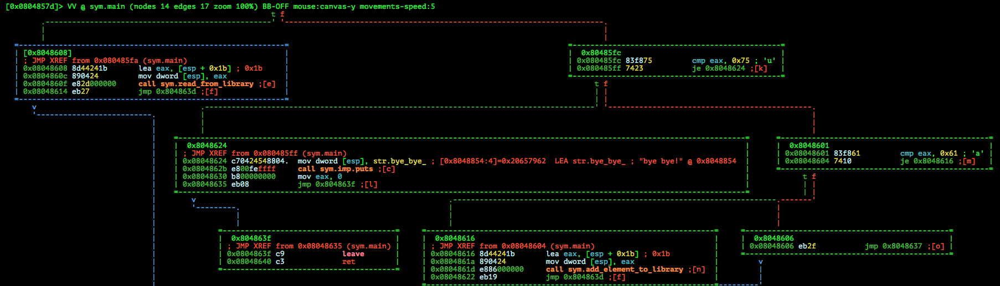

# PoliCTF 2015: John's Library

**Category:** Pwnable
**Points:** 150
**Solves:** 86
**Description:**

> Do you like reading books? here we have the best collection ever! you can even save some books for future reading!! enjoy noob!
> library.polictf.it:80

>> GPG key: yowlijOshSuftEvawvIshgugdecWikBi

> [johns-library](johns-library_141fd0852dd13d3c5c3a08330cf24886.tar.gz.gpg)

## Write-up

This writeup is based on following writeups:

* <https://ctf-team.vulnhub.com/polictf-2015-johns-library/> (Common understanding)
* <https://github.com/thebarbershopper/ctf-writeups/tree/master/polictf-2015/johns-library> (Common + Detailed understanding + Cool exploit)
* <http://www.bannsecurity.com/index.php/home/10-ctf-writeups/11-polictf-2015-john-s-library> (Detailed understanding)
* <http://blog.morganz.me/blog/2015/07/15/polictf-2015-pwnable150-johns-library-writeup/> (IDA decompiled source + Stack graph explanation)

### Meta

Keywords:

* Stack Buffer Overflow `sbo`
* Integer Underflow `iu`

We are given GPG encrypted data that we decrypt using the GPG key provided in the description:

```bash
$ file johns-library_141fd0852dd13d3c5c3a08330cf24886.tar.gz.gpg 
johns-library_141fd0852dd13d3c5c3a08330cf24886.tar.gz.gpg: GPG symmetrically encrypted data (AES256 cipher)
$ gpg -o ./johns-library_141fd0852dd13d3c5c3a08330cf24886.tar.gz -d ./johns-library_141fd0852dd13d3c5c3a08330cf24886.tar.gz.gpg 
gpg: AES256 encrypted data
gpg: gpg-agent is not available in this session
Enter passphrase: <yowlijOshSuftEvawvIshgugdecWikBi>
gpg: encrypted with 1 passphrase
$ file johns-library_141fd0852dd13d3c5c3a08330cf24886.tar.gz
johns-library_141fd0852dd13d3c5c3a08330cf24886.tar.gz: gzip compressed data, from Unix, last modified: Thu Jun 18 00:09:08 2015
$ tar xvf johns-library_141fd0852dd13d3c5c3a08330cf24886.tar.gz 
johns-library/
johns-library/johns-library
$ cd johns-library/
$ file johns-library 
johns-library: ELF 32-bit LSB  executable, Intel 80386, version 1 (SYSV), dynamically linked (uses shared libs), for GNU/Linux 2.6.24, BuildID[sha1]=be781865612b01299b9ca38fdb0444b9c2f16c62, not stripped
```

We are given a i386 32bit non-stripped ELF for Linux.

Running it:

```bash
$ ./johns-library 
Welcome to the jungle library mate! Try to escape!!
 
 r - read from library
 a - add element
 u - exit
a
Hey mate! Insert how long is the book title: 
5
hello
 
 r - read from library
 a - add element
 u - exit
r
Insert the index of the book you want to read: 0
hello 
 r - read from library
 a - add element
 u - exit
r
Insert the index of the book you want to read: 1
 
 r - read from library
 a - add element
 u - exit
u
bye bye!
```

We can `a`dd book titles providing a length and title and `r`ead them later using the book index. If we don't want to use the service anymore, we can exit it with `u`.

Let's have a look at `checksec`:

```bash
gdb-peda$ checksec 
CANARY    : disabled
FORTIFY   : disabled
NX        : disabled
PIE       : disabled
RELRO     : Partial
```

Only partial RELRO and everything else is turned off. A Stack Buffer Overflow or Format String is most likely our target vulnerability.

Let's have a look at functions and objects in our binary using `radare2`:

```bash
$ r2 ./johns-library 
 -- Run your own r2 scripts in awk using the r2awk program.
[0x08048480]> is | sort -k1 | column -t
45                symbols
[Symbols]
vaddr=0x080483bc  paddr=0x000003bc  ord=078  fwd=NONE  sz=0    bind=GLOBAL   type=FUNC    name=_init
vaddr=0x080483f0  paddr=0x000003f0  ord=001  fwd=NONE  sz=16   bind=GLOBAL   type=FUNC    name=imp.printf
[...]
vaddr=0x08048550  paddr=0x00000550  ord=034  fwd=NONE  sz=0    bind=LOCAL    type=FUNC    name=frame_dummy
vaddr=0x0804857d  paddr=0x0000057d  ord=073  fwd=NONE  sz=196  bind=GLOBAL   type=FUNC    name=main
vaddr=0x08048641  paddr=0x00000641  ord=054  fwd=NONE  sz=103  bind=GLOBAL   type=FUNC    name=read_from_library
vaddr=0x080486a8  paddr=0x000006a8  ord=058  fwd=NONE  sz=197  bind=GLOBAL   type=FUNC    name=add_element_to_library
vaddr=0x0804876d  paddr=0x0000076d  ord=066  fwd=NONE  sz=33   bind=GLOBAL   type=FUNC    name=print_menu
vaddr=0x08048790  paddr=0x00000790  ord=067  fwd=NONE  sz=97   bind=GLOBAL   type=FUNC    name=__libc_csu_init
[...]
vaddr=0x0804a038  paddr=0x00001038  ord=072  fwd=NONE  sz=0    bind=GLOBAL   type=NOTYPE  name=__bss_start
vaddr=0x0804a038  paddr=0x00001038  ord=076  fwd=NONE  sz=0    bind=GLOBAL   type=OBJECT  name=__TMC_END__
vaddr=0x0804a040  paddr=0x00001040  ord=071  fwd=NONE  sz=4    bind=GLOBAL   type=OBJECT  name=stdout@@GLIBC_2.0
vaddr=0x0804a044  paddr=0x00001044  ord=032  fwd=NONE  sz=1    bind=LOCAL    type=OBJECT  name=completed.6590
vaddr=0x0804a048  paddr=0x00001048  ord=046  fwd=NONE  sz=4    bind=GLOBAL   type=OBJECT  name=num
vaddr=0x0804a060  paddr=0x00001060  ord=047  fwd=NONE  sz=512  bind=GLOBAL   type=OBJECT  name=len
vaddr=0x0804a260  paddr=0x0804a260  ord=068  fwd=NONE  sz=0    bind=GLOBAL   type=NOTYPE  name=_end
```

We see the following:

* Four functions have been implemented for the binary: `main`, `read_from_library`, `add_element_to_library` and `print_menu`
* Two global BSS objects stand out: `num` with size `4` and `len` with size `512`. The latter seems to be an array of some sort, looking at its size.

After looking at the graphs of each function with `radare2` (e.g. `VV @ sym.main`), we notice a `gets` call in `add_element_to_library`:



By reversing it reading the assembly, setting breakpoints with `gdb` and analysing e.g. by `gdb-peda` guessed arguments or even looking at [decompiled pseudo-C source code](http://blog.morganz.me/blog/2015/07/15/polictf-2015-pwnable150-johns-library-writeup/) (generated by e.g. IDA), you'll see that both functions called in `main` - `read_from_library` and `add_element_to_library` get a pointer to the stack (`esp + 0x1b`) as first and only argument - the stack frame space is reserved in the beginning of main with `sub esp, 0x420`:






After more reversing, you'll notice the following in `add_element_to_library`:

* `num` contains the number of books already added
* `len` is a global array of integers containing the lengths of each book
* The first line of our input is read using `scanf("%d", input)` and saved later into `len`
* Using the buffer passed from main as an argument for this function, `gets` stores the second line of our input into the buffer address plus the given length
* A check if our input length is greater than `1024` is done before the `gets()` call:
```bash
Hey mate! Insert how long is the book title: 
1024
hi
 
 r - read from library
 a - add element
 u - exit
a
Hey mate! Insert how long is the book title: 
1025
Hey you! what are you trying to do??
```
* However, as seen in the decompiled pseudo code or at looking the kind of jump instruction , [`jle`](http://www.mathemainzel.info/files/x86asmref.html#jle), the check is only done for positive numbers. Thus, we can insert negative numbers and thus cause an Integer Underflow `iu` - thus being able to control `EIP`.

For a better visualization, have a look at the stack graph in [this writeup](http://blog.morganz.me/blog/2015/07/15/polictf-2015-pwnable150-johns-library-writeup/).

## Other write-ups and resources

* <https://www.whitehatters.academy/polictf-2015-pwnable-johns-library/>
* <https://ctf-team.vulnhub.com/polictf-2015-johns-library/>
* <https://github.com/thebarbershopper/ctf-writeups/tree/master/polictf-2015/johns-library>
* <http://www.bannsecurity.com/index.php/home/10-ctf-writeups/11-polictf-2015-john-s-library>
* <http://blog.morganz.me/blog/2015/07/15/polictf-2015-pwnable150-johns-library-writeup/>
* <https://bamboofox.torchpad.com/Write-ups/PoliCTF/johns-library>
* <https://gist.github.com/hhc0null/9de4301e197e8ed06259#file-johns_library_exploit-py>
