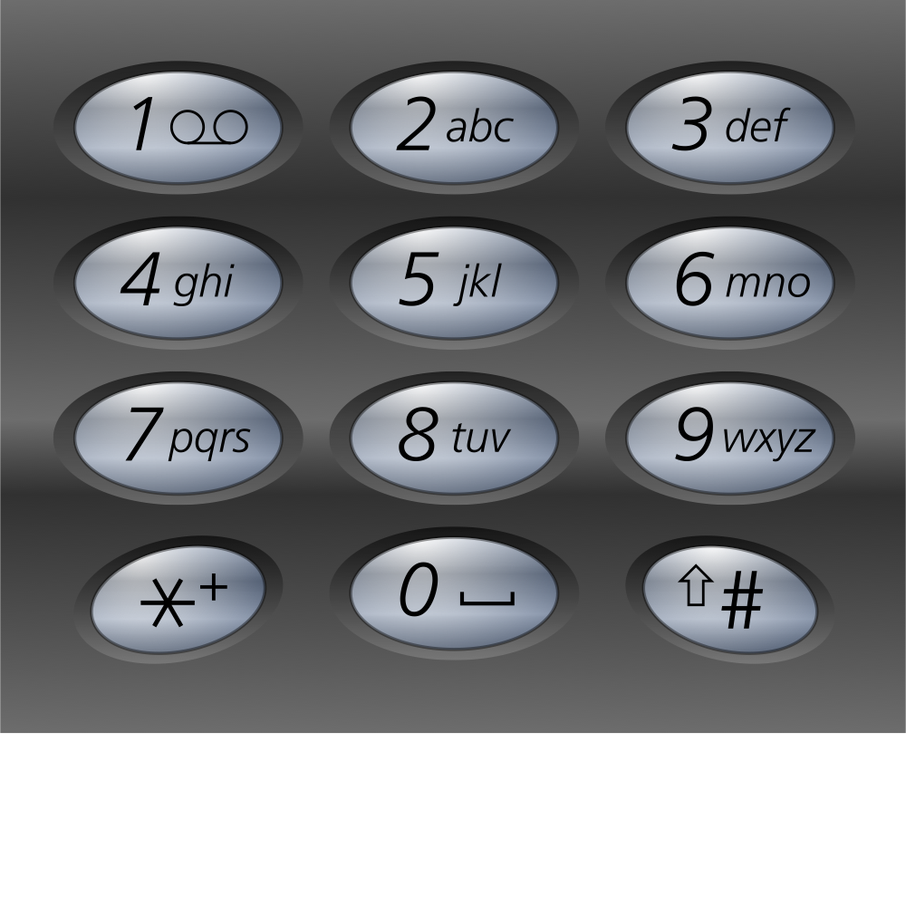
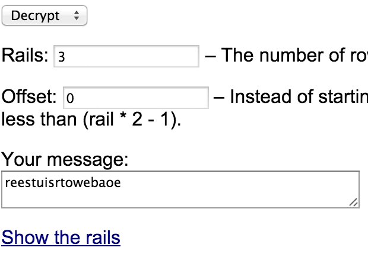
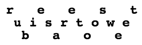
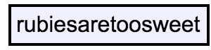

# Pragyan CTF 2015: Rubies on Rails

**Category:** Cryptography
**Points:** 50
**Solves** 18
**Description:**

> [crypted.txt](crypted.txt)

## Write-up

The ciphertext is encrypted using the [telephone keypad](http://en.wikipedia.org/wiki/Telephone_keypad):



We decrypt this using [this code](https://github.com/YASME-Tim/crypto-tools/tree/master/handycode):

```bash
$ python handycode.py "$(cat crypted.txt)"
reestuisrtowebaoe
```

The title of this challenge, `Rubies on Rails`, hints that the railfence cipher is used. We can decrypt the ciphertext using an [online tool](http://rumkin.com/tools/cipher/railfence.php):







The flag is `rubiesaretoosweet`.

Thanks to the [Hexpresso CTF team](https://hexpresso.wordpress.com/)!

## Other write-ups and resources

* none yet
