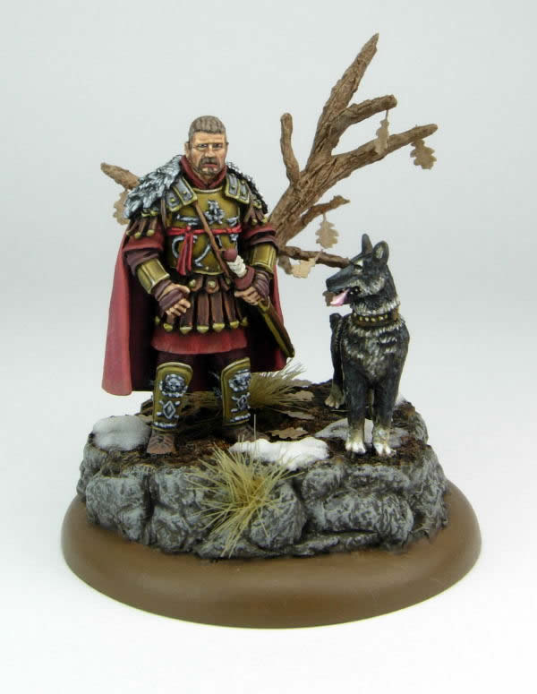
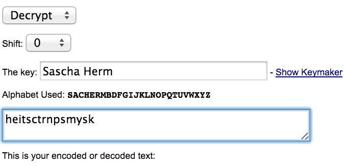
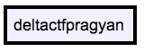

# Pragyan CTF 2015: Access Code

**Category:** Forensics
**Points:** 30
**Solves** 28
**Description:**

> Find the access code
>
> [painter.pdf](painter.pdf)

## Write-up

When opening the PDF, we see a censored image of a painting and an "encrypted code" and are told that the "KEYED" painter has the access code to this picture.

The encrypted code is `heitsctrnpsmysk` and we can extract the thumbnail of the picture using any carving tool, e.g `foremost` or `scalpel`:

After that, we see that the painter's name is [Sascha Herm](http://www.sascha-herm.com/Warlord_Games.htm) and that the picture is of `General Maximus`, a Roman general.

This implies that we have to search for a cipher to decrypt the encrypted code and detect the ["keyed" CAESAR cipher](http://rumkin.com/tools/cipher/caesar-keyed.php).

We decrypt the ciphertext using the painter's name as the key and get the flag:

Thanks to [@bbuerhaus](https://twitter.com/bbuerhaus) for the solution!

## Other write-ups and resources

* none yet
