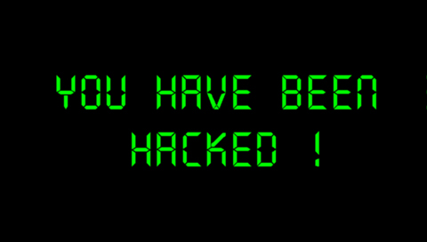

# Pragyan CTF 2015: Don't Stop

**Category:** Steganography
**Points:** 5
**Solves** 98
**Description:**

> Keep looking
>
> [Proxy.jpg](Proxy.jpg)

## Write-up

We are given a picture:



The first thing we do is `strings -a Proxy.jpg`:

```bash
$ strings -a Proxy.jpg
Ducky
Adobe
57RCv9
[...]
1Z5;"A
kjiFF
16bbee7466db38dad50701223d57ace8
```

There is a md5 hash sum `16bbee7466db38dad50701223d57ace8`, which also is the flag.

## Other write-ups and resources

* none yet
