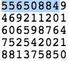
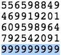

# Pragyan CTF 2015: Something is different

**Category:** Steganography
**Points:** 100
**Solves** 26
**Description:**

> Hint! just look at the difference
>
> [modified.png](modified.png)

## Write-up

We are given a picture of pi and the first `20590` decimal places.

Using an [online OCR tool](http://www.free-ocr.com/), we get the textual representation of this picture.

We notice on the one hand that some digits are different and on the other hand that the replaced digits form a triangle:

vs

The flag is `triangle`.

## Other write-ups and resources

* none yet
