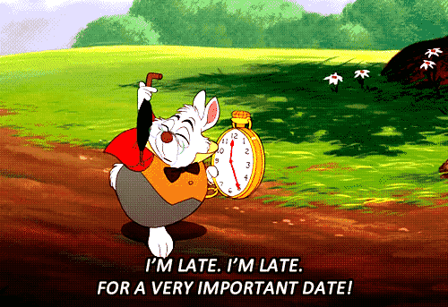

# Coney

**Category:** Crypto
**Points:** 60
**Author:** 
**Description:**

>

##Solution

Due to the name of the problem, the most logical thing to do was simply Google ```Graphics Interchange Format``` which would lead the user to the wikipedia page [GIF](http://en.wikipedia.org/wiki/GIF). After reading a bit one would notice the header (```47 49 46 38 37 61```) and the terminating (```3B```) hex of a standart GIF. After consulting a trusty hex editor it was noticed that while the header was correct, the terminating hexadecimal was not.

Due to the incorrect terminating hexadecimal one would assume that the file was merged with something else. After utilising wikipedia's page on [List of file signatures](http://en.wikipedia.org/wiki/List_of_file_signatures) and comparing possible files that could have merged, it was found a compressed file was is the cause.

Simply opening the file using WinZip, Winrar, or 7-Zip prompted a file name ```x```. The file contained:

>U2FsdGVkX1/seMYknjQGW971EboRgFcx+jfczzdSrWMjt1xwRrPnQBbEsz+Mt7dA4xxsOVB88e8VGl70

After some research on possible ciphers utilising the gif's content as reference, the user would've stumble upon the [Rabbit Cipher](http://en.wikipedia.org/wiki/Rabbit_%28cipher%29). Utilising a online rabid decipher and the key ```rabbit``` as guessed through the content of the image, the following was retrieved:

>The key is who_knew_there_is_a_rabbit_cipher


##Flag

>who_knew_there_is_a_rabbit_cipher

## Other write-ups and resources
