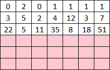

# Q.E.S.

**Category:** Crypto
**Points:** 80
**Author:** 
**Description:**

>

## Writeup

Cryptic problem time! Where to start... We focus on the file name of the picture, seq.png. We assume seq stands for sequence, and we conclude the pattern in QES utilizes sequences. However when we try plugging the numbers into https://oeis.org/ , no known sequence is found. We have to assume that QES contains multiple sequences.

Anytime you have sequences, look for fibonacci numbers. CTFs LOVE fibonacci. Here I have highlighted the fibonacci terms I see...

A suspiciously nice pattern... Every third term starting from the first is part of the fibonacci sequence. We try every third term starting from the second, and with the guiding hand of https://oeis.org/ we discover this second sequence is the lucas sequence! Finally, every third term starting from the third number forms the pentagonal numbers sequence.

From here, we need to complete the grid, a trivial task.

The flag is just the rest of the grid.

    13  29  70  21  47  92  34
    76  117 55  123 145 89  199
    176 144 322 210 233 521 247

##Flag

>13297021479234761175512314589199176144322210233521247

## Other write-ups and resources

