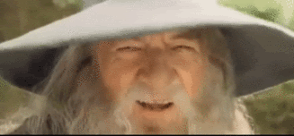

# Graphics Interchange Format 

**Category:** Steganography
**Points:** 15
**Author:** 
**Description:**


>


## Writeup
Due to the name of the problem, the most logical thing to do was simply Google ```Graphics Interchange Format``` which would lead the user to the wikipedia page [GIF](http://en.wikipedia.org/wiki/GIF). After reading a bit one would notice the header (```38 39 61```) and the terminating (```3B```) hex of a standart GIF. After consulting a trusty hex editor it was noticed everything was fine, and thus no modifications was done to the format in itself (joining files together, etc.). Despite the fact, a clear quirk can be seen at the end of the image, suggesting there is something within its bytes causing a sudden morph. 

If one was to start from the end of the files data upwards (as the quirk happens at the end of the GIF), between offset ```000E8E70``` and ```000E8F20``` one would find the following:

````

56 91 27 59 31 C3 0C 72 21 FD E9 09 FF 22 C3 72 4D 40 73 64 03 04 D4 C4 02 94 47 CB 2A 60 FD F8 E5 16 4D 00 4F 1B EA 20 86 20 38 88 A0 9F E0 F3 20 90 11 7C 1A 22 06 84 60 E2 94 23 BB 6E 17 77 2D 31 66 6C 61 67 69 73 67 61 6E 64 61 6C 66 74 68 65 62 65 73 74 01 12 D6 A0 06 50 00 05 5A 00 05 28 60 01 26 20 09 D8 A0 8B D9 20 0F 20 21 8C 21 41 11 26 61 12 C2 F8 11 B0 23 13 1E 41 94 20 CD 15 E2 00 0C 26 20 8E CF C0 0D 1C 21 0C 39 AD 30 0F 53 20 E6 31 19 7A 01 17 12 6C C1 18 01 10 38 A1 57 7B 75 0F EC E0 3E 0F 42 FB 04 42 20 F9
V‘'Y1Ã.r!ýé.ÿ"ÃrM@sd..ÔÄ.”GË*`ýøå.M.O.ê † 8ˆ Ÿàó ..|.".„`â”#»n.w-1flagisgandalfthebest..Ö .P..Z..(`.& .Ø ‹Ù . !Œ!A.&a.Âø.°#..A” Í.â..& ŽÏÀ..!.9.0.S æ1.z...lÁ...8¡W{u.ìà>.Bû.B ùÆo¶–FM..%ù.ÿ..2’

````

The flag is noticibly within the file.

##Flag

>gandalfthebest

## Other write-ups and resources