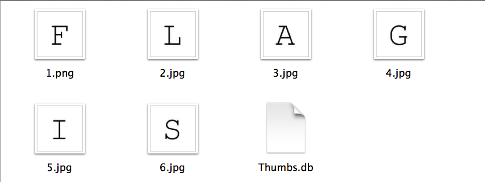
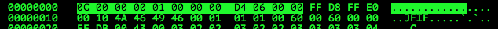
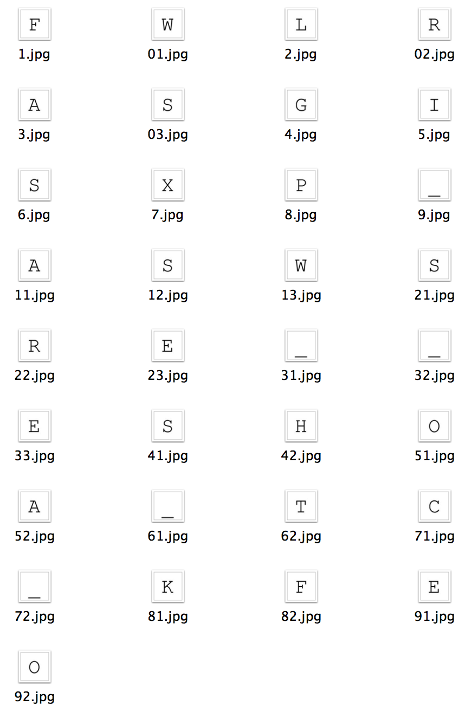

# School CTF 2015: hidden-file-200

**Category:** Forensics
**Points:** 200

**Description:**

>See the [picture](./eng_d57d2fcf49801b8156b08a4cebb3fdc44c11466f.png)

## Write-up

by [polym](https://github.com/abpolym)

We are given a zip archive that we extract using `7z` to find 6 images and one thumbnail database, `Thumbs.db`:

```bash
+bash-4.3$ 7z x archive_aa0ff96d678e0d96f808e7ac50c07fa65c9aceed.zip -oout

7-Zip [64] 9.20  Copyright (c) 1999-2010 Igor Pavlov  2010-11-18
p7zip Version 9.20 (locale=utf8,Utf16=on,HugeFiles=on,8 CPUs)

Processing archive: archive_aa0ff96d678e0d96f808e7ac50c07fa65c9aceed.zip

Extracting  Thumbs.db
Extracting  1.png
Extracting  2.jpg
Extracting  3.jpg
Extracting  4.jpg
Extracting  5.jpg
Extracting  6.jpg

Everything is Ok

Files: 7
Size:       190660
Compressed: 50880
+bash-4.3$ cd out
+bash-4.3$ file *
1.png:     PNG image data, 100 x 100, 8-bit/color RGB, non-interlaced
2.jpg:     JPEG image data, JFIF standard 1.02
3.jpg:     JPEG image data, JFIF standard 1.02
4.jpg:     JPEG image data, JFIF standard 1.02
5.jpg:     JPEG image data, JFIF standard 1.02
6.jpg:     JPEG image data, JFIF standard 1.02
Thumbs.db: CDF V2 Document, No summary info
```

The first 6 images just spell out `FLAGIS`:



We can extract `Thumbs.db` like any zip-archive and find more data blobs:

```bash
+bash-4.3$ 7z x Thumbs.db -oout

7-Zip [64] 9.20  Copyright (c) 1999-2010 Igor Pavlov  2010-11-18
p7zip Version 9.20 (locale=utf8,Utf16=on,HugeFiles=on,8 CPUs)

Processing archive: Thumbs.db

Extracting  8
Extracting  4
Extracting  2
Extracting  1
Extracting  3
Extracting  6
Extracting  5
Extracting  7
Extracting  21
Extracting  01
Extracting  9
Extracting  11
Extracting  02
Extracting  03
Extracting  12
Extracting  13
Extracting  61
Extracting  41
Extracting  31
Extracting  22
Extracting  23
Extracting  32
Extracting  33
Extracting  51
Extracting  42
Extracting  52
Extracting  81
Extracting  71
Extracting  62
Extracting  72
Extracting  91
Extracting  82
Extracting  92
Extracting  Catalog

Everything is Ok

Files: 34
Size:       50912
Compressed: 61440
+bash-4.3$ cd out/
```

By opening one of these files with a hexeditor, we see that they are JPGs (same file signature `JFIF` as normal JPGs) with extra 12 bytes of meta-data:



After removing `Catalog`, which is a catalogue/meta-data file about all other files inside `Thumbs.db`, we snip the extra bytes using `xxd` and save the JPGs in another directory:

```bash
+bash-4.3$ rm Catalog
+bash-4.3$ mkdir jpgs
+bash-4.3$ for i in *; do xxd -s12 -p "$i" | xxd -r -p > "jpgs/$i.jpg"; done
+bash-4.3$ cd jpgs/
+bash-4.3$ file *
01.jpg:   JPEG image data, JFIF standard 1.01
02.jpg:   JPEG image data, JFIF standard 1.01
03.jpg:   JPEG image data, JFIF standard 1.01
1.jpg:    JPEG image data, JFIF standard 1.01
11.jpg:   JPEG image data, JFIF standard 1.01
12.jpg:   JPEG image data, JFIF standard 1.01
13.jpg:   JPEG image data, JFIF standard 1.01
2.jpg:    JPEG image data, JFIF standard 1.01
21.jpg:   JPEG image data, JFIF standard 1.01
22.jpg:   JPEG image data, JFIF standard 1.01
23.jpg:   JPEG image data, JFIF standard 1.01
3.jpg:    JPEG image data, JFIF standard 1.01
31.jpg:   JPEG image data, JFIF standard 1.01
32.jpg:   JPEG image data, JFIF standard 1.01
33.jpg:   JPEG image data, JFIF standard 1.01
4.jpg:    JPEG image data, JFIF standard 1.01
41.jpg:   JPEG image data, JFIF standard 1.01
42.jpg:   JPEG image data, JFIF standard 1.01
5.jpg:    JPEG image data, JFIF standard 1.01
51.jpg:   JPEG image data, JFIF standard 1.01
52.jpg:   JPEG image data, JFIF standard 1.01
6.jpg:    JPEG image data, JFIF standard 1.01
61.jpg:   JPEG image data, JFIF standard 1.01
62.jpg:   JPEG image data, JFIF standard 1.01
7.jpg:    JPEG image data, JFIF standard 1.01
71.jpg:   JPEG image data, JFIF standard 1.01
72.jpg:   JPEG image data, JFIF standard 1.01
8.jpg:    JPEG image data, JFIF standard 1.01
81.jpg:   JPEG image data, JFIF standard 1.01
82.jpg:   JPEG image data, JFIF standard 1.01
9.jpg:    JPEG image data, JFIF standard 1.01
91.jpg:   JPEG image data, JFIF standard 1.01
92.jpg:   JPEG image data, JFIF standard 1.01
```

We have a look at the JPGs to see that they, rearranged, spell out our flag, `XP_WAS_SO_SWEET_FOR_HACKERS`:



## Other write-ups and resources

* [Indonesian](http://www.hasnydes.us/2015/05/schoolctf-hidden-file-200pts/) 
* [Japanese](http://charo-it.hatenablog.jp/entry/2015/05/03/225115)
* [Chinese](http://blog.lionbug.pw/ctf/school-ctf-spring-writeup/) (Down, [Cached version](http://webcache.googleusercontent.com/search?q=cache:9Ss-ircs-WgJ:blog.lionbug.pw/ctf/school-ctf-spring-writeup/+&cd=4&hl=de&ct=clnk&gl=de))
