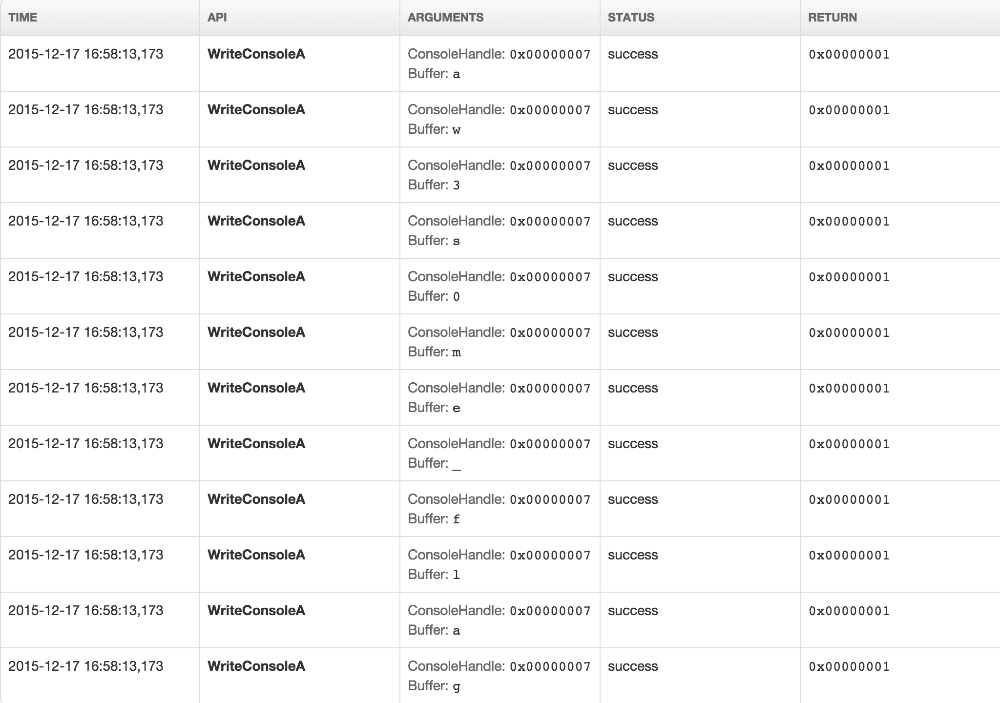

# School CTF 2015: run-the-image-400

**Category:** Steagano
**Points:** 400

**Description:**

> This Image Cannot Be Run in DOS Mode, but what about its part?

## Write-up

by [polym](https://github.com/abpolym)

We are given a picture:


The description hints that the picture cannot be run in DOS mode, but a part of it.
This hints that there is an PE executable inside the jpeg, which we can detect with `binwalk` and extract with `foremost`:

```bash
+bash-4.3$ binwalk stegano2_d5e256930e8becd029ed32477365cd0270ca698a.jpeg | grep -v Zlib
DECIMAL       HEXADECIMAL     DESCRIPTION
--------------------------------------------------------------------------------
0             0x0             JPEG image data, JFIF standard  1.01
37079         0x90D7          Microsoft portable executable

+bash-4.3$ foremost stegano2_d5e256930e8becd029ed32477365cd0270ca698a.jpeg 
Processing: stegano2_d5e256930e8becd029ed32477365cd0270ca698a.jpeg
|*|
+bash-4.3$ tree output/
output/
├── audit.txt
├── exe
│   └── 00000072.exe
└── jpg
    └── 00000000.jpg

    2 directories, 3 files
```

Running the resulting [executable](00000072.exe) in any sandbox of our choice (e.g. [malwr](https://malwr.com/) or [anubis](https://anubis.iseclab.org/) gives us the flag,`aw3s0me_flag`:



## Other write-ups and resources

* [Japanese](http://charo-it.hatenablog.jp/entry/2015/05/03/225115)
* [Chinese](http://blog.lionbug.pw/ctf/school-ctf-spring-writeup/) (Down, [Cached version](http://webcache.googleusercontent.com/search?q=cache:9Ss-ircs-WgJ:blog.lionbug.pw/ctf/school-ctf-spring-writeup/+&cd=4&hl=de&ct=clnk&gl=de))
