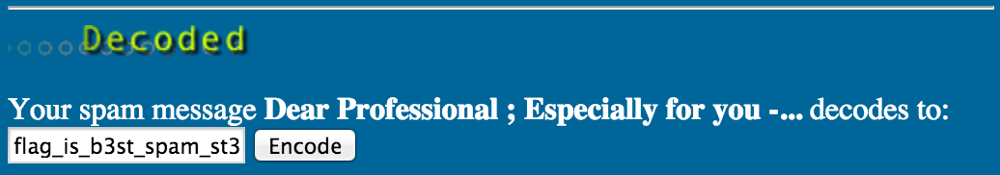

# School CTF 2015: strange-spam-100

**Category:** Steagano
**Points:** 100

**Description:**

> There is a meaning even in things originally intended to be meaningless, it is only necessary to find it.

## Write-up

by [polym](https://github.com/abpolym)

This writeup is based on this [Indonesian writeup](http://www.hasnydes.us/2015/05/schoolctf-strange-spam-100pts/).

Searching for the keywords `spam steganography`, we find a [website that offers steganography using spam mails](http://www.spammimic.com/).

We copy verbatim our spam message into the [decode site](http://www.spammimic.com/decode.shtml) and receive the flag:

The flag is `flag_is_b3st_spam_st3g4n0`.

## Other write-ups and resources

* [Indonesian](http://www.hasnydes.us/2015/05/schoolctf-strange-spam-100pts/) 
* [Chinese](http://blog.lionbug.pw/ctf/school-ctf-spring-writeup/) (Down, [Cached version](http://webcache.googleusercontent.com/search?q=cache:9Ss-ircs-WgJ:blog.lionbug.pw/ctf/school-ctf-spring-writeup/+&cd=4&hl=de&ct=clnk&gl=de))
* [Japanese](http://fl04t.hatenablog.com/entry/2015/05/04/School_CTF_Writeup)
