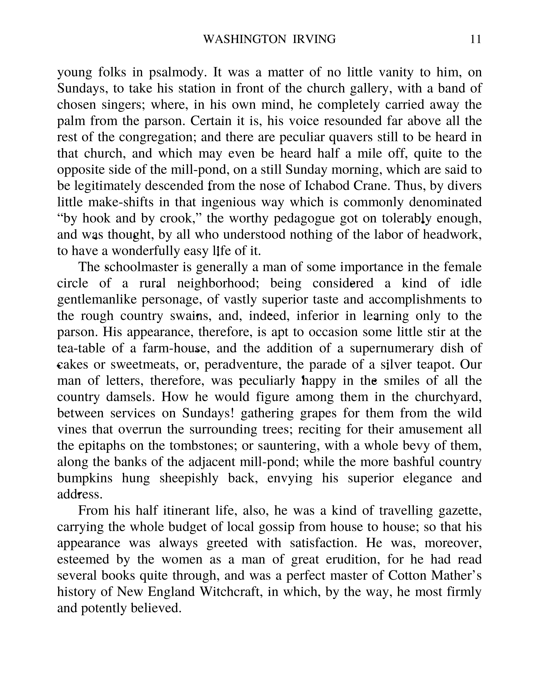

# School CTF 2015: tacticus-abilitus-100

**Category:** Steagano
**Points:** 100

**Description:**

> Somebody should fix his printer, shouldn't he? link

## Write-up

by [polym](https://github.com/abpolym)

This writeup is very loosely based on [this Indonesian writeup](http://www.hasnydes.us/2015/05/schoolctf-tacticus-abilitus-100pts/)
We are given a PNG:

After reading the challenge description and having a closer look at the text, we notice some tainted characters:

We write down every tainted character:

	flagisaeneascpiher

The flag is `aeneascpiher`.

## Other write-ups and resources

* [Indonesian](http://www.hasnydes.us/2015/05/schoolctf-tacticus-abilitus-100pts/) 
* [Chinese](http://blog.lionbug.pw/ctf/school-ctf-spring-writeup/) (Down, [Cached version](http://webcache.googleusercontent.com/search?q=cache:9Ss-ircs-WgJ:blog.lionbug.pw/ctf/school-ctf-spring-writeup/+&cd=4&hl=de&ct=clnk&gl=de))
* [Japanese](http://fl04t.hatenablog.com/entry/2015/05/04/School_CTF_Writeup)
