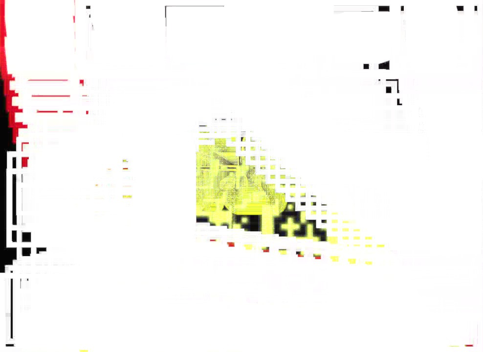
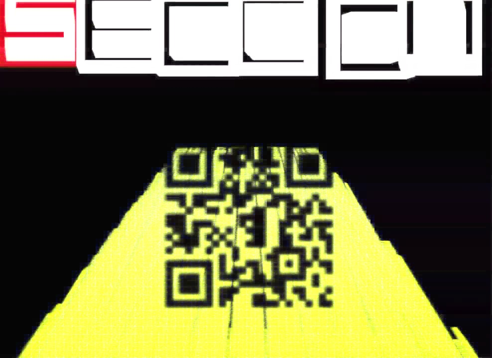

# SECCON Quals CTF 2015: SECCON WARS 2015

**Category:** Stegano
**Points:** 100
**Solves:** 312
**Description:**

> <https://youtu.be/8SFsln4VyEk>

## Write-up

by [polym](https://github.com/abpolym)

This solution is based on several solution by [this writeup](https://hackmd.io/s/VJKXiph4x) and these two: [1](https://github.com/Execut3/CTF/tree/master/Participated-CTF/2015/seccon/SecconWars), [2](http://hfukuda.hatenablog.com/entry/2015/12/07/235823).

We are given a youtube video that shows a scrolling yellow text in Japanese on black background in Star-Wars style, a moving title split in tiles that appears after some time and a QR Code in black that is visible as an overlay over the Japanese text.

[Some solutions](https://github.com/Execut3/CTF/tree/master/Participated-CTF/2015/seccon/SecconWars) suggest to use `vlc` and apply some sort of filter `Tools -> Preferences -> Show Settings : all -> Vidoe -> enable : scene video filter` to get the desired QR Code.

[Others](http://hfukuda.hatenablog.com/entry/2015/12/07/235823) apply ImageMagick's `mogrify` tool and make use of the `PIL` python library to overlay frames of the video in the form of PNGs to get the flag.

[This writeup](https://hackmd.io/s/VJKXiph4x), however, has the fastest solution. We first split the video into different frames, then overlay these frames using ImageMagicks `convert` tool to get the QR Code!

The step-by-step solution is as follows:

* `ffmpeg -i SECCON\ WARS\ 2015-8SFsln4VyEk.mp4 -f image2 frame%d.jpg` - Convert the video to individual frames in the form of JPGs
* `convert frame???.jpg -background none -compose lighten -flatten output-1.jpg` - Overlay each frame to get a continues yellow stream of Japanese text to highlight the QR Code
* Be frustrated that the tiles of the title destroy your overlapping:

* Find a frame, since which the white-red tiles do not move over the QR Code anymore, e.g. `frame700.jpg` and move them to a different directory with `for i in {700..2008}; do mv frame$i.jpg new/; done;`
* After going to the directory with the subset of frames with `cd new/`, try again to get `output-2.jpg`:

* Cut the QR Code from the picture, submit it to [an online QR decoder](https://zxing.org/w/decode.jspx) and get the flag: `SECCON{TH3F0RC3AVVAK3N53P7}`

## Other write-ups and resources

* <https://github.com/Execut3/CTF/tree/master/Participated-CTF/2015/seccon/SecconWars>
* <http://corb3nik.github.io/2015/12/06/Secon-Wars-2015/>
* <https://github.com/p4-team/ctf/tree/master/2015-12-05-seccon/seccon_wars_100#eng-version>
* [Japanese](http://katc.hateblo.jp/entry/2015/12/06/185159)
* [Japanese](http://iwasi.hatenablog.jp/entry/2015/12/06/190557)
* [Japanese](http://akashisn.azurewebsites.net/2015/12/06/seccon-2015-online-ctf-write-up/)
* [Japanese](http://nononono.sakura.ne.jp/blog/2015-1206/)
* [Japanese](https://hackmd.io/s/VJKXiph4x)
* [Japanese](http://hfukuda.hatenablog.com/entry/2015/12/07/235823)
* [Japanese](https://docs.google.com/document/d/1GEdzPOohsiWt8EPojNazlVPuNFZpQ9FOQxb-E7sfzSQ)
