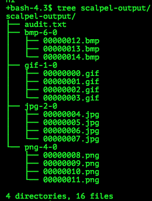

# SECCON Quals CTF 2015: Steganography 1

**Category:** Stegano
**Points:** 100
**Solves:** 304
**Description:**

> Find image files in the file
> 
> [MrFusion.gpjb](./MrFusion.gpjb)
> 
> Please input flag like this format-->SECCON{*** ** **** ****}
> 
> There is no bonus in this question

## Write-up

by [polym](https://github.com/abpolym)

First, with `file`, we see that the given file `MrFusion.gpjb` is a GIF.

Using `binwalk`, we see that this gif contains several other gifs, bmps, jpgs and pngs:

	DECIMAL       HEXADECIMAL     DESCRIPTION
	--------------------------------------------------------------------------------
	0             0x0             GIF image data, version "89a", 1280 x 720
	6943          0x1B1F          PNG image, 1280 x 720, 8-bit colormap, interlaced
	9727          0x25FF          JPEG image data, JFIF standard  1.01
	26632         0x6808          PC bitmap, Windows 3.x format, 1280 x 720 x 24
	2791486       0x2A983E        GIF image data, version "89a", 1280 x 720
	2794240       0x2AA300        PNG image, 1280 x 720, 8-bit colormap, interlaced
	2796217       0x2AAAB9        JPEG image data, JFIF standard  1.01
	2813627       0x2AEEBB        PC bitmap, Windows 3.x format, 1280 x 720 x 24
	5578481       0x551EF1        GIF image data, version "89a", 1280 x 720
	5580896       0x552860        PNG image, 1280 x 720, 8-bit colormap, interlaced
	5583378       0x553212        JPEG image data, JFIF standard  1.01
	5601221       0x5577C5        PC bitmap, Windows 3.x format, 1280 x 720 x 24
	8366075       0x7FA7FB        GIF image data, version "89a", 1280 x 720
	8368830       0x7FB2BE        PNG image, 1280 x 720, 8-bit colormap, interlaced
	8371932       0x7FBEDC        JPEG image data, JFIF standard  1.01

It looks like the file extension `gpjb` stands for `g`if, `p`ng, `j`pg and `b`mp.

We extract the pictures using `scalpel` with a custom [config](./scalpel.conf).
Running it with `scalpel -c ./scalpel.conf` gives us several pictures:

After manually extracting one corrupted gif, we see that each picture shows a single character. We order them according to the given flag format to get the flag.
## Other write-ups and resources

* <https://github.com/p4-team/ctf/tree/master/2015-12-05-seccon/stegano_1_100#eng-version>
* [Japanese](http://miettal.hatenablog.com/entry/2015/12/07/104233)
* [Japanese](http://katc.hateblo.jp/entry/2015/12/06/185159)
* [Japanese](http://iwasi.hatenablog.jp/entry/2015/12/06/190557)
* [Japanese](http://akashisn.azurewebsites.net/2015/12/06/seccon-2015-online-ctf-write-up/)
* [Japanese](http://kanpapa.com/today/2015/12/seccon-ctf-2015-online-write-up.html)
* [Japanese](http://nononono.sakura.ne.jp/blog/2015-1206/)
* [Japanese](https://hackmd.io/s/EJyPJyh4x)
* [Japanese](http://hfukuda.hatenablog.com/entry/2015/12/07/235823)
* [Japanese](https://docs.google.com/document/d/1GEdzPOohsiWt8EPojNazlVPuNFZpQ9FOQxb-E7sfzSQ)
