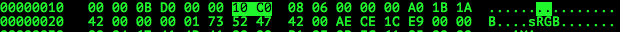
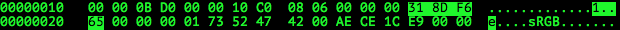
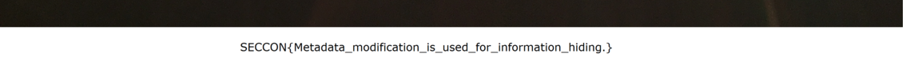

# SECCON Quals CTF 2015: Steganography 2

**Category:** Stegano
**Points:** 100
**Solves:** 18
**Description:**

> Find the flag in this file.
> 
> [sunrise.zip](https://github.com/SECCON/SECCON2015_online_CTF/blob/master/Stegano/100_Steganography%202/sunrise.zip)

[Alternative download](https://mega.nz/#!KEtT2DDB!2-6CgeI_prJAtxejPjQduHlvbhHUtk7qANT1Rnlcyp0)


## Write-up

by [polym](https://github.com/abpolym)

Inside the zip is a png that we check with `pngcheck`, `exiftool` and steganography tools such as `stegsolve` for any inconsistencies, hints or the flag itself.

Neither `exiftool` nor any stego tool gives us any clue as to where the flag is.

`pngcheck` gives us following output:

```bash
+bash-4.3$ pngcheck sunrise.png 
OK: sunrise.png (3024x4032, 32-bit RGB+alpha, non-interlaced, 77.0%).
```

The png is `4032px` high and `3024px` wide, but we can change these values, e.g. the height, to see if every data in the PNG is interpreted and not left out.

So we open `sunrise.png` with any hexeditor (My preference is `hexedit`), look up the offset for the width and height of our png in [this format specification](http://www.w3.org/TR/PNG/#11IHDR) and change it to a higher value (in hex):



However, each chunk has a checksum/CRC to detect tampering/corruption as explained [here](http://www.w3.org/TR/PNG/#5Chunk-layout).

`pngcheck` can tell us which CRC is to be expected and which one is computed:

```bash
+bash-4.3$ pngcheck sunrise.new.png 
sunrise.new.png  CRC error in chunk IHDR (computed 318df665, expected a01b1a42)
ERROR: sunrise.new.png
```

So we change the CRC of our `IDAT` chunk to the computed one in `hexedit`:



Now we can see the flag in the bottom of our PNG:



## Other write-ups and resources

* <https://github.com/teamavidya/ctf/tree/master/2015_seccon_quals/steganography2%5Bstego100%5D>
* [French](http://khack40.info/seccon-ctf-2015-steganography-2/)
* [Japanese](http://iwasi.hatenablog.jp/entry/2015/12/06/190557)
