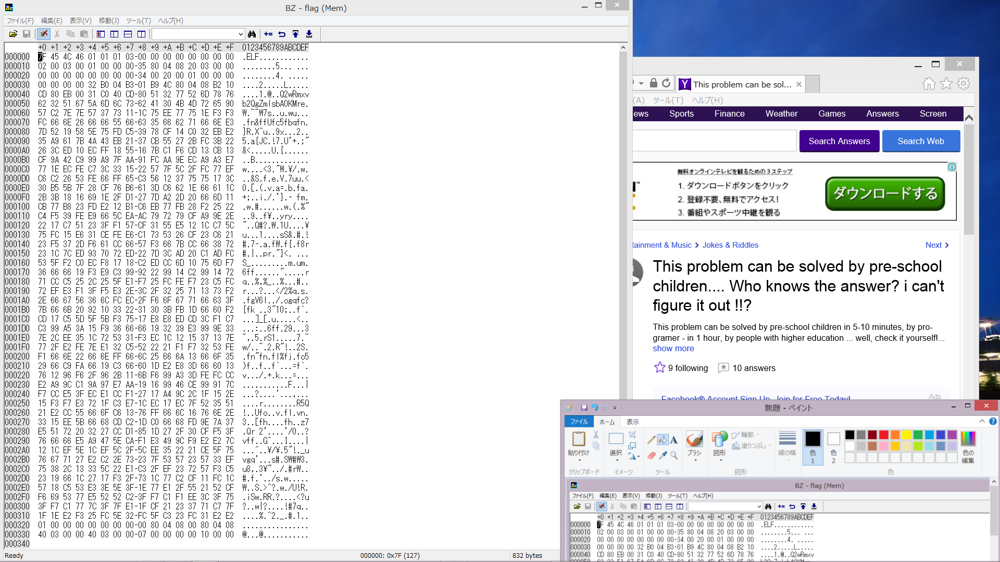
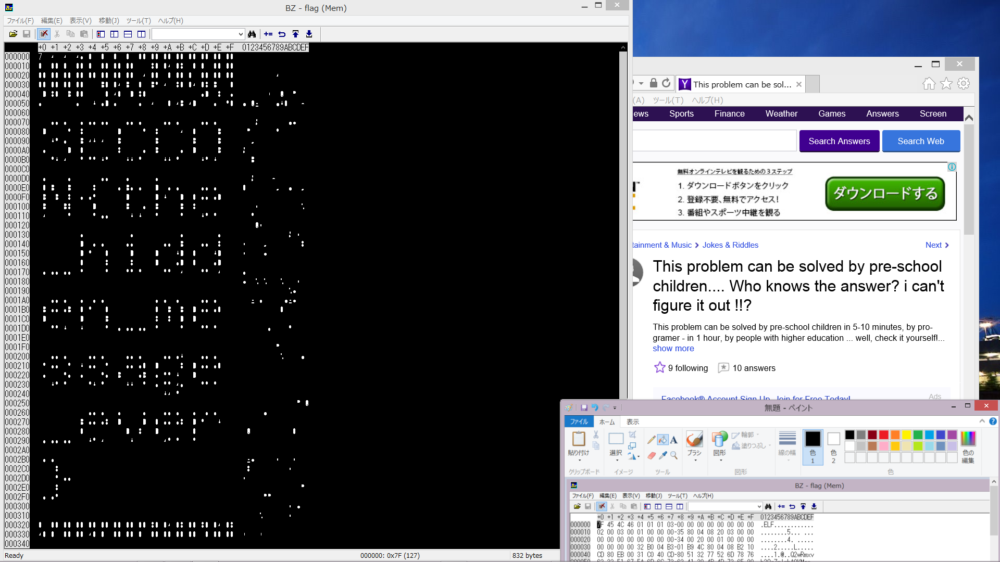

# SECCON Quals CTF 2015: Steganography 3

**Category:** Stegano
**Points:** 100
**Solves:** 172
**Description:**

> We can get desktop capture!
> 
> Read the secret message.
> 
> [desktop_capture.png](./desktop_capture.png)

## Write-up

by [polym](https://github.com/abpolym)

We are given a PNG:

It shows an ELF named flag opened in a hex editor, a paint tool and a forum thread with the title

	This problem can be solved by pre-school children [...]

If you are blind and miss the wood for the trees, you start by applying [OCR](https://en.wikipedia.org/wiki/Optical_character_recognition) to get the binary representation of [the portraited ELF](./thiself).

However, when you run the ELF, you only get the output `Rmxvb2QgZmlsbA0K`, which, base64 decoded, is `Flood fill`.

This is a hint to use the paint tool `Flood fill`, as suggested in the png.

We apply the flood fill option and see the flag in the hex representation of the ELF:

## Other write-ups and resources

* <https://github.com/danangaji/ctf/blob/master/201512/SECCON/Stegano_3/README.md>
* <https://github.com/p4-team/ctf/tree/master/2015-12-05-seccon/stegano_3_100#eng-version>
* <https://obumchidi.wordpress.com/2015/12/14/seccon-2015-online-ctf-steganography-3-solution/>
* [Japanese](http://miettal.hatenablog.com/entry/2015/12/07/104233)
* [Japanese](http://katc.hateblo.jp/entry/2015/12/06/185159)
* [Japanese](http://iwasi.hatenablog.jp/entry/2015/12/06/190557)
* [Japanese](https://hackmd.io/s/Ekwbl134e)
* [Japanese](https://docs.google.com/document/d/1GEdzPOohsiWt8EPojNazlVPuNFZpQ9FOQxb-E7sfzSQ)
