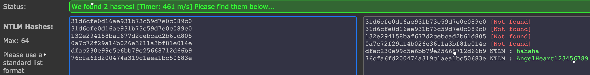

# Securinets Quals CTF 2015: Forensics2

**Category:** Forensics
**Points:** 200
**Solves:** TODO
**Description:** 

> Hint : ALYSSA's account (Compte de ALYSSA) 
>
> url : [http://41.231.22.133:8080/2/forensics.rar](forensics.rar)

## Write-up

by [polym](https://github.com/abpolym)

We are given a rar that we extract to find two files, `SAM` and `SYSTEM`:

```bash
+bash-4.3$ unrar x forensics.rar 

UNRAR 5.21 freeware      Copyright (c) 1993-2015 Alexander Roshal


Extracting from forensics.rar

Creating    forensics                                                 OK
Extracting  forensics/SAM                                             OK 
Extracting  forensics/SYSTEM                                          OK 
All OK
```

Both files are from the `Windows Registry` database (see [wiki](https://en.wikipedia.org/wiki/Windows_Registry)).

While `SAM` ([Security Account Manager](https://en.wikipedia.org/wiki/Security_Account_Manager)) contains usernames and passwords, `SYSTEM` also contains a system bootkey to encrypt and decrypt [SAM password hashes](ftp://distro.ibiblio.org/openwall/passwords/pwdump/syskey.txt).

On Linux, we can use `bkhive` and `samdump2` to recover the password files with decrypted [LM and NTLM hashes](http://openwall.info/wiki/john/hash-formats).

First, we use `bkhive` on `SYSTEM` to recover the bootkey `bootkey`:

```bash
$ bkhive SYSTEM bootkey
bkhive 1.1.1 by Objectif Securite
http://www.objectif-securite.ch
original author: ncuomo@studenti.unina.it

Root Key : CMI-CreateHive{F10156BE-0E87-4EFB-969E-5DA29D131144}
Default ControlSet: 001
Bootkey: 5b851e0b74d0f3c73519e18d9cb76a2b
```

Now, we can use `samdump2` on `SAM` using the `bootkey` to get [the password file](./windows-passwd.txt) containing our hashes:

```bash
$ samdump2 SAM bootkey > windows-passwd.txt
```

The passwords are stored in the second hashes row, containing NTLM hashes.

We have several options to crack these hashes - In this writeup I'll choose two - `john`, [Jumbo version](http://www.openwall.com/john/), and [an online hash database](https://hashkiller.co.uk/ntlm-decrypter.aspx).

The former in combination with a wordlist attack using the rockyou wordlist dictionary accomplishes to crack three hashes:

```bash
$ john --format=NT --wordlist=./rockyou.txt windows-passwd.txt 
Loaded 5 password hashes with no different salts (NT [MD4 128/128 X2 SSE2-16])
Remaining 3 password hashes with no different salts
Press 'q' or Ctrl-C to abort, almost any other key for status
0g 0:00:00:02 DONE (2015-12-27 15:00) 0g/s 5625Kp/s 5625Kc/s 16875KC/s             ..*7¡Vamos!
Session completed

6 password hashes cracked, 0 left

$ john --show --format=NT windows-passwd.txt                                                                                                                                           
Administrateur::500:aad3b435b51404eeaad3b435b51404ee:31d6cfe0d16ae931b73c59d7e0c089c0:::
Invit:501:aad3b435b51404eeaad3b435b51404ee:31d6cfe0d16ae931b73c59d7e0c089c0:::
admin:hahaha:1003:aad3b435b51404eeaad3b435b51404ee:dfac230e99c5e6bb79e25668712d66b9:::

3 password hashes cracked, 3 left
```

Side-note: I guess it says `6 passwords hashes cracked`, because it also cracked 6 out of 6 LM hashes (which are all the same `aad3b435b51404eeaad3b435b51404ee` for the string `no password` (see [here](https://www.felixrr.pro/archives/339/what-is-aad3b435b51404eeaad3b435b51404ee)).

Using the latter option, we crack two out of six hashes:



The flag is the password for the user `admin`, namely `hahaha`.

## Other write-ups and resources

* <http://ipushino.blogspot.de/2015/03/securinets-ctf-2015-forensics-forensics2.html>