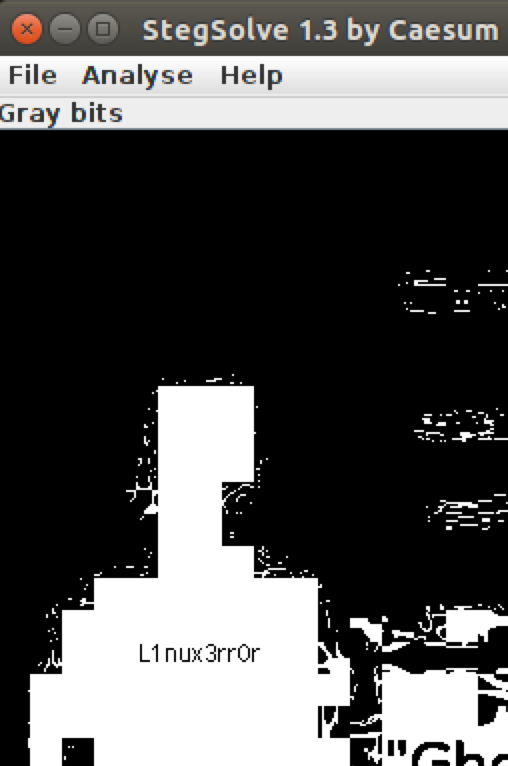

# Securinets Quals CTF 2015: Basics (Basique)

**Category:** Stegano
**Points:** 25
**Solves:** TODO
**Description:** 

> Hint : no hint (aucun hint) 
>
> url : [http://41.231.22.133:8030/3/steg.png](steg.png)

## Write-up

by [polym](https://github.com/abpolym)

We are given a PNG file:

Using `stegsolve`, we find the flag in the gray bits panel of the image:

The flag is `L1nux3rr0r`.

## Other write-ups and resources

* <http://ipushino.blogspot.de/2015/03/securinets-ctf-2015-stegano-basics.html>