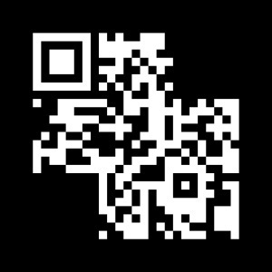

# Securinets Quals CTF 2015: Broken

**Category:** Stegano
**Points:** 100
**Solves:** TODO
**Description:** 

> Hint : no hint (aucun hint) 
>
> url : [http://41.231.22.133:8030/2/Broken.jpg](Broken.jpg)

## Write-up

by [polym](https://github.com/abpolym)

We are given a ''broken'' QR code:

This task is rather easy. All we have to do is invert the picture using `convert -negate Broken.jpg Broken-inv.jpg` and submit the ''broken'' QR code to an [online QR decoder](https://zxing.org/w/decode.jspx).

Though it is broken, it works, since the missing parts are only necessary for aligning the picture.

The flag is `1t_S_s0_cr3atIv3`.

## Other write-ups and resources

* <http://ipushino.blogspot.de/2015/03/securinets-ctf-2015-stegano-broken.html>
* [Korean](http://blog.naver.com/hy00un__/220306608668)