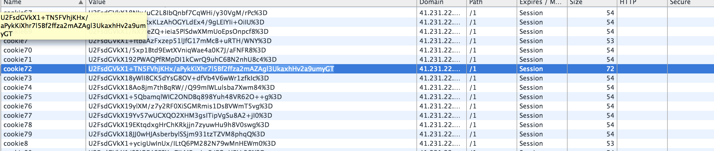

# Securinets Quals CTF 2015: Cookies

**Category:** Web
**Points:** 50
**Solves:** TODO
**Description:** 

> Hint : Cookie special forces (Les forces spéciales des cookies) 
>
> url : http://41.231.22.133:8010/1/

## Write-up

We look at out cookies and see several cookies of similar length and one cookie that does stand out:



Looking at the [jsencryption.js](./41.231.22.133-8010/1/jsencryption.js), we see that the backend uses the [Gibberish AES](http://github.com/markpercival/gibberish-aes/tree/master) encryption to encrypt the cookies.

[There](https://github.com/mdp/gibberish-aes), we see that we can decrypt these cookies using `openssl` using the [found key](./41.231.22.133-8010/1/index.html) "salt":

```bash
$ echo "U2FsdGVkX1+TN5FVhjKHx/aPykKiXhr7l5Bf2ffza2mAZAgl3UkaxhHv2a9umyGT" | openssl enc -d -aes-256-cbc -a -k salt
flag=NaiMuS_2OI5
```

The flag is `NaiMuS_2OI5`.

## Other write-ups and resources

* <https://rezk2ll.wordpress.com/2015/03/24/securinets-quals-ctf-2015-cookies-write-up/>