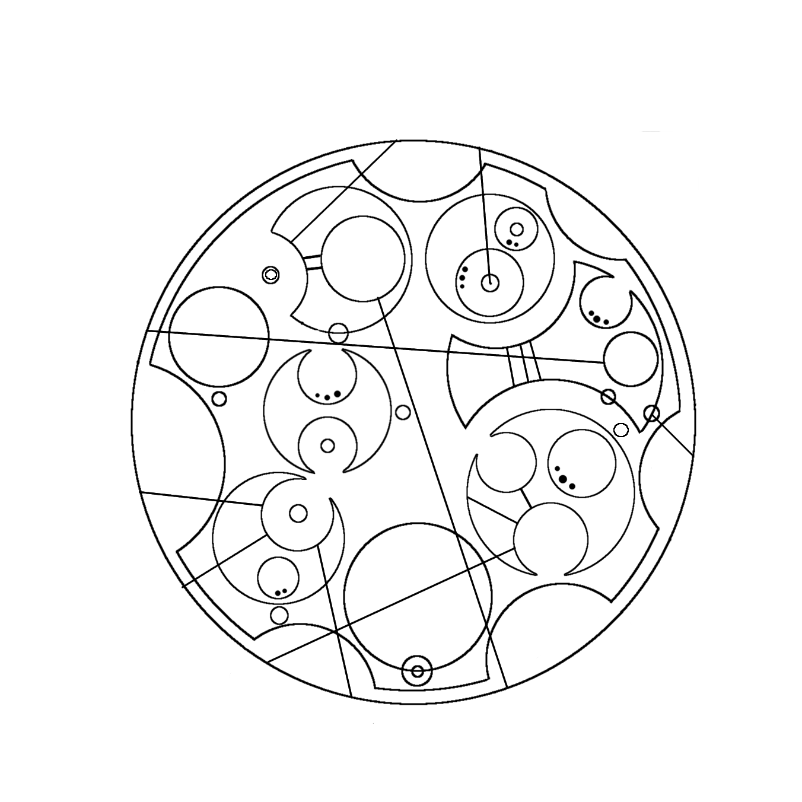

# STEM CTF 2015: doctor-message-300

**Category:** 
**Points:** 
**Solves:** 
**Description:**

> 

## Write-up

(TODO)

## Other write-ups and resources

* <http://tqk.pw/ctf/writeup/2015/09/13/some-easy-writeup-for-mitrectf-2015/#crypto-300---doctor-message> 
