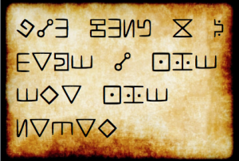

# STEM CTF 2015: gravity-falls-100

**Category:**
**Points:**
**Solves:**
**Description:**

> 

## Write-up

(TODO)

## Other write-ups and resources

* <http://tqk.pw/ctf/writeup/2015/09/13/some-easy-writeup-for-mitrectf-2015/#crypto-100---message>
* <https://0x90r00t.com/2015/09/14/mitre-stem-2015-crypto-100-gravity-falls-write-up/>
