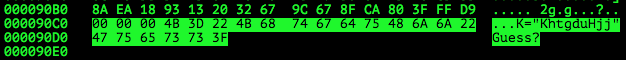

# Th3Jackers CTF 2015: Easy stegano

**Category:** Stegano
**Points:** 100
**Solves** 17
**Description:**

> Description: easy to slove
>
> Attachment: [d30b7599498d0e8cf28f2cd9a7c9b9ba](d30b7599498d0e8cf28f2cd9a7c9b9ba)

## Write-up

by [polym](https://github.com/abpolym)

This write-up is based on a write-up by [ctf-team](https://ctf-team.vulnhub.com/the3jackers-2015-steg100/).

Using the `file` command, we see that we are given a JPG.

Neither `binwalk` nor `foremost` detect any additional files hidden in the JPG, so we open the JPG with a hexeditor.

We search for the footer signature of the JPG, which is always `FFD9` in hexadecimal and find additional data after the JPG officially ends:



This data says `K="KhtgduHjj"Guess?`, which is a hint to the `outguess` steganography program. `K="KhtgduHjj"` means that the password (or `K`ey) is `KhtgduHjj`.

Applying `outguess` on the JPG yields something interesting:

```bash
+bash-4.3$ outguess -k KhtgduHjj -r d30b7599498d0e8cf28f2cd9a7c9b9ba out.txt
Unknown data type of d30b7599498d0e8cf28f2cd9a7c9b9ba
+bash-4.3$ mv d30b7599498d0e8cf28f2cd9a7c9b9ba{,.jpg}
+bash-4.3$ outguess -k KhtgduHjj -r d30b7599498d0e8cf28f2cd9a7c9b9ba.jpg out.txt
Reading d30b7599498d0e8cf28f2cd9a7c9b9ba.jpg....
Extracting usable bits:   40455 bits
Steg retrieve: seed: 146, len: 33
+bash-4.3$ cat out.txt 
Jbhun_Hlbh_S0HhaQ_GU3_SyNnt0K_==
+bash-4.3$ cat out.txt  | base64 --decode | phd
00000000  25 b8 6e 9f  f1 e5 6e 1f  d2 d0 78 5a  43 f1 94 df  │%·n·│··n·│··xZ│C···│
00000010  f4 b2 36 7b  74 2b                                  │··6{│t+│
00000016
```

The base64 encoding is a red herring and we just have to apply rot13 to it to get the flag:

```bash
+bash-4.3$ python -c 'print "Jbhun_Hlbh_S0HhaQ_GU3_SyNnt0K_==".encode("rot13")'
Wouha_Uyou_F0UunD_TH3_FlAag0X_==
```

The flag is `Wouha_Uyou_F0UunD_TH3_FlAag0X_==`.

## Other write-ups and resources

* <https://ctf-team.vulnhub.com/the3jackers-2015-steg100/>
* [Persian](http://nevermore.blog.ir/post/th3jackers-2015-CTF-writeup)
