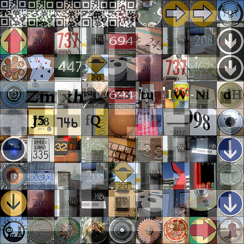
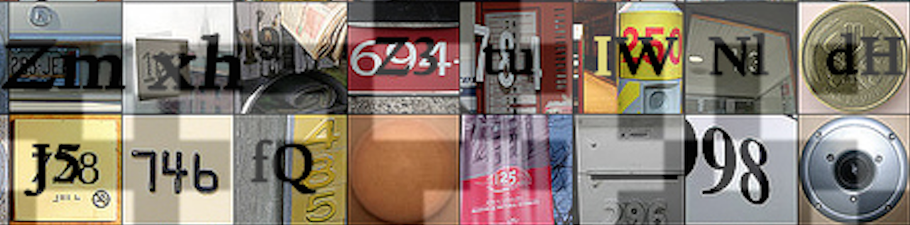

# Th3Jackers CTF 2015: Private Eyes

**Category:** Stegano
**Points:** 200
**Solves** 8
**Description:**

> Description: é_é
>
> Attachment: [0227597b75da424e4233f8b3c1873446](0227597b75da424e4233f8b3c1873446)

## Write-up

by [polym](https://github.com/abpolym)

This writeup is based on a writeup by [this persian writeup](http://nevermore.blog.ir/post/th3jackers-2015-CTF-writeup).

By running `file 0227597b75da424e4233f8b3c1873446`, we see that we are given a JPG, which shows several pictures of arrows, QR codes, numbers etc in small tiles:



Applying `exiftool`, `binwalk` or any steganography tools to it, we can't see anything suspicious hidden inside the JPG.

The QR codes and the transparent QR code background seem to be decoys (red herrings) that we have to ignore.

The solution to this problem is a ''hidden'' base64 code in these tiles:



The base64 string is `ZmxhZ3tuIWNldHJ5fQ98=`, which decoded gives us the flag:

```bash
+bash-4.3$ base64 --decode <<< 'ZmxhZ3tuIWNldHJ5fQ98=' | xxd
0000000: 666c 6167 7b6e 2163 6574 7279 7d0f 7c    flag{n!cetry}.|
```

The flag is `flag{n!cetry}`.

PS: The file name is md5(hellobitch). So nice...

## Other write-ups and resources

* [Persian](http://nevermore.blog.ir/post/th3jackers-2015-CTF-writeup)
