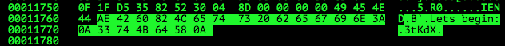
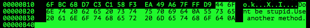
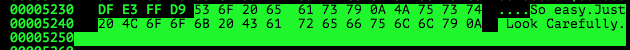
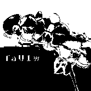
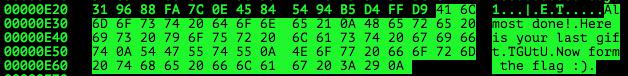

# Th3Jackers CTF 2015: Ultimate Steg

**Category:** Stegano
**Points:** 300
**Solves** 8
**Description:**

> Description: A key is Hidden within this file, Find it and get the f\*\*kin' flag
>
> Attachment: [61b94d373df24a669390bf5cc31090ac](61b94d373df24a669390bf5cc31090ac)

## Write-up

by [polym](https://github.com/abpolym)

This writeup is based on a writeup by [bannsecurity](http://bannsecurity.com/index.php/home/10-ctf-writeups/25-th3jackers-ctf-2015-ultimate-steg).

We are given a gif:


Using `binwalk`, we see that it contains a zip containing several other pictures in `jpg` and `png` format:

```bash
$ binwalk 61b94d373df24a669390bf5cc31090ac | igrep -v Zlib
DECIMAL       HEXADECIMAL     DESCRIPTION
--------------------------------------------------------------------------------
0             0x0             GIF image data, version "89a", 189 x 188
77499         0x12EBB         Zip archive data, at least v2.0 to extract, compressed size: 71435,  uncompressed size: 71543, name: "1.png"
148969        0x245E9         Zip archive data, at least v2.0 to extract, compressed size: 2720,  uncompressed size: 2880, name: "2.jpg"
151724        0x250AC         Zip archive data, at least v2.0 to extract, compressed size: 13980,  uncompressed size: 101684, name: "3.jpg"
165739        0x2876B         Zip archive data, at least v2.0 to extract, compressed size: 6875,  uncompressed size: 7019, name: "4.jpg"
172649        0x2A269         Zip archive data, at least v2.0 to extract, compressed size: 20250,  uncompressed size: 21072, name: "5.jpg"
192934        0x2F1A6         Zip archive data, at least v2.0 to extract, compressed size: 3552,  uncompressed size: 3693, name: "6.jpg"
196521        0x2FFA9         Zip archive data, at least v1.0 to extract, compressed size: 947,  uncompressed size: 947, name: "strange_file.png"
197882        0x304FA         End of Zip archive
```

We extract the zip using `foremost`:

```bash
$ foremost 61b94d373df24a669390bf5cc31090ac
$ tree output
output/
├── audit.txt
├── gif
│   └── 00000000.gif
└── zip
    └── 00000151.zip

2 directories, 3 files
$ 7z x 00000151.zip -oout
$ cd out
$ ls -1
1.png
2.jpg
3.jpg
4.jpg
5.jpg
6.jpg
strange_file.png
$ file *
1.png:            PNG image data, 187 x 186, 8-bit/color RGB, non-interlaced
2.jpg:            JPEG image data, JFIF standard 1.01
3.jpg:            JPEG image data, JFIF standard 1.01, comment: "CREATOR: gd-jpeg v1.0 (using IJ"
4.jpg:            JPEG image data, JFIF standard 1.01
5.jpg:            JPEG image data, JFIF standard 1.01
6.jpg:            JPEG image data, JFIF standard 1.01, comment: "CREATOR: gd-jpeg v1.0 (using IJ"
strange_file.png: data
```

The first picture `1.png` has trailing data (`3tKdX`):



The second picture `2.jpg` tells us to use another method:



We have to apply `outguess` on `2.jpg` to receive another hidden message (`N0LWF`):

```bash
$ outguess -r 2.jpg 2txt
Reading 2.jpg....
Extracting usable bits:   2315 bits
Steg retrieve: seed: 32, len: 16
$ cat 2txt
N0LWF
Dont stop
```

The third picture `3.jpg` seems to contain a lot of Zip archive data, which we again extract using `foremost`:

```bash
$ binwalk 3.jpg
DECIMAL       HEXADECIMAL     DESCRIPTION
--------------------------------------------------------------------------------
0             0x0             JPEG image data, JFIF standard  1.01
7877          0x1EC5          Zip archive data, at least v1.0 to extract, compressed size: 12,  uncompressed size: 12, name: "0"
7920          0x1EF0          Zip archive data, at least v1.0 to extract, compressed size: 12,  uncompressed size: 12, name: "1"
7963          0x1F1B          Zip archive data, at least v1.0 to extract, compressed size: 12,  uncompressed size: 12, name: "10"
[...]
52632         0xCD98          Zip archive data, at least v1.0 to extract, compressed size: 12,  uncompressed size: 12, name: "997"
52677         0xCDC5          Zip archive data, at least v1.0 to extract, compressed size: 12,  uncompressed size: 12, name: "998"
52722         0xCDF2          Zip archive data, at least v1.0 to extract, compressed size: 12,  uncompressed size: 12, name: "999"
101657        0x18D19         End of Zip archive
$ foremost 3.jpg
Processing: 3.jpg
|*|
$ tree output/
output/
├── audit.txt
├── jpg
│   └── 00000000.jpg
└── zip
    └── 00000015.zip

2 directories, 3 files
$ cd output/zip
$ 7z x 00000015.zip -oout

7-Zip [64] 9.20  Copyright (c) 1999-2010 Igor Pavlov  2010-11-18
p7zip Version 9.20 (locale=utf8,Utf16=on,HugeFiles=on,8 CPUs)

Processing archive: 00000015.zip

Extracting  0
Extracting  1
Extracting  10
Extracting  100
[...]
Extracting  997
Extracting  998
Extracting  999

Everything is Ok

Files: 1000
Size:       12000
Compressed: 105579
$ cd out
$ md5 * | sort -k1
bad77862a36f0c5bb90a75500fad3985  0
bad77862a36f0c5bb90a75500fad3985  1
bad77862a36f0c5bb90a75500fad3985  10
[...]
bad77862a36f0c5bb90a75500fad3985  998
bad77862a36f0c5bb90a75500fad3985  999
cc5c5b83ac14f86100dc92e279a911de  368
$ cat 0
NotHiNg HeRe
$ cat 368
GoOd 3RlZ30=
```

We get another piece of the puzzle, (`3RlZ30=`). Looks like a base64 encoded string?

Running `exiftool` on `4.jpg`, we get the fourth piece, `ZmxhZ`, from the `Artist` exif field:

```bash
$ exiftool 4.jpg
ExifTool Version Number         : 9.99
File Name                       : 4.jpg
Directory                       : .
File Size                       : 6.9 kB
File Modification Date/Time     : 2015:01:18 21:14:24+01:00
File Access Date/Time           : 2015:12:21 19:08:08+01:00
File Inode Change Date/Time     : 2015:12:21 19:06:41+01:00
File Permissions                : rw-r-----
File Type                       : JPEG
File Type Extension             : jpg
MIME Type                       : image/jpeg
JFIF Version                    : 1.01
Resolution Unit                 : None
X Resolution                    : 1
Y Resolution                    : 1
Exif Byte Order                 : Little-endian (Intel, II)
Artist                          : If you insist here is your gift: ZmxhZ
Comment                         : 
Image Width                     : 187
Image Height                    : 186
Encoding Process                : Baseline DCT, Huffman coding
Bits Per Sample                 : 8
Color Components                : 3
Y Cb Cr Sub Sampling            : YCbCr4:2:0 (2 2)
Image Size                      : 187x186
Megapixels                      : 0.035
```

Trailing data in the fifth picture, `5.jpg`, tells us to look closely:



We can get the fifth piece, `TaU1w`, using `stegsolve` in a blue pane:



The sixth piece of the puzzle (`TGUtU`) is in the trailing data of `6.jpg`:



Our six puzzle pieces can be permutated to generate the correct flag using [this python script](./permutations.py):

```bash
$ python2.7 permutations.py
[...]
flag{Just-aSiMpLe-Steg}
[...]
```

The flag is `flag{Just-aSiMpLe-Steg}`.
## Other write-ups and resources

* <http://bannsecurity.com/index.php/home/10-ctf-writeups/25-th3jackers-ctf-2015-ultimate-steg>
* [Persian](http://nevermore.blog.ir/post/th3jackers-2015-CTF-writeup)
