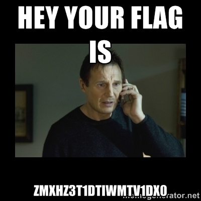

# Th3Jackers CTF 2015: TRLOL

**Category:** Trivia
**Points:** 150
**Solves** 14
**Description:**

> Description: 58076138, go there and take the flag LOL!
>
> Attachment:

## Write-up

Googling for `58076138` in Google Images results in this [meme](http://memegenerator.net/instance/58076138):



The text we read is:

> Hey your flag is ZmxhZ3t1dTIwMTV1dX0 - I will find you and kill you

base64 decoding this string via `echo 'ZmxhZ3t1dTIwMTV1dX0' | base64 --decode` results in `flag{uu2015u`.

So we are missing something on the end of the string. We read `I will find you and kill you` and see that `you=u` and therefore we add the character `u` to the string: `ZmxhZ3t1dTIwMTV1dX0u`.

Now we base64 decode this new string again to get the flag:

```
$ echo 'ZmxhZ3t1dTIwMTV1dX0u' | base64 --decode
flag{uu2015uu}.
```

## Other write-ups and resources

* none yet
