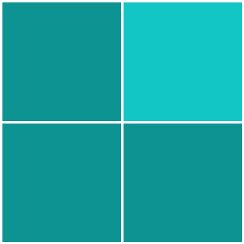

# Trend Micro CTF 2015: programming-100

**Category:** programming
**Points:** 100
**Solves:**
**Description:**

> Click the different Color

> 

> The number of increases after we solve few

## Write-up

(TODO)

## Other write-ups and resources

* <https://0x90r00t.com/2015/09/29/trend-micro-2015-progamming-100-write-up/>
* <https://b01lers.net/challenges/Trend%20Micro%20Qualifier%202015/Click%20on%20the%20Different%20Color/63/>
* <https://github.com/RandomsCTF/write-ups/tree/master/Trend%20Micro%20CTF%20Asia%20Pacific%20%26%20Japan%202015%20Online%20Qualifier/Programming%20100>
* <https://yanapermana.wordpress.com/2015/09/28/trend-micro-2015-write-up-ctf-programming-100/>
* <https://ctftime.org/writeup/1780>
* <https://github.com/p4-team/ctf/tree/master/2015-09-26-trendmicro/colors#eng-version>
* <https://aeacussec.pt/blog/index.php/2015/09/27/trendmicro-ctf-programming100-click-the-different-color-2/>
