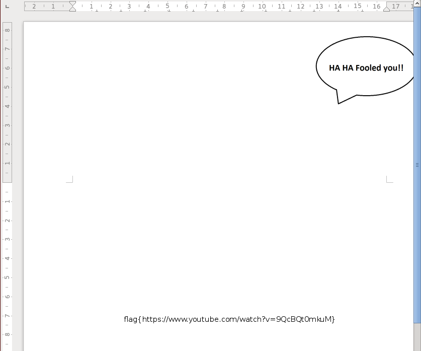

# UIU CTF 2015: sniffthis

**Category:** Network
**Points:** 200
**Solves:** 30
**Description:** 

> NETWORK: Just say no. [traffic.7z](https://ctf.acm.illinois.edu/archive/traffic.7z)

## Write-up

This challenge consists in a pcap file for network traffic.
Let's export the HTTP objects and browse the files.
In the middle of a lot of Pandora traffic, we find key.gif and key.bmp.
Sadly, none of them can be opened with an image viewer, and they both contain the same text:
```
$cat key.gif
<html>
<head><title>301 Moved Permanently</title></head>
<body bgcolor="white">
<center><h1>301 Moved Permanently</h1></center>
<hr><center>nginx</center>
</body>
</html>
```

Apparently, the images were moved to another location.
Let's search for that new location in the capture.
Searching for the string "key.bmp" in wireshark returns a packet with the following url:
<https://www.dropbox.com/s/1x6rspz1tf7fvmk/key.bmp>

Visiting the page allows us to download the actual file which still doesn't correspond to an actual image.
```
$file key.bmp 
key.bmp: Microsoft Word 2007+
```
It is actually a word document, so let's open it with our favorite word processor:

This looks like a false lead, but if we remove the image, we can reveal the flag:


## Other write-ups and resources

* <http://www.bobbyblues.com/misc/CTF/uiu2015-sniffthis/>
* <http://www.gameofpwnz.com/?p=102>