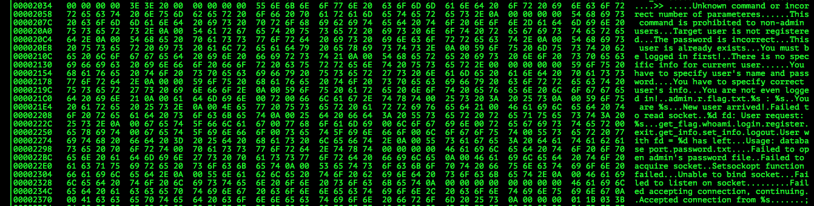

# VolgaCTF Quals CTF 2015: database

**Category:** Pwn
**Points:** 75
**Solves:** 116
**Description:**

> hack the database!
> 
> nc database.2015.volgactf.ru 7777
> [database](http://files.2015.volgactf.ru/database/database)

## Write-up

by [polym](https://github.com/abpolym)

This writeup is based on following writeups:

* <http://www.rogdham.net/2015/05/03/volgactf-2015-quals-write-ups.en>
* <https://github.com/smokeleeteveryday/CTF_WRITEUPS/tree/master/2015/VOLGACTF/pwn/database>
* <http://www.mrt-prodz.com/blog/view/2015/05/volgactf-2015-quals---database-75pts-writeup>

First, we apply `file` on the given binary to find out what we are dealing with:

```bash
$ file database
database: ELF 64-bit LSB  executable, x86-64, version 1 (SYSV), dynamically linked (uses shared libs), for GNU/Linux 2.6.24, BuildID[sha1]=d9a1acedc81f211feef5289d2cb05effd06d4a34, not stripped
```

`x86` Linux, not stripped ELF.

After running the binary, we can connect to it using `nc` with the specified port:

```bash
$ ./database
Usage: database port
$ ./database 7777
[...]
# On another terminal:
$ nc localhost 7777
>> help
Unknown command or incorrect number of parameteres.
^C
```

Ok so the usual `help` does not give us any further information.

Time to look at strings, functions, libraries and other information of this binary by using [`radare2`](https://github.com/radare/radare2) ([Here](https://github.com/pwntester/cheatsheets/blob/master/radare2.md) is a good cheatsheet)!

```bash
$ radare2 ./database
[0x00401010]> iz
[strings]
addr=0x00402038 off=0x00002038 ordinal=000 sz=4 section=.rodata string=
addr=0x00402040 off=0x00002040 ordinal=001 sz=52 section=.rodata string=Unknowncommandorincorrectnumberofparameteres.
addr=0x00402078 off=0x00002078 ordinal=002 sz=47 section=.rodata string=Thiscommandisprohibitedtononadminusers.
addr=0x004020a8 off=0x000020a8 ordinal=003 sz=31 section=.rodata string=Targetuserisnotregistered.
addr=0x004020c8 off=0x000020c8 ordinal=004 sz=27 section=.rodata string=Thepasswordisincorrect.
addr=0x004020e4 off=0x000020e4 ordinal=005 sz=29 section=.rodata string=Thisuserisalreadyexists.
addr=0x00402102 off=0x00002102 ordinal=006 sz=29 section=.rodata string=Youmustbeloggedinfirst
addr=0x00402120 off=0x00002120 ordinal=007 sz=44 section=.rodata string=Thereisnospecificinfoforcurrentuser.
addr=0x00402150 off=0x00002150 ordinal=008 sz=46 section=.rodata string=Youhavetospecifyusersnameandpassword.
addr=0x00402180 off=0x00002180 ordinal=009 sz=41 section=.rodata string=Youhavetospecifycorrectusersinfo.
addr=0x004021aa off=0x000021aa ordinal=010 sz=28 section=.rodata string=Youarenotevenloggedin
addr=0x004021c8 off=0x000021c8 ordinal=011 sz=7 section=.rodata string=adminr
addr=0x004021cf off=0x000021cf ordinal=012 sz=9 section=.rodata string=flag.txt
addr=0x004021d8 off=0x000021d8 ordinal=013 sz=8 section=.rodata string=ss
addr=0x004021e1 off=0x000021e1 ordinal=014 sz=12 section=.rodata string=Youares.
addr=0x004021ee off=0x000021ee ordinal=015 sz=18 section=.rodata string=Newuserarrived
addr=0x00402200 off=0x00002200 ordinal=016 sz=22 section=.rodata string=Failedtoreadsocket
addr=0x00402217 off=0x00002217 ordinal=017 sz=25 section=.rodata string=dfdUserrequests.
addr=0x00402231 off=0x00002231 ordinal=018 sz=9 section=.rodata string=get_flag
addr=0x0040223a off=0x0000223a ordinal=019 sz=7 section=.rodata string=whoami
addr=0x00402241 off=0x00002241 ordinal=020 sz=6 section=.rodata string=login
addr=0x00402247 off=0x00002247 ordinal=021 sz=9 section=.rodata string=register
addr=0x00402250 off=0x00002250 ordinal=022 sz=5 section=.rodata string=exit
addr=0x00402255 off=0x00002255 ordinal=023 sz=9 section=.rodata string=get_info
addr=0x0040225e off=0x0000225e ordinal=024 sz=9 section=.rodata string=set_info
addr=0x00402267 off=0x00002267 ordinal=025 sz=7 section=.rodata string=logout
addr=0x0040226e off=0x0000226e ordinal=026 sz=28 section=.rodata string=Userwithfddhasleft.
addr=0x0040228b off=0x0000228b ordinal=027 sz=21 section=.rodata string=Usagedatabaseport
addr=0x004022a0 off=0x000022a0 ordinal=028 sz=13 section=.rodata string=password.txt
addr=0x004022b0 off=0x000022b0 ordinal=029 sz=37 section=.rodata string=Failedtoopenadminspasswordfile
addr=0x004022d6 off=0x000022d6 ordinal=030 sz=25 section=.rodata string=Failedtoacquiresocket
addr=0x004022f0 off=0x000022f0 ordinal=031 sz=28 section=.rodata string=Setsockoptfunctionfailed.
addr=0x0040230d off=0x0000230d ordinal=032 sz=23 section=.rodata string=Unabletobindsocket.
addr=0x00402325 off=0x00002325 ordinal=033 sz=27 section=.rodata string=Failedtolistenonsocket
addr=0x00402348 off=0x00002348 ordinal=034 sz=40 section=.rodata string=Failedacceptingconnectioncontinuing
addr=0x00402371 off=0x00002371 ordinal=035 sz=28 section=.rodata string=Acceptedconnectionfroms
addr=0x00603150 off=0x00003150 ordinal=000 sz=4 section=.data string=8
addr=0x00603158 off=0x00003158 ordinal=001 sz=4 section=.data string=
addr=0x00603160 off=0x00003160 ordinal=002 sz=4 section=.data string=x
addr=0x00603169 off=0x00003169 ordinal=003 sz=3 section=.data string=
addr=0x00603171 off=0x00003171 ordinal=004 sz=3 section=.data string=
addr=0x00603179 off=0x00003179 ordinal=005 sz=3 section=.data string=
addr=0x00603181 off=0x00003181 ordinal=006 sz=3 section=.data string=
addr=0x00603188 off=0x00003188 ordinal=007 sz=4 section=.data string=
addr=0x00603190 off=0x00003190 ordinal=008 sz=4 section=.data string=P
addr=0x00603199 off=0x00003199 ordinal=009 sz=3 section=.data string=
addr=0x006031a1 off=0x000031a1 ordinal=010 sz=3 section=.data string=

47 strings
```

You can also use a hexeditor e.g. `hexedit` and find argument and other real strings compact in the data segment of the binary:



You have to manually find the start of the data segment either by just having a closer look at the binary (usually the `.data` or `.rodata` segment are in the `2/3` to `3/4` section of the binary) or decompiling it using any decompiler and then searching for found strings.

We see some command like strings like `whoami`, `login`, `register` etc and try these:

```bash
$ nc localhost 7777
>> whoami
You are not even logged in!
>> login admin pass
The password is incorrect.
>> register guest pass
>> whoami
You are guest.
>> get_flag
This command is prohibited to non-admin users.
>> get_info
guest : There is no specific info for current user.
admin : profileinformation
```

Looks like we have to login as admin to get the flag!

By either decompiling or using `radare` again, we can see a list of symbols in the symbol table that hold [global variables or functions](https://en.wikipedia.org/wiki/Symbol_table):

```bash
[0x00401010]> is
[Symbols]
addr=0x00602e00 off=0x00202e00 ord=028 fwd=NONE sz=0 bind=LOCAL type=OBJECT name=__JCR_LIST__
addr=0x00401040 off=0x00001040 ord=029 fwd=NONE sz=0 bind=LOCAL type=FUNC name=deregister_tm_clones
addr=0x00401070 off=0x00001070 ord=030 fwd=NONE sz=0 bind=LOCAL type=FUNC name=register_tm_clones
addr=0x004010b0 off=0x000010b0 ord=031 fwd=NONE sz=0 bind=LOCAL type=FUNC name=__do_global_dtors_aux
addr=0x006031b0 off=0x002031b0 ord=032 fwd=NONE sz=1 bind=LOCAL type=OBJECT name=completed.6972
addr=0x00602df8 off=0x00202df8 ord=033 fwd=NONE sz=0 bind=LOCAL type=OBJECT name=__do_global_dtors_aux_fini_array_entry
addr=0x004010d0 off=0x000010d0 ord=034 fwd=NONE sz=0 bind=LOCAL type=FUNC name=frame_dummy
addr=0x00602df0 off=0x00202df0 ord=035 fwd=NONE sz=0 bind=LOCAL type=OBJECT name=__frame_dummy_init_array_entry
addr=0x00402658 off=0x00002658 ord=038 fwd=NONE sz=0 bind=LOCAL type=OBJECT name=__FRAME_END__
addr=0x00602e00 off=0x00202e00 ord=039 fwd=NONE sz=0 bind=LOCAL type=OBJECT name=__JCR_END__
addr=0x00602df8 off=0x00202df8 ord=041 fwd=NONE sz=0 bind=LOCAL type=NOTYPE name=__init_array_end
addr=0x00602e08 off=0x00202e08 ord=042 fwd=NONE sz=0 bind=LOCAL type=OBJECT name=_DYNAMIC
addr=0x00602df0 off=0x00202df0 ord=043 fwd=NONE sz=0 bind=LOCAL type=NOTYPE name=__init_array_start
addr=0x00603000 off=0x00203000 ord=044 fwd=NONE sz=0 bind=LOCAL type=OBJECT name=_GLOBAL_OFFSET_TABLE_
addr=0x00402020 off=0x00002020 ord=045 fwd=NONE sz=2 bind=GLOBAL type=FUNC name=__libc_csu_fini
addr=0x0040168e off=0x0000168e ord=046 fwd=NONE sz=82 bind=GLOBAL type=FUNC name=logout
addr=0x00401174 off=0x00001174 ord=048 fwd=NONE sz=233 bind=GLOBAL type=FUNC name=insert_new_user
addr=0x00603140 off=0x00203140 ord=051 fwd=NONE sz=0 bind=UNKNOWN type=NOTYPE name=data_start
addr=0x00603160 off=0x00203160 ord=052 fwd=NONE sz=8 bind=GLOBAL type=OBJECT name=get_flag_prohibited
addr=0x004015b1 off=0x000015b1 ord=053 fwd=NONE sz=221 bind=GLOBAL type=FUNC name=get_info
addr=0x0040125d off=0x0000125d ord=055 fwd=NONE sz=235 bind=GLOBAL type=FUNC name=get_flag
addr=0x006031a8 off=0x002031a8 ord=059 fwd=NONE sz=0 bind=GLOBAL type=NOTYPE name=_edata
addr=0x00603190 off=0x00203190 ord=061 fwd=NONE sz=8 bind=GLOBAL type=OBJECT name=no_data
addr=0x00402024 off=0x00002024 ord=063 fwd=NONE sz=0 bind=GLOBAL type=FUNC name=_fini
addr=0x00401348 off=0x00001348 ord=066 fwd=NONE sz=238 bind=GLOBAL type=FUNC name=login
addr=0x006031b8 off=0x002031b8 ord=069 fwd=NONE sz=8 bind=GLOBAL type=OBJECT name=users
addr=0x006031a0 off=0x002031a0 ord=073 fwd=NONE sz=8 bind=GLOBAL type=OBJECT name=logout_error
addr=0x00603198 off=0x00203198 ord=074 fwd=NONE sz=8 bind=GLOBAL type=OBJECT name=no_info_specified
addr=0x004016e0 off=0x000016e0 ord=076 fwd=NONE sz=199 bind=GLOBAL type=FUNC name=whoami
addr=0x00603178 off=0x00203178 ord=079 fwd=NONE sz=8 bind=GLOBAL type=OBJECT name=user_exists
addr=0x00603180 off=0x00203180 ord=083 fwd=NONE sz=8 bind=GLOBAL type=OBJECT name=no_user
addr=0x00603140 off=0x00203140 ord=084 fwd=NONE sz=0 bind=GLOBAL type=NOTYPE name=__data_start
addr=0x004010fd off=0x000010fd ord=086 fwd=NONE sz=119 bind=GLOBAL type=FUNC name=rtrim
addr=0x00603148 off=0x00203148 ord=088 fwd=NONE sz=0 bind=GLOBAL type=OBJECT name=__dso_handle
addr=0x004014f1 off=0x000014f1 ord=089 fwd=NONE sz=192 bind=GLOBAL type=FUNC name=set_info
addr=0x00402030 off=0x00002030 ord=090 fwd=NONE sz=4 bind=GLOBAL type=OBJECT name=_IO_stdin_used
addr=0x00603170 off=0x00203170 ord=091 fwd=NONE sz=8 bind=GLOBAL type=OBJECT name=incorrect_password
addr=0x00603168 off=0x00203168 ord=092 fwd=NONE sz=8 bind=GLOBAL type=OBJECT name=user_not_found
addr=0x00401fb0 off=0x00001fb0 ord=093 fwd=NONE sz=101 bind=GLOBAL type=FUNC name=__libc_csu_init
addr=0x00603150 off=0x00203150 ord=094 fwd=NONE sz=8 bind=GLOBAL type=OBJECT name=invitation
addr=0x006031c0 off=0x002031c0 ord=096 fwd=NONE sz=0 bind=GLOBAL type=NOTYPE name=_end
addr=0x00401010 off=0x00001010 ord=098 fwd=NONE sz=0 bind=GLOBAL type=FUNC name=_start
addr=0x006031a8 off=0x002031a8 ord=099 fwd=NONE sz=0 bind=GLOBAL type=NOTYPE name=__bss_start
addr=0x00401436 off=0x00001436 ord=100 fwd=NONE sz=187 bind=GLOBAL type=FUNC name=register_user
addr=0x00401be2 off=0x00001be2 ord=101 fwd=NONE sz=971 bind=GLOBAL type=FUNC name=main
addr=0x00603188 off=0x00203188 ord=108 fwd=NONE sz=8 bind=GLOBAL type=OBJECT name=no_info
addr=0x00603158 off=0x00203158 ord=109 fwd=NONE sz=8 bind=GLOBAL type=OBJECT name=incorrect_command
addr=0x006031a8 off=0x002031a8 ord=113 fwd=NONE sz=0 bind=GLOBAL type=OBJECT name=__TMC_END__
addr=0x00400d90 off=0x00000d90 ord=117 fwd=NONE sz=0 bind=GLOBAL type=FUNC name=_init
addr=0x006031a8 off=0x002031a8 ord=119 fwd=NONE sz=8 bind=GLOBAL type=OBJECT name=stderr@@GLIBC_2.2.5
addr=0x004017a7 off=0x000017a7 ord=121 fwd=NONE sz=1083 bind=GLOBAL type=FUNC name=process_connection
addr=0x00400dc0 off=0x00000dc0 ord=001 fwd=NONE sz=16 bind=GLOBAL type=FUNC name=imp.recv
addr=0x00400dd0 off=0x00000dd0 ord=002 fwd=NONE sz=16 bind=GLOBAL type=FUNC name=imp.strncpy
addr=0x00400000 off=0x00000000 ord=003 fwd=NONE sz=16 bind=UNKNOWN type=NOTYPE name=imp._ITM_deregisterTMCloneTable
addr=0x00400de0 off=0x00000de0 ord=004 fwd=NONE sz=16 bind=GLOBAL type=FUNC name=imp.puts
addr=0x00400df0 off=0x00000df0 ord=005 fwd=NONE sz=16 bind=GLOBAL type=FUNC name=imp.setsockopt
addr=0x00400e10 off=0x00000e10 ord=006 fwd=NONE sz=16 bind=GLOBAL type=FUNC name=imp.inet_ntoa
addr=0x00400e20 off=0x00000e20 ord=007 fwd=NONE sz=16 bind=GLOBAL type=FUNC name=imp.fclose
addr=0x00400e30 off=0x00000e30 ord=008 fwd=NONE sz=16 bind=GLOBAL type=FUNC name=imp.g_hash_table_lookup
addr=0x00400e40 off=0x00000e40 ord=009 fwd=NONE sz=16 bind=GLOBAL type=FUNC name=imp.strlen
addr=0x00400e50 off=0x00000e50 ord=010 fwd=NONE sz=16 bind=GLOBAL type=FUNC name=imp.__stack_chk_fail
addr=0x00400e60 off=0x00000e60 ord=011 fwd=NONE sz=16 bind=GLOBAL type=FUNC name=imp.htons
addr=0x00400e70 off=0x00000e70 ord=012 fwd=NONE sz=16 bind=GLOBAL type=FUNC name=imp.send
addr=0x00400e80 off=0x00000e80 ord=013 fwd=NONE sz=16 bind=GLOBAL type=FUNC name=imp.strchr
addr=0x00400e90 off=0x00000e90 ord=014 fwd=NONE sz=16 bind=GLOBAL type=FUNC name=imp.printf
addr=0x00400ea0 off=0x00000ea0 ord=015 fwd=NONE sz=16 bind=GLOBAL type=FUNC name=imp.snprintf
addr=0x00400eb0 off=0x00000eb0 ord=016 fwd=NONE sz=16 bind=GLOBAL type=FUNC name=imp.memset
addr=0x00400ec0 off=0x00000ec0 ord=017 fwd=NONE sz=16 bind=GLOBAL type=FUNC name=imp.close
addr=0x00400ed0 off=0x00000ed0 ord=018 fwd=NONE sz=16 bind=GLOBAL type=FUNC name=imp.g_hash_table_new
addr=0x00400ee0 off=0x00000ee0 ord=019 fwd=NONE sz=16 bind=GLOBAL type=FUNC name=imp.__libc_start_main
addr=0x00400ef0 off=0x00000ef0 ord=020 fwd=NONE sz=16 bind=GLOBAL type=FUNC name=imp.fgets
addr=0x00400f00 off=0x00000f00 ord=021 fwd=NONE sz=16 bind=GLOBAL type=FUNC name=imp.calloc
addr=0x00400f10 off=0x00000f10 ord=022 fwd=NONE sz=16 bind=GLOBAL type=FUNC name=imp.strcmp
addr=0x00400f20 off=0x00000f20 ord=023 fwd=NONE sz=16 bind=UNKNOWN type=NOTYPE name=imp.__gmon_start__
addr=0x00400f30 off=0x00000f30 ord=024 fwd=NONE sz=16 bind=GLOBAL type=FUNC name=imp.listen
addr=0x00400f40 off=0x00000f40 ord=025 fwd=NONE sz=16 bind=GLOBAL type=FUNC name=imp.g_hash_table_insert
addr=0x00400f50 off=0x00000f50 ord=026 fwd=NONE sz=16 bind=GLOBAL type=FUNC name=imp.bind
addr=0x00400f70 off=0x00000f70 ord=027 fwd=NONE sz=16 bind=GLOBAL type=FUNC name=imp.fopen
addr=0x00400000 off=0x00000000 ord=028 fwd=NONE sz=16 bind=UNKNOWN type=NOTYPE name=imp._Jv_RegisterClasses
addr=0x00400f80 off=0x00000f80 ord=029 fwd=NONE sz=16 bind=GLOBAL type=FUNC name=imp.accept
addr=0x00400f90 off=0x00000f90 ord=030 fwd=NONE sz=16 bind=GLOBAL type=FUNC name=imp.atoi
addr=0x00400fa0 off=0x00000fa0 ord=031 fwd=NONE sz=16 bind=GLOBAL type=FUNC name=imp.sprintf
addr=0x00400fb0 off=0x00000fb0 ord=032 fwd=NONE sz=16 bind=GLOBAL type=FUNC name=imp.exit
addr=0x00400fc0 off=0x00000fc0 ord=033 fwd=NONE sz=16 bind=GLOBAL type=FUNC name=imp.fwrite
addr=0x00400fd0 off=0x00000fd0 ord=034 fwd=NONE sz=16 bind=GLOBAL type=FUNC name=imp.g_hash_table_lookup_extended
addr=0x00400000 off=0x00000000 ord=035 fwd=NONE sz=16 bind=UNKNOWN type=NOTYPE name=imp._ITM_registerTMCloneTable
addr=0x00400fe0 off=0x00000fe0 ord=036 fwd=NONE sz=16 bind=GLOBAL type=FUNC name=imp.g_hash_table_foreach
addr=0x00400ff0 off=0x00000ff0 ord=037 fwd=NONE sz=16 bind=GLOBAL type=FUNC name=imp.fork
addr=0x00401000 off=0x00001000 ord=038 fwd=NONE sz=16 bind=GLOBAL type=FUNC name=imp.socket
addr=0x00400f60 off=0x00000f60 ord=041 fwd=NONE sz=16 bind=GLOBAL type=FUNC name=imp.g_str_hash
addr=0x00400e00 off=0x00000e00 ord=045 fwd=NONE sz=16 bind=GLOBAL type=FUNC name=imp.g_str_equal

91 symbols
```

Note that this is harder in the case of the ELF being stripped - meaning that this information is removed from the ELF using the tool `strip`.

These functions seem to be interesting:

* `rtrim`
* `insert_new_user`
* `get_flag`
* `login`
* `register_user`
* `set_info`
* `get_info`
* `logout`
* `whoami`
* `process_connection`

Now you can either use `gdb` to debug the binary step by step or decompile the binary using `objdump`, hopper, ida or other decompilers .

While decompiling / reversing the binary these functions become interesting (since they depend on user input):

* `rtrim`
* `insert_new_user`
* `login`
* `register_user`

`rtrim`:

```asm
00000000004010fd <rtrim>:
  4010fd:       55                      push   rbp
  4010fe:       48 89 e5                mov    rbp,rsp
  401101:       48 83 ec 20             sub    rsp,0x20
  401105:       48 89 7d e8             mov    QWORD PTR [rbp-0x18],rdi
  401109:       48 8b 45 e8             mov    rax,QWORD PTR [rbp-0x18]
  40110d:       48 89 c7                mov    rdi,rax
  401110:       e8 2b fd ff ff          call   400e40 <strlen@plt>

  401115:       48 8d 50 ff             lea    rdx,[rax-0x1]
  401119:       48 8b 45 e8             mov    rax,QWORD PTR [rbp-0x18]
  40111d:       48 01 d0                add    rax,rdx
  401120:       48 89 45 f8             mov    QWORD PTR [rbp-0x8],rax
  401124:       eb 3e                   jmp    401164 <rtrim+0x67>

  401126:       48 8b 45 f8             mov    rax,QWORD PTR [rbp-0x8]
  40112a:       0f b6 00                movzx  eax,BYTE PTR [rax]
  40112d:       3c 0d                   cmp    al,0xd ; "\r"
  40112f:       74 27                   je     401158 <rtrim+0x5b>

  401131:       48 8b 45 f8             mov    rax,QWORD PTR [rbp-0x8]
  401135:       0f b6 00                movzx  eax,BYTE PTR [rax]
  401138:       3c 0a                   cmp    al,0xa ; "\n"
  40113a:       74 1c                   je     401158 <rtrim+0x5b>

  40113c:       48 8b 45 f8             mov    rax,QWORD PTR [rbp-0x8]
  401140:       0f b6 00                movzx  eax,BYTE PTR [rax]
  401143:       3c 20                   cmp    al,0x20 ; " "
  401145:       74 11                   je     401158 <rtrim+0x5b>

  401147:       48 8b 45 f8             mov    rax,QWORD PTR [rbp-0x8]
  40114b:       0f b6 00                movzx  eax,BYTE PTR [rax]
  40114e:       3c 09                   cmp    al,0x9 ; "\t"
  401150:       74 06                   je     401158 <rtrim+0x5b>

  401152:       48 8b 45 e8             mov    rax,QWORD PTR [rbp-0x18]
  401156:       eb 1a                   jmp    401172 <rtrim+0x75>

  401158:       48 8b 45 f8             mov    rax,QWORD PTR [rbp-0x8]
  40115c:       c6 00 00                mov    BYTE PTR [rax],0x0
  40115f:       48 83 6d f8 01          sub    QWORD PTR [rbp-0x8],0x1
  401164:       48 8b 45 f8             mov    rax,QWORD PTR [rbp-0x8]
  401168:       48 3b 45 e8             cmp    rax,QWORD PTR [rbp-0x18]
  40116c:       73 b8                   jae    401126 <rtrim+0x29>

  40116e:       48 8b 45 e8             mov    rax,QWORD PTR [rbp-0x18]
  401172:       c9                      leave  
  401173:       c3                      ret    
```

`rtrim` strips whitecharacters from a given string - in this case `\n` (`0xa`), ` ` (`0x20`), `\t` (`0x9`) and `\r` (`0xd`).

* `insert_new_user`:

```asm
0000000000401174 <insert_new_user>:
  401174:       55                      push   rbp
  401175:       48 89 e5                mov    rbp,rsp
  401178:       48 83 ec 30             sub    rsp,0x30
  40117c:       48 89 7d e8             mov    QWORD PTR [rbp-0x18],rdi
  401180:       48 89 75 e0             mov    QWORD PTR [rbp-0x20],rsi
  401184:       48 89 55 d8             mov    QWORD PTR [rbp-0x28],rdx
  401188:       be 01 00 00 00          mov    esi,0x1
  40118d:       bf 40 00 00 00          mov    edi,0x40
  401192:       e8 69 fd ff ff          call   400f00 <calloc@plt>

  401197:       48 89 45 f0             mov    QWORD PTR [rbp-0x10],rax
  40119b:       48 8b 45 e8             mov    rax,QWORD PTR [rbp-0x18]
  40119f:       48 89 c7                mov    rdi,rax
  4011a2:       e8 56 ff ff ff          call   4010fd <rtrim>

  4011a7:       48 89 c1                mov    rcx,rax
  4011aa:       48 8b 45 f0             mov    rax,QWORD PTR [rbp-0x10]
  4011ae:       ba 40 00 00 00          mov    edx,0x40
  4011b3:       48 89 ce                mov    rsi,rcx
  4011b6:       48 89 c7                mov    rdi,rax
  4011b9:       e8 12 fc ff ff          call   400dd0 <strncpy@plt>

  4011be:       48 8b 45 f0             mov    rax,QWORD PTR [rbp-0x10]
  4011c2:       48 83 c0 40             add    rax,0x40
  4011c6:       c6 00 00                mov    BYTE PTR [rax],0x0
  4011c9:       be 01 00 00 00          mov    esi,0x1
  4011ce:       bf 80 00 00 00          mov    edi,0x80
  4011d3:       e8 28 fd ff ff          call   400f00 <calloc@plt>

  4011d8:       48 89 45 f8             mov    QWORD PTR [rbp-0x8],rax
  4011dc:       48 8b 45 e0             mov    rax,QWORD PTR [rbp-0x20]
  4011e0:       48 89 c7                mov    rdi,rax
  4011e3:       e8 15 ff ff ff          call   4010fd <rtrim>

  4011e8:       48 89 c1                mov    rcx,rax
  4011eb:       48 8b 45 f8             mov    rax,QWORD PTR [rbp-0x8]
  4011ef:       ba 40 00 00 00          mov    edx,0x40
  4011f4:       48 89 ce                mov    rsi,rcx
  4011f7:       48 89 c7                mov    rdi,rax
  4011fa:       e8 d1 fb ff ff          call   400dd0 <strncpy@plt>

  4011ff:       48 8b 45 f8             mov    rax,QWORD PTR [rbp-0x8]
  401203:       c6 40 40 00             mov    BYTE PTR [rax+0x40],0x0
  401207:       48 83 7d d8 00          cmp    QWORD PTR [rbp-0x28],0x0
  40120c:       74 2f                   je     40123d <insert_new_user+0xc9>

  40120e:       48 8b 45 d8             mov    rax,QWORD PTR [rbp-0x28]
  401212:       48 89 c7                mov    rdi,rax
  401215:       e8 e3 fe ff ff          call   4010fd <rtrim>

  40121a:       48 8b 55 f8             mov    rdx,QWORD PTR [rbp-0x8]
  40121e:       48 8d 4a 40             lea    rcx,[rdx+0x40]
  401222:       ba 40 00 00 00          mov    edx,0x40
  401227:       48 89 c6                mov    rsi,rax
  40122a:       48 89 cf                mov    rdi,rcx
  40122d:       e8 9e fb ff ff          call   400dd0 <strncpy@plt>

  401232:       48 8b 45 f8             mov    rax,QWORD PTR [rbp-0x8]
  401236:       c6 80 80 00 00 00 00    mov    BYTE PTR [rax+0x80],0x0
  40123d:       48 8b 05 74 1f 20 00    mov    rax,QWORD PTR [rip+0x201f74]        # 6031b8 <users>
  401244:       48 8b 55 f8             mov    rdx,QWORD PTR [rbp-0x8]
  401248:       48 8b 4d f0             mov    rcx,QWORD PTR [rbp-0x10]
  40124c:       48 89 ce                mov    rsi,rcx
  40124f:       48 89 c7                mov    rdi,rax
  401252:       e8 e9 fc ff ff          call   400f40 <g_hash_table_insert@plt>

  401257:       48 8b 45 f0             mov    rax,QWORD PTR [rbp-0x10]
  40125b:       c9                      leave  
  40125c:       c3                      ret 
```

To ease the reversing task, you can use reverse engineering tools that produce pseudo C code, such as IDA or hopper (for Objective-C?).

A representation of this pseudo-code can be seen [here](https://github.com/smokeleeteveryday/CTF_WRITEUPS/tree/master/2015/VOLGACTF/pwn/database).

After having a closer look at how a user is registered, we see that `rtrim` is called several times in `insert_new_user` - once for the username and once for the password.

This means that we can register ourselves with a username that has a tabspace character appended such as `admin\t`.
This username then is trimmed with `rtrim`, becoming `rtrim`, and after that inserted in the database with the new password!

Following that, we just login as `admin` and the new password to call `get_flag` and receive the flag, `{does_it_look_like_column_tr@ncation}`.

To reproduce the exploit, follow these steps:

* `echo -n 'HACK{test_flag_sotesty}' > flag.txt`
* `echo 'admin profileinformation' > password.txt`
* Run the executable with `bash database 7777` in a VM
* Run the [solver script](./solve.py)

## Other write-ups and resources

* <http://www.rogdham.net/2015/05/03/volgactf-2015-quals-write-ups.en>
* <https://github.com/smokeleeteveryday/CTF_WRITEUPS/tree/master/2015/VOLGACTF/pwn/database>
* <http://www.mrt-prodz.com/blog/view/2015/05/volgactf-2015-quals---database-75pts-writeup>
* [Japanese](http://sioncojp.hateblo.jp/entry/2015/05/14/035148)
* [Polish](http://forum.4programmers.net/Spolecznosc/251462-writeup_volgactf_2015)
