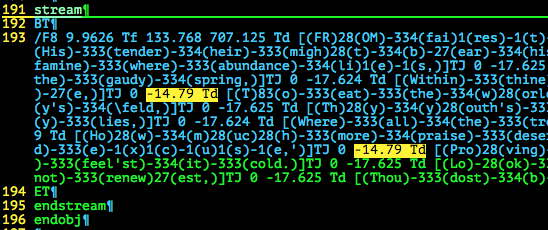

# VolgaCTF Quals CTF 2015: poem

**Category:** Stego
**Points:** 100
**Solves:** 28
**Description:**

> Enjoy each of the sonnets equally.
> 
> [poem](http://files.2015.volgactf.ru/poem/poem.pdf)

## Write-up

by [polym](https://github.com/abpolym)

This writeup is based on two writeups: A writeup by [whitehatters](https://www.whitehatters.academy/volgactf-2015-poem/) and a [Japanese writeup](http://sioncojp.hateblo.jp/entry/2015/05/14/201258)

We are given a PDF with a poem verbatim copied from an original poem.

The first thing that stands out is the varying spaces between each line.

We decompress the PDF (content) streams using `qpdf --qdf --object-streams=disable poem.pdf out.pdf` and see the decompressed streams by opening `out.pdf` in `vim`:



The highlighted (yellow) parts are text-positioning operators that move a text line. See the [Adobe PDF reference page 330](http://partners.adobe.com/public/developer/en/pdf/PDFReference.pdf) for more details.

In this case, a `Td` text line operator has two operands.
The first operand in our case almost always 0, the second is most of the time `-14.xxx` or `-17.xxx`. - Correct me, if I am wrong :).

The authors encoded a binary string into the second operand of each `Td` operator: `14` is `0` and `17` is `1`.

We can use [this script](./parsepdf.py) to (almost) extract the hidden binary:

```
+bash-4.3$ python2.7 parsepdf.py out.pdf
FLAG: {size_does_mattej_afxer_dll}
```

The script tries to recover the actual flag, which is `{size_does_matter_after_all}`, by adding missing, hidden bits after each stream - so far it is unknown where they are hidden.

## Other write-ups and resources

* <https://www.whitehatters.academy/volgactf-2015-poem/>
* [Japanese](http://sioncojp.hateblo.jp/entry/2015/05/14/201258)
