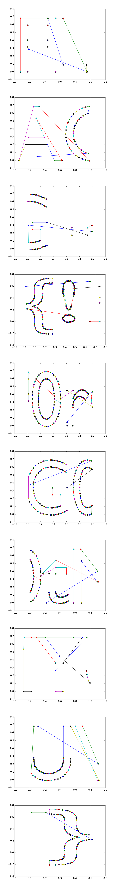

# VolgaCTF Quals CTF 2015: strange text

**Category:** Stego | PPC
**Points:** 350
**Solves:** 27
**Description:**

> We found some text with strange symbols - can you get a flag? [link](http://files.2015.volgactf.ru/strange_text/text.txt)

## Write-up

by [polym](https://github.com/abpolym)

This writeup is based on a writeup by [rogdham](http://www.rogdham.net/2015/05/03/volgactf-2015-quals-write-ups.en).

We are given a strange text file containing some float numbers.

This is (x,y) coordinates data that we have to plot, whereas the x points contain a group key.

If we for example split the data on `,`, we get this:

```
[...]
0.09.491787910461426
0.3002592921257019
0.09.47504711151123
0.30399078130722046
[...]
```

Here, `0.09.491787910461426` is an x point `0.491787910461426` with key `09` and `0.3002592921257019` is the related y point.

We can plot each of these points using [matplotlib](http://matplotlib.org/api/pyplot_api.html).

[This python script](./plotit.py) does the job and produces the final flag picture:



The flag is `{!F0rG0tMYUV}`.

## Other write-ups and resources

* <http://www.rogdham.net/2015/05/03/volgactf-2015-quals-write-ups.en> 
