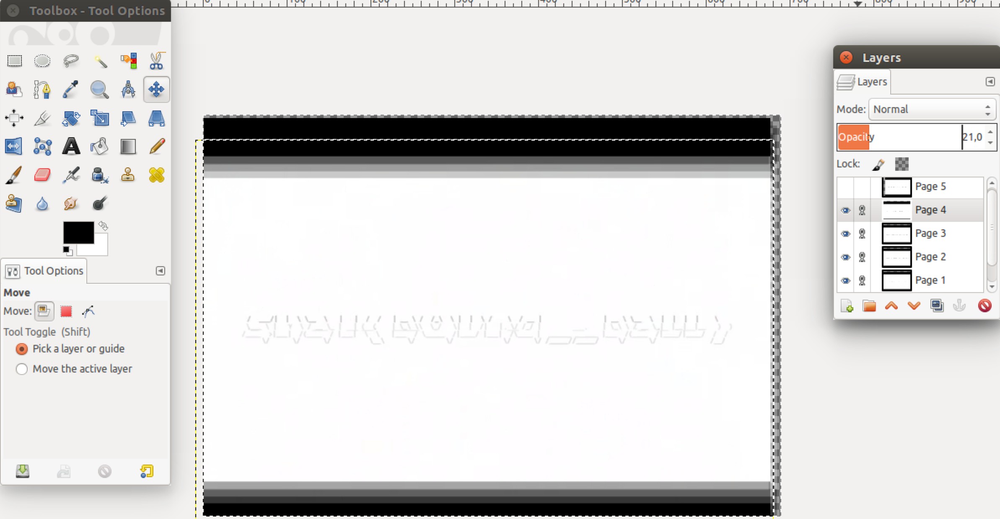

# WhiteHat Grand Prix Qualification Round 2015: Ca Mau

**Category:** Forensics
**Points:** 100
**Solves:** 64
**Description:**

> View me
> 
> [http://material.grandprix.whitehatvn.com/for100_2c698f97bca6186011c351dfdcd20c23](http://material.grandprix.whitehatvn.com/for100_2c698f97bca6186011c351dfdcd20c23)
> [http://materials.grandprix.whitehatvn.com/for100_2c698f97bca6186011c351dfdcd20c23](http://materials.grandprix.whitehatvn.com/for100_2c698f97bca6186011c351dfdcd20c23) (Mirror)


## Write-up

by [polym](https://github.com/abpolym)

This write-up is based on following write-ups:

* <https://github.com/teamavidya/ctf/tree/master/2015_whitehat_quals/ca_mau%5Bforensics100%5D>
* [Vietnamese](https://blog.tinduong.pw/whitehat-grandprix-global-challenge/)

We are given a video of several colored bouncing balls, viewable [here](https://www.youtube.com/watch?v=h-E8FpNbVeA).

If you watch the video, you sometimes see frames that seem to contain something else than just bouncing balls.

Therefore, we extract all individual frames to find these different frames:

```bash
$ ffmpeg -i for100.mp4 for100-%d.png
[...]
$ ls -lS 
[...]
-rw-r--r--   1 xxx  xxx     326773 Jan  3 11:30 for100-14407.png
-rw-r--r--   1 xxx  xxx     326323 Jan  3 11:30 for100-24023.png
[...]
-rw-r--r--   1 xxx  xxx      64310 Jan  3 11:31 for100-36974.png
-rw-r--r--   1 xxx  xxx      19474 Jan  3 11:59 for100-7136.png
[...]
-rw-r--r--   1 xxx  xxx       9623 Jan  3 11:59 for100-57618.png
-rw-r--r--   1 xxx  xxx       9308 Jan  3 11:59 for100-57617.png
[...]
-rw-r--r--   1 xxx  xxx       1083 Jan  3 11:29 for100-9675.png
-rw-r--r--   1 xxx  xxx       1076 Jan  3 11:30 for100-21559.png
```

If you open files with size less than `20000` bytes, you see either black frames or frames with some ASCII art:


We move these smaller frames into an individual folder `frames/`:

```bash
$ mkdir frames
$ find . -size -62k -exec mv {} frames/{} \;
$ cd frames/
```

Then, we only select those frames that show unique ASCII art and put them in a new `tiff`:

```bash
$ convert for100-21560.png for100-3078.png for100-40981.png for100-57614.png  for100-68106.png for100-7136.png stack.tiff
```

Now, we put the ASCII art pieces together as overlapping layers to complete the puzzle using `gimp`:



The frames spell out in ASCII art - the flag is sha1(b0und__ball) == `WhiteHat{ddbae30b37b4e46bf54f91766fa02b42c4c0927d}`.

[This writeup](https://github.com/teamavidya/ctf/tree/master/2015_whitehat_quals/ca_mau%5Bforensics100%5D) achieved a better result:


## Other write-ups and resources

* <https://github.com/teamavidya/ctf/tree/master/2015_whitehat_quals/ca_mau%5Bforensics100%5D>
* [Vietnamese](https://blog.tinduong.pw/whitehat-grandprix-global-challenge/)
