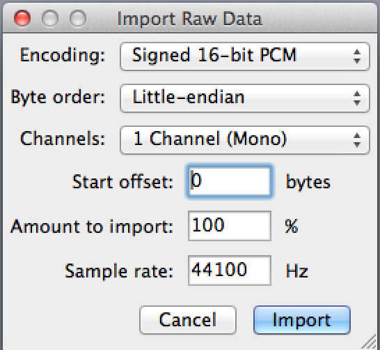
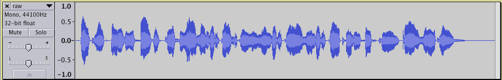

# WhiteHat Grand Prix Qualification Round 2015: Phong Nha Ke Bang

**Category:** Forensics
**Points:** 200
**Solves:** 11
**Description:**

> Flag is transmissed over the wire, listen carefully!
> 
> Flag = WhiteHat{md5_string}
> 
> [for200_3498c3f7c12b934cc58ed892bd96b34a](for200_3498c3f7c12b934cc58ed892bd96b34a)

## Write-up

by [polym](https://github.com/abpolym)

This writeup is based on following writeups:

* <https://sugivo.wordpress.com/2015/10/28/whitehat-2015-global-challenge-phong-nha-ke-bang-forensic-200/>
* [Vietnamese](https://blog.tinduong.pw/whitehat-grandprix-global-challenge/)

We are given a pcap (`for200.pcap`) inside a zip that we extract using `7z x for200_3498c3f7c12b934cc58ed892bd96b34a`.

Opening the pcap using `wireshark`, we see a lot of TCP packets.

Bu having a look at the data transmitted (`Analyze -> Follow -> TCP Stream`), we see that the data at first seems to be random.

We therefore save it as raw data `Show data as "Raw" -> Save as... => raw.bin` to get a [raw file](./raw.bin).

It turns out that this is a PCM audio file that we can import and listen to using `audacity`.

To do so, follow the following steps:

* `File -> Import -> Raw Data...`
* Set the encoding as 16-bit PCM, byte order as little-endian, channel numbers as 1 and sample rate 44100Hz as this picture demonstrates:

You then imported a raw PCM audio file, which waveform looks like the following:

Side-note: Disregard the wrong audio meta-information on the left side - `audacity` seems to be buggy there.

Now just listen to it closely to hear "md5 of pcm_streaming_in_2015 all lowercase".

The flag is `27c857563887a5bea24ef240211d562b` == md5("pcm_streaming_in_2015").

## Other write-ups and resources

* <https://sugivo.wordpress.com/2015/10/28/whitehat-2015-global-challenge-phong-nha-ke-bang-forensic-200/>
* [Vietnamese](https://blog.tinduong.pw/whitehat-grandprix-global-challenge/)
