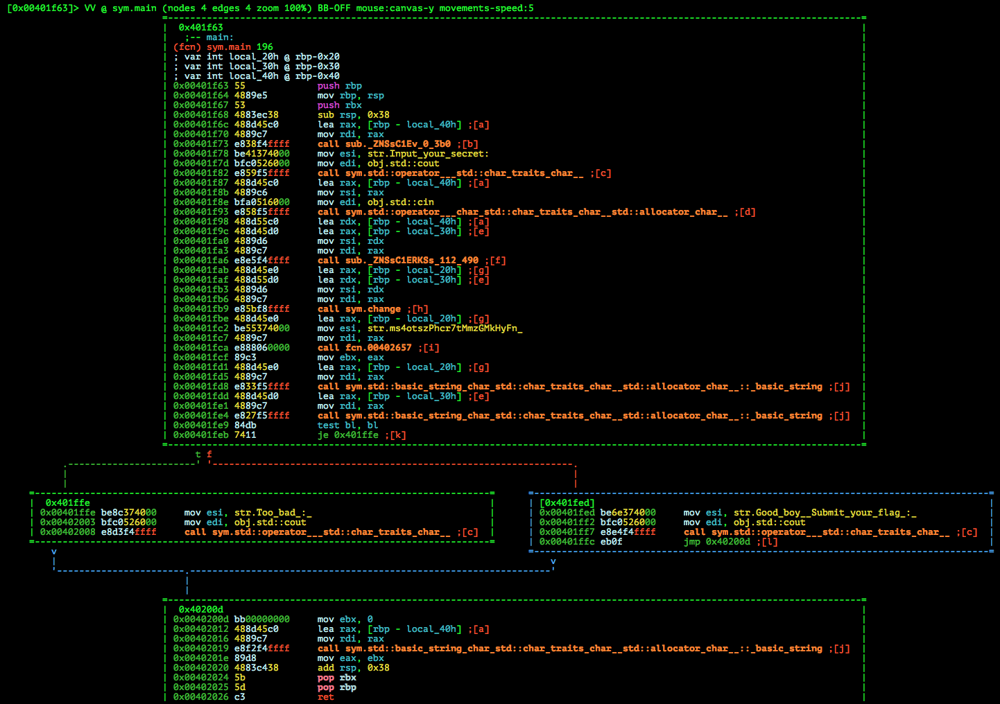
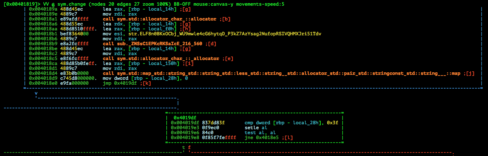

# WhiteHat Grand Prix Qualification Round 2015: Dong Van

**Category:** Reverse
**Points:** 100
**Solves:** 81
**Description:**

> Flag = WhiteHat{sha1(key)}
> 
> [re100_35d14595b17756b79556f6eca775c31a](re100_35d14595b17756b79556f6eca775c31a)


## Write-up

by [polym](https://github.com/abpolym)

This writeup is based on following writeups:

* <https://github.com/ByteBandits/writeups/blob/master/whitehat-grand-prix-quals-2015/reversing/dong%20wan/sudhackar/README.md>

Keywords:

* `x86-64` Linux Binary
* Custom Encoding

We are given a Zip that we extract to reveal a x86-64 executable for Linux:

```bash
$ file re100_35d14595b17756b79556f6eca775c31a 
re100_35d14595b17756b79556f6eca775c31a: Zip archive data, at least v2.0 to extract
$ 7z x re100_35d14595b17756b79556f6eca775c31a 

7-Zip [64] 9.20  Copyright (c) 1999-2010 Igor Pavlov  2010-11-18
p7zip Version 9.20 (locale=en_US.UTF-8,Utf16=on,HugeFiles=on,1 CPU)

Processing archive: re100_35d14595b17756b79556f6eca775c31a

Extracting  Re100

Everything is Ok

Size:       37869
Compressed: 11582
$ file Re100 
Re100: ELF 64-bit LSB  executable, x86-64, version 1 (SYSV), dynamically linked (uses shared libs), for GNU/Linux 2.6.24, BuildID[sha1]=6c7c0504ab2f342427f59846298e97f9e4fbb98f, not stripped
```

Running it:

```bash
$ chmod u+x ./Re100 
$ ./Re100 
Input your secret: hello
Too bad :($ 
```

Analyzing the binary with `radare2`, we find several interesting strings (`iz`):

```
[0x004016c0]> iz
[...]
vaddr=0x004036f8 paddr=0x000036f8 ordinal=002 sz=65 len=64 section=.rodata type=ascii string=ELF8n0BKxOCbj/WU9mwle4cG6hytqD+P3kZ7AzYsag2NufopRSIVQHMXJri51Tdv
vaddr=0x0040373c paddr=0x0000373c ordinal=003 sz=5 len=4 section=.rodata type=ascii string=0000
vaddr=0x00403741 paddr=0x00003741 ordinal=004 sz=20 len=19 section=.rodata type=ascii string=Input your secret: 
vaddr=0x00403755 paddr=0x00003755 ordinal=005 sz=25 len=24 section=.rodata type=ascii string=ms4otszPhcr7tMmzGMkHyFn=
vaddr=0x0040376e paddr=0x0000376e ordinal=006 sz=30 len=29 section=.rodata type=ascii string=Good boy! Submit your flag :)
vaddr=0x0040378c paddr=0x0000378c ordinal=007 sz=11 len=10 section=.rodata type=ascii string=Too bad :(
[...]
```

We follow the Xref of the `Good boy! Submit your flag :)` string at address `0x0040376e` and land in the `main` function:



After the initial C++ shock, we can see that our input string, stored at `rbp-0x40` (see `0x00401f87`) is passed at the function `sub._ZNSsC1ERKSs_112_490`.
We set a breakpoint at `0x00401fb9` in `gdb-peda` and have a look at the content of `rbp-0x40` and `rbp-0x30`:

```bash
$ gdb ./Re100 
Reading symbols from ./Re100...(no debugging symbols found)...done.
gdb-peda$ b *0x00401fb9
Breakpoint 1 at 0x401fb9
gdb-peda$ r
Starting program: /tmp/here/Re100 
[...]
Breakpoint 1, 0x0000000000401fb9 in main ()
gdb-peda$ x/wx $rbp-0x30
0x7fffffffe440: 0x00606028
gdb-peda$ x/wx $rbp-0x40
0x7fffffffe430: 0x00606028
gdb-peda$ x/wx 0x00606028
0x606028:       0x37333331
```

We can see that both `rbp-0x30` and `rbp-0x40` contain a pointer `0x00606028` to our input. Lets step over the `sym.change` function, which receives `rbp-0x20` and `rbp-0x30` as parameters:

```bash
gdb-peda$ ni
[----------------------------------registers-----------------------------------]
RAX: 0x7fffffffe450 --> 0x608a88 ("jljV/R==")
[...]
   0x401fb9 <main+86>:  call   0x401819 <_Z6changeSs>
=> 0x401fbe <main+91>:  lea    rax,[rbp-0x20]
   0x401fc2 <main+95>:  mov    esi,0x403755
[...]
gdb-peda$ x/wx $rbp-0x30
0x7fffffffe440: 0x006088c8
gdb-peda$ x/wx $rbp-0x20
0x7fffffffe450: 0x00608a88
gdb-peda$ x/wx 0x006088c8
0x6088c8:       0x37333331
gdb-peda$ x/wx $rax
0x7fffffffe450: 0x00608a88
gdb-peda$ x/wx 0x00608a88
0x608a88:       0x566a6c6a
gdb-peda$ x/s 0x00608a88
0x608a88:       "jljV/R=="
```

We can see that the result is a string that looks like base64. If we decode it, we get garbage:

```bash
$ echo -n jljV/R== | base64 --decode | xxd 
0000000: 8e58 d5fd                                .X..
```

This string together with another base64-like string `ms4otszPhcr7tMmzGMkHyFn=` is passed to the next function `fcn.00402657`, which result then determines if we guessed the correct input or not.
Thus we assume that `ms4otszPhcr7tMmzGMkHyFn=` is the correct, but encoded flag, which we have to decode.

Decoding this string with base64, however, also results in garbage:

```bash
$ echo -n ms4otszPhcr7tMmzGMkHyFn= | base64 --decode | xxd 
0000000: 9ace 28b6 cccf 85ca fbb4 c9b3 18c9 07c8  ..(.............
0000010: 59 
```

Consequently, we have a look at the encoding function `sym.change`:



Here, another interesting string is used. Printing the symbol with `radare2` yields:

```bash
:> ps @ str.ELF8n0BKxOCbj_WU9mwle4cG6hytqD_P3kZ7AzYsag2NufopRSIVQHMXJri51Tdv 
ELF8n0BKxOCbj/WU9mwle4cG6hytqD+P3kZ7AzYsag2NufopRSIVQHMXJri51Tdv
```

If we have a closer look at the string, we notice that each character only appears once in the string and that the string is exactly 64 characters long:

```bash
:> ps @ str.ELF8n0BKxOCbj_WU9mwle4cG6hytqD_P3kZ7AzYsag2NufopRSIVQHMXJri51Tdv | grep -o . | sort | uniq -c | awk '{print $1}' | sort -u
1
:> ps @ str.ELF8n0BKxOCbj_WU9mwle4cG6hytqD_P3kZ7AzYsag2NufopRSIVQHMXJri51Tdv | tr -d '\n' | wc
      0       1      64
```

Recalling how base64 works, we guess that this is a base64 encoding algorithm using a custom character set.

If we replace each character in the encoded flag string with the correct character set (thus reversing the use of a custom character set) and decode it, we get the correct, decoded input:

```bash
$ echo ms4otszPhcr7tMmzGMkHyFn= | tr 'ELF8n0BKxOCbj/WU9mwle4cG6hytqD+P3kZ7AzYsag2NufopRSIVQHMXJri51Tdv' 'ABCDEFGHIJKLMNOPQRSTUVWXYZabcdefghijklmnopqrstuvwxyz0123456789+/' | base64 --decode && echo
Funny_encode_huh!
```

Submitting this input to the flag server reveals the final flag: `WhiteHat{49a07ca9d78eefff4f3c7888eb1dedeb56b16f1c}`.

## Other write-ups and resources

* <https://github.com/ByteBandits/writeups/blob/master/whitehat-grand-prix-quals-2015/reversing/dong%20wan/sudhackar/README.md>
